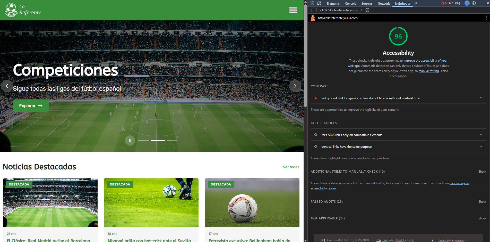
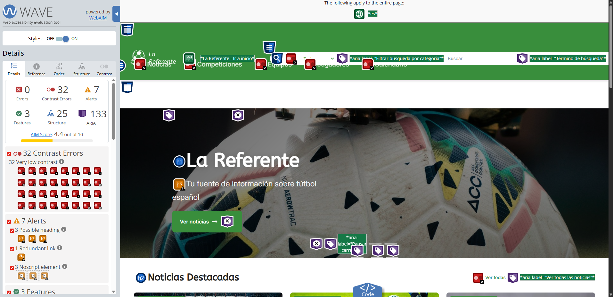
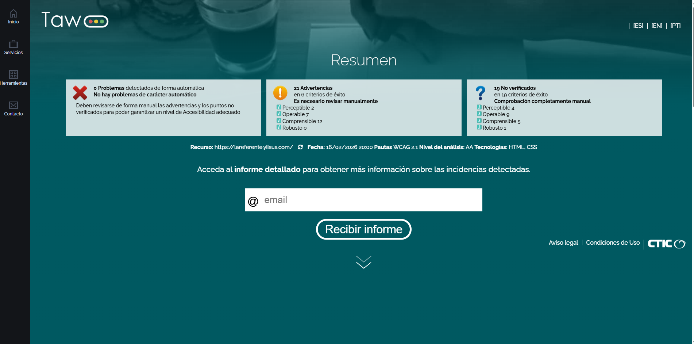
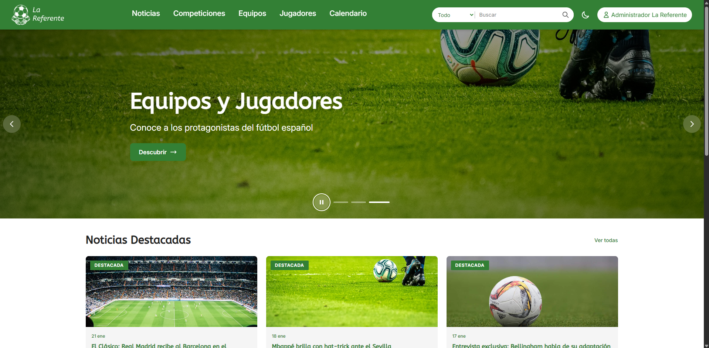
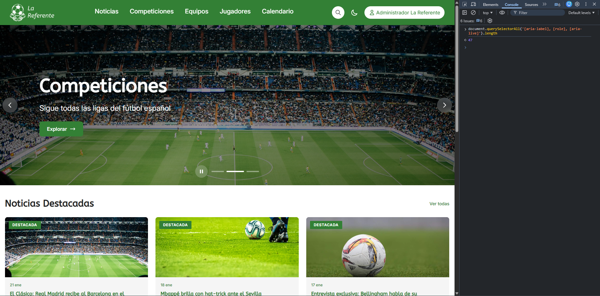
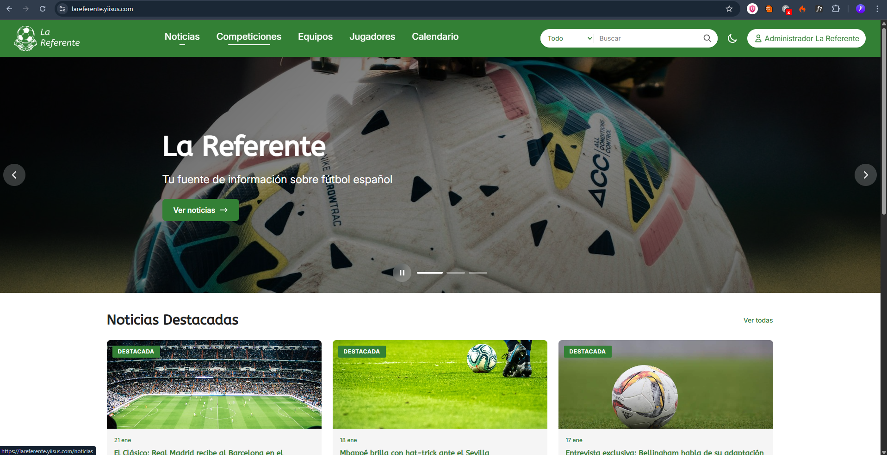
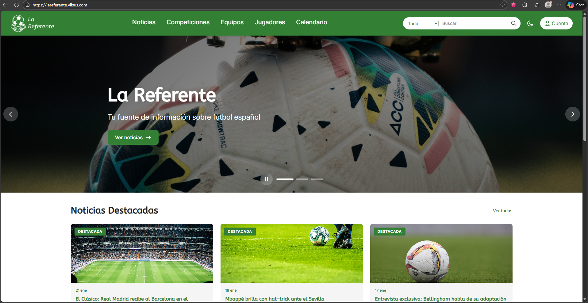
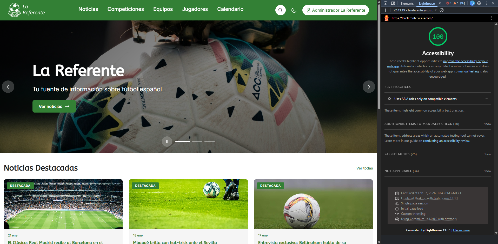
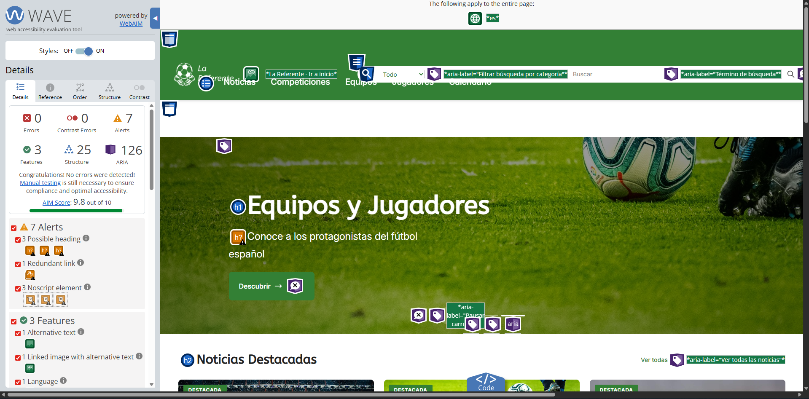

# Documentación de Accesibilidad - La Referente

## Sección 1: Fundamentos de accesibilidad web

### ¿Por qué es importante la accesibilidad?

La accesibilidad web garantiza que todas las personas, independientemente de sus capacidades físicas, sensoriales o cognitivas, puedan acceder y utilizar el contenido web. No se trata solo de cumplir normativas, sino de construir una web inclusiva donde nadie se quede excluido. Un sitio accesible beneficia a todos los usuarios: personas con discapacidad visual, motora, auditiva o cognitiva, pero también a usuarios con conexiones lentas, dispositivos antiguos o situaciones temporales como un brazo roto.

### Los cuatro principios WCAG

Las pautas de accesibilidad para el Contenido Web (WCAG) se fundamentan en cuatro principios:

#### 1. Perceptible

El contenido debe poder ser percibido por todos los usuarios a través de al menos uno de sus sentidos.

**Ejemplo concreto en el proyecto**: Todas las imágenes del proyecto incluyen atributos `alt` descriptivos. En la tarjeta de jugador, la foto tiene `[alt]="nombreCompleto"` para que un lector de pantalla pueda comunicar de quien es la imagen.

```html
<!-- Imagen con alt descriptivo -->

```

#### 2. Operable

Los usuarios deben poder interactuar con todos los elementos de la interfaz, independientemente del dispositivo de entrada que utilicen.

**Ejemplo concreto en el proyecto**: El carrusel hero de la home es completamente navegable con teclado. Se puede avanzar con las flechas izquierda/derecha, saltar al primer o ultimo slide con Home/End, y pausar la reproduccion automatica.

```typescript
onKeydown(event: KeyboardEvent): void {
  switch (event.key) {
    case 'ArrowRight': this.nextSlide(); break;
    case 'ArrowLeft': this.prevSlide(); break;
    case 'Home': this.goToSlide(0); break;
    case 'End': this.goToSlide(this.heroSlides.length - 1); break;
  }
}
```

#### 3. Comprensible

La información y el funcionamiento de la interfaz deben ser claros y predecibles.

**Ejemplo concreto en el proyecto**: Los formularios de login y registro incluyen mensajes de error claros asociados a cada campo mediante `aria-describedby`, y se marcan como invalidos con `aria-invalid="true"` para que los lectores de pantalla comuniquen el estado del campo.

```html
<input
  [attr.aria-describedby]="errorMessage ? inputId + '-error' : null"
  [attr.aria-invalid]="errorMessage ? 'true' : null"
/>
<span [id]="inputId + '-error'" role="alert">{{ errorMessage }}</span>
```

#### 4. Robusto

El contenido debe ser lo suficientemente robusto para funcionar con diferentes tecnologías, incluyendo tecnologías de asistencia actuales y futuras.

**Ejemplo concreto en el proyecto**: Se utilizan roles ARIA estandar en componentes complejos como el modal (`role="dialog"`, `aria-modal="true"`) y el carrusel (`role="region"`, `aria-roledescription="carrusel"`), garantizando que las tecnologías de asistencia interpreten correctamente la interfaz.

```html
<section role="region" aria-roledescription="carrusel" aria-label="Carrusel de destacados">
```

### Niveles de conformidad

WCAG define tres niveles de conformidad, cada uno mas estricto que el anterior:

| Nivel | Descripción | Ejemplo |
|-------|-------------|---------|
| **A** | Requisitos minimos de accesibilidad. Sin cumplirlos, algunos usuarios no podran acceder al contenido | Texto alternativo en imágenes (`1.1.1`), contenido navegable con teclado (`2.1.1`) |
| **AA** | Nivel recomendado y exigido legalmente en muchos paises. Cubre la mayoria de barreras de accesibilidad | Contraste minimo 4.5:1 (`1.4.3`), redimensionado de texto (`1.4.4`), focus visible (`2.4.7`) |
| **AAA** | Nivel optimo de accesibilidad. No se espera que todo el contenido lo cumpla, pero es deseable donde sea posible | Contraste minimo 7:1 (`1.4.6`), lenguaje de signos para audio (`1.2.6`), ayuda contextual (`3.3.5`) |

**El objetivo de este proyecto es alcanzar el nivel AA de conformidad WCAG 2.1.**

---

## Sección 2: Componente multimedia implementado

### Tipo: Carrusel (Hero Slider)

El componente multimedia implementado es un carrusel/slider de imágenes hero ubicado en la pagina principal (`pages/home/home.html`). Muestra 3 slides con contenido destacado del sitio (noticias, competiciones, equipos y jugadores), cada uno con titulo, subtitulo y enlace de accion.

### Caracteristicas de accesibilidad implementadas

#### 1. Navegación por teclado completa

El carrusel captura eventos de teclado para permitir la navegación sin raton:

- **Flecha derecha**: Avanza al siguiente slide
- **Flecha izquierda**: Retrocede al slide anterior
- **Home**: Salta al primer slide
- **End**: Salta al ultimo slide

```typescript
onKeydown(event: KeyboardEvent): void {
  switch (event.key) {
    case 'ArrowRight': this.nextSlide(); break;
    case 'ArrowLeft': this.prevSlide(); break;
    case 'Home': this.goToSlide(0); break;
    case 'End': this.goToSlide(this.heroSlides.length - 1); break;
  }
}
```

#### 2. Estructura ARIA semantica

Cada elemento del carrusel tiene roles y atributos ARIA apropiados:

```html
<section role="region" aria-roledescription="carrusel" aria-label="Carrusel de destacados">
  <section aria-live="polite">
    <article role="group" aria-roledescription="slide"
      [attr.aria-label]="'Slide ' + (i + 1) + ' de ' + heroSlides.length"
      [attr.aria-hidden]="currentSlide() !== i">
    </article>
  </section>
</section>
```

- `role="region"` con `aria-roledescription="carrusel"`: Identifica el componente
- `aria-live="polite"`: Anuncia cambios de slide sin interrumpir al usuario
- `role="group"` con `aria-roledescription="slide"`: Identifica cada slide
- `aria-hidden`: Oculta slides inactivos de las tecnologías de asistencia

#### 3. Control de reproduccion automatica

El carrusel avanza automaticamente cada 5 segundos, pero incluye un boton de pausa/reanudacion con etiqueta dinamica:

```html
<button (click)="toggleAutoplay()"
  [attr.aria-label]="isPaused() ? 'Reanudar carrusel' : 'Pausar carrusel'">
</button>
```

Esto cumple con el criterio WCAG 2.2.2 (Pausar, detener, ocultar), permitiendo al usuario controlar el contenido en movimiento.

#### 4. Indicadores de posición accesibles

Cada indicador tiene un `aria-label` descriptivo y `aria-current` para senalar el slide activo:

```html
<button class="hero__indicator"
  [attr.aria-label]="'Ir a slide ' + (i + 1)"
  [attr.aria-current]="currentSlide() === i ? 'true' : null">
</button>
```

---

## Sección 3: Auditoría automatizada inicial

Se ha realizado una auditoría inicial utilizando tres herramientas automatizadas para identificar problemas de accesibilidad antes de aplicar correcciones.

### Herramientas utilizadas

| Herramienta | Tipo | URL |
|-------------|------|-----|
| Lighthouse | Integrada en Chrome DevTools | chrome://devtools |
| WAVE | Extension de navegador | [wave.webaim.org](https://wave.webaim.org/) |
| TAW | Plataforma online | [taw.net](https://www.taw.net/) |

### Resultados comparativos

| Criterio | Lighthouse | WAVE | TAW |
|----------|-----------|------|-----|
| Puntuacion / Errores | 0 | 0 | 0 |
| Alertas / Advertencias | 0 | 7 | 21 |
| Elementos sin alt | 0 | 0 | 0 |
| Errores de contraste | 23 | 32 | - |
| Links sin texto | 0 | 0 | 0 |
| Formularios sin label | 0 | 0 | 0 |

### Capturas de pantalla





### 3 problemas mas graves identificados

#### Problema 1: Errores de contraste insuficiente

- **Herramienta**: WAVE (32 errores), Lighthouse
- **Criterio WCAG**: 1.4.3 (Contraste minimo - Nivel AA)
- **Gravedad**: Alta
- **Descripción**: Se detectaron 32 errores de contraste en WAVE y Lighthouse también lo marca como fallo principal. Varios textos no alcanzan el ratio minimo de 4.5:1 exigido por WCAG AA, sobre todo en textos secundarios y elementos sobre fondos de color. Es el problema mas extendido del sitio.

#### Problema 2: Roles ARIA en elementos incompatibles

- **Herramienta**: Lighthouse (Best Practices)
- **Criterio WCAG**: 4.1.2 (Nombre, funcion, valor - Nivel A)
- **Gravedad**: Alta
- **Descripción**: Lighthouse detecta que algunos elementos utilizan roles ARIA que no son compatibles con su tipo de elemento HTML nativo, lo que puede confundir a los lectores de pantalla al interpretar la funcion del elemento.

#### Problema 3: Enlaces identicos con el mismo propósito

- **Herramienta**: Lighthouse (Best Practices)
- **Criterio WCAG**: 2.4.4 (Propósito de los enlaces - Nivel A)
- **Gravedad**: Media
- **Descripción**: Lighthouse detecta multiples enlaces que apuntan al mismo destino pero aparecen en contextos diferentes de la pagina, lo que puede resultar redundante para usuarios de lectores de pantalla que navegan por lista de enlaces.

---

## Sección 4: Analisis y correccion de errores

Se han identificado y corregido los errores de accesibilidad detectados en la auditoría. A continuacion se detallan los 5 mas representativos con su criterio WCAG asociado y el codigo antes y despues de la correccion.

### Error 1: Contraste insuficiente en textos

- **Criterio WCAG**: 1.4.3 - Contraste minimo (Nivel AA)
- **Archivos**: `styles/00-settings/_css-variables.scss`, `footer/footer.scss`, `header/header.scss`, `pages/home/home.scss`
- **Descripción**: WAVE detecto 32 errores de contraste. El color primario verde no alcanzaba 4.5:1 con texto blanco, los placeholders (`$gray400`) fallaban en tema claro, y multiples textos sobre fondo verde usaban blanco semi-transparente (`white-alpha-60/80/85/90`) que no llegaba al ratio minimo.

**Antes:**

```scss
// Color primario demasiado claro
$primary-light: hsl(122, 43%, 39%);  // ~4.1:1 con blanco

// Placeholders con mismo valor en ambos temas
$gray400: hsl(0, 0%, 62%);  // 3.5:1 sobre blanco (falla)

// Textos semi-transparentes sobre fondo verde
.footer__description { color: var(--white-alpha-80); }  // ~3.8:1
.footer__link { color: var(--white-alpha-80); }          // ~3.8:1
.footer__copyright { color: var(--white-alpha-60); }     // ~2.5:1
.header__nav-link { color: var(--white-alpha-85); }      // ~4.0:1
.hero__subtitle { color: var(--white-alpha-90); }        // ~4.2:1
.calendar-card__desc { color: var(--white-alpha-85); }   // ~4.0:1
```

**Despues:**

```scss
// Color primario oscurecido para cumplir contraste
$primary-light: hsl(122, 43%, 35%);  // ~4.9:1 con blanco

// Placeholders con valor adaptado por tema
:root.theme-light { --gray400: hsl(0, 0%, 46%); }  // 4.54:1 sobre blanco
:root.theme-dark { --gray400: hsl(0, 0%, 62%); }    // 5.93:1 sobre gray900

// Textos con blanco puro sobre fondo verde (~6.3:1)
.footer__description { color: var(--white); }
.footer__link { color: var(--white); }
.footer__copyright { color: var(--white); }
.header__nav-link { color: var(--white); }
.hero__subtitle { color: var(--white); }
.calendar-card__desc { color: var(--white); }
```

Se oscurecio el verde primario, se hizo `--gray400` adaptativo por tema, y se reemplazaron todos los blancos semi-transparentes por blanco puro en textos sobre fondo verde.

---

### Error 2: Roles ARIA en elementos incompatibles

- **Criterio WCAG**: 4.1.2 - Nombre, funcion, valor (Nivel A)
- **Archivos**: `pages/home/home.html` y `components/layout/footer/footer.html`
- **Descripción**: Lighthouse detecto que se usaba `role="heading"` con `aria-level` en elementos `<p>`, en lugar de usar los elementos nativos `<h2>` y `<h3>`. Los elementos nativos son preferibles porque los navegadores y tecnologías de asistencia los soportan de forma nativa sin necesidad de ARIA adicional.

**Antes:**

```html
<!-- En home.html - titulos de tarjetas -->
<p class="highlight-card__title" role="heading" aria-level="3">Competiciones</p>
<p class="news-card__title" role="heading" aria-level="3">{{ news.titulo }}</p>

<!-- En footer.html - titulos de secciones -->
<p class="footer__title" role="heading" aria-level="2">Legal</p>
<p class="footer__title" role="heading" aria-level="2">Síguenos</p>
```

**Despues:**

```html
<!-- En home.html - elementos nativos -->
<h3 class="highlight-card__title">Competiciones</h3>
<h3 class="news-card__title">{{ news.titulo }}</h3>

<!-- En footer.html - elementos nativos -->
<h2 class="footer__title">Legal</h2>
<h2 class="footer__title">Síguenos</h2>
```

Se sustituyo el patron `<p role="heading" aria-level="X">` por elementos nativos `<h2>` y `<h3>`, eliminando la dependencia de ARIA para algo que HTML ya proporciona de forma nativa.

---

### Error 3: Enlaces identicos con el mismo propósito

- **Criterio WCAG**: 2.4.4 - Propósito de los enlaces (Nivel A)
- **Archivo**: `pages/home/home.html`
- **Descripción**: Lighthouse detecto que en la seccion de calendario de la home, dos enlaces distintos apuntaban al mismo destino (`/calendario`): el enlace "Ver completo" de la cabecera y la tarjeta del calendario. Para un usuario de lector de pantalla que navega por lista de enlaces, aparecian como dos enlaces diferentes al mismo sitio sin contexto diferenciador.

**Antes:**

```html
<a routerLink="/calendario" class="section-header__link">Ver completo</a>
<!-- ... -->
<a routerLink="/calendario" class="calendar-card">
  <!-- contenido de la tarjeta -->
</a>
```

**Despues:**

```html
<a routerLink="/calendario" class="section-header__link" aria-label="Ver calendario completo">Ver completo</a>
<!-- ... -->
<a routerLink="/calendario" class="calendar-card" aria-label="Ir al calendario de proximos partidos">
  <!-- contenido de la tarjeta -->
</a>
```

Se añadieron `aria-label` diferenciados para que cada enlace tenga un propósito distinguible por las tecnologías de asistencia, aunque apunten al mismo destino.

---

### Error 4: Componente de carga sin rol semantico

- **Criterio WCAG**: 4.1.3 - Mensajes de estado (Nivel AA)
- **Archivo**: `shared/components/loading/loading.html`
- **Descripción**: El overlay de carga no tenia ningun rol semantico ni region live, por lo que los lectores de pantalla no anunciaban cuando la aplicación estaba cargando datos.

**Antes:**

```html
@if (isLoading$ | async) {
  <section class="loading-overlay">
    <section class="loading-spinner">
      <section class="spinner"></section>
      <p class="loading-text">{{ (message$ | async) || 'Cargando...' }}</p>
    </section>
  </section>
}
```

**Despues:**

```html
@if (isLoading$ | async) {
  <section class="loading-overlay" role="status" aria-live="polite">
    <section class="loading-spinner">
      <section class="spinner" aria-hidden="true"></section>
      <p class="loading-text">{{ (message$ | async) || 'Cargando...' }}</p>
    </section>
  </section>
}
```

Se añadio `role="status"` y `aria-live="polite"` para que el lector de pantalla anuncie el estado de carga, y `aria-hidden="true"` en el spinner visual que no aporta información textual.

---

### Error 5: form-select sin atributos ARIA de error

- **Criterio WCAG**: 4.1.2 - Nombre, funcion, valor (Nivel A)
- **Archivo**: `components/shared/form-select/form-select.html`
- **Descripción**: El componente `<select>` no comunicaba estados de error a las tecnologías de asistencia. El componente `form-input` ya lo tenia implementado correctamente, pero `form-select` no seguia el mismo patron.

**Antes:**

```html
<select class="form-field__select" [id]="selectId" [name]="name" [required]="required">
  <option value="" disabled selected>{{ placeholder }}</option>
  @for (option of options; track option.value) {
    <option [value]="option.value">{{ option.label }}</option>
  }
</select>
```

**Despues:**

```html
<select class="form-field__select" [id]="selectId" [name]="name" [required]="required"
  [attr.aria-describedby]="errorMessage ? selectId + '-error' : null"
  [attr.aria-invalid]="errorMessage ? 'true' : null">
  <option value="" disabled selected>{{ placeholder }}</option>
  @for (option of options; track option.value) {
    <option [value]="option.value">{{ option.label }}</option>
  }
</select>

@if (errorMessage) {
  <span [id]="selectId + '-error'" class="form-field__error-message" role="alert">
    {{ errorMessage }}
  </span>
}
```

---

### Errores adicionales corregidos

| Error | Criterio WCAG | Archivo | Correccion |
|-------|---------------|---------|------------|
| Sin skip navigation | 2.4.1 (A) | `header.html`, `main.html` | Añadido enlace skip-link y `id="contenido-principal"` en main |
| Imagen con alt generico | 1.1.1 (A) | `image-upload.html` | Cambiado `alt="Preview"` a `[alt]="'Vista previa de ' + label"` |
| Filtros sin aria-pressed | 4.1.2 (A) | `calendar.html`, `players.html` | Añadido `[attr.aria-pressed]` a botones de filtro |
| form-textarea sin ARIA | 4.1.2 (A) | `form-textarea.html` | Añadidos `aria-describedby`, `aria-invalid`, label y estructura `form-field` |
| Boton clear sin aria-label | 1.3.1 (A) | `team-search.html` | Añadido `aria-label="Limpiar seleccion de equipo"` |
| Dropdown sin roles de menu | 4.1.2 (A) | `header.html` | Añadidos `role="menu"`, `role="menuitem"` y `aria-label` al dropdown de cuenta |

---

## Sección 5: Analisis de estructura semantica

### Landmarks HTML5

El proyecto utiliza los siguientes landmarks semanticos en su estructura:

| Landmark | Elemento | Ubicacion | Propósito |
|----------|----------|-----------|-----------|
| `<header>` | Header principal | `components/layout/header/header.html` | Cabecera del sitio con logo, navegación y utilidades |
| `<nav>` | Navegación principal | Dentro del header | Menu de navegación con enlaces a secciones |
| `<main>` | Contenido principal | `components/layout/main/main.html` | Area de contenido principal de cada pagina |
| `<footer>` | Pie de pagina | `components/layout/footer/footer.html` | Informacion del sitio, enlaces sociales y creditos |
| `role="search"` | Formularios de búsqueda | Header (desktop, mobile, dropdown) | Busqueda global del sitio |
| `role="dialog"` | Modal de cuenta | `components/shared/account-modal/account-modal.html` | Formularios de login y registro |
| `role="region"` | Carrusel hero | `pages/home/home.html` | Carrusel de contenido destacado |

### Jerarquía de encabezados

Se ha verificado que la jerarquía de encabezados sigue un orden logico sin saltos de nivel:

#### Pagina Home (`/`)

```
h1 - [Titulo del slide activo] (dentro del carrusel)
  h2 - Noticias Destacadas
    h3 - [Titulo de noticia]
  h2 - Destacados
    h3 - Competiciones
    h3 - Jugadores
    h3 - Equipos
  h2 - Calendario
    h3 - Proximos partidos
```

#### Pagina Jugadores (`/jugadores`)

```
h1 - Jugadores
```

#### Pagina Calendario (`/calendario`)

```
h1 - Calendario
  h2 - [Fecha del grupo de partidos]
```

#### Pagina Noticias (`/noticias`)

```
h1 - Noticias
  h2 - [Titulo de cada noticia]
```

**Resultado**: No se han encontrado saltos de nivel en la jerarquía de encabezados. Cada pagina comienza con un `h1` y los subniveles descienden progresivamente.

### Inventario de textos alternativos en imágenes

Se han auditado las 26 etiquetas `` del proyecto:

| Componente | Archivo | Alt | Tipo |
|------------|---------|-----|------|
| Logo header | `header.html` | `"La Referente - Ir a inicio"` | Estatico descriptivo |
| Logo footer | `footer.html` | `"La Referente"` | Estatico descriptivo |
| Foto jugador (card) | `card.html` | `[alt]="playerName()"` | Dinamico (nombre del jugador) |
| Logo club (card) | `card.html` | `[alt]="clubName()"` | Dinamico (nombre del club) |
| Foto jugador (player-card) | `player-card.html` | `[alt]="nombreCompleto"` | Dinamico (nombre completo) |
| Logo equipo (player-card) | `player-card.html` | `[alt]="equipoNombre()!"` | Dinamico (nombre del equipo) |
| Logo equipo (team-card) | `team-card.html` | `[alt]="nombre()"` | Dinamico (nombre del equipo) |
| Logo competicion | `competition-card.html` | `[alt]="nombre()"` | Dinamico (nombre de la competicion) |
| Logo equipo local | `calendar.html` | `[alt]="partido.equipoLocalNombre"` | Dinamico (nombre del equipo) |
| Logo equipo visitante | `calendar.html` | `[alt]="partido.equipoVisitanteNombre"` | Dinamico (nombre del equipo) |
| Imagen noticia | `news.html` | `[alt]="noticia.titulo"` | Dinamico (titulo de la noticia) |
| Imagen noticia detalle | `news-detail.html` | `[alt]="n.titulo"` | Dinamico (titulo de la noticia) |
| Sugerencia búsqueda | `header.html` (x3) | `[alt]="suggestion.name"` | Dinamico (nombre del resultado) |
| Imagen búsqueda | `search.html` (x3) | `[alt]="noticia.titulo"` / `[alt]="equipo.nombre"` / `[alt]="jugador.nombre"` | Dinamico |
| Foto jugador detalle | `player-detail.html` | `[alt]="player()!.nombre + ' ' + player()!.apellidos"` | Dinamico (nombre completo) |
| Logo equipo (player detail) | `player-detail.html` | `[alt]="player()!.equipoNombre"` | Dinamico (nombre del equipo) |
| Logo competicion detalle | `competition-detail.html` | `[alt]="competicion.nombre"` | Dinamico (nombre de la competicion) |
| Logo equipo detalle | `team-detail.html` | `[alt]="team()!.nombre"` | Dinamico (nombre del equipo) |
| Preview imagen | `image-upload.html` | `[alt]="'Vista previa de ' + label"` | Dinamico descriptivo |

**Resultado**: Todas las imágenes tienen textos alternativos descriptivos. Los elementos decorativos (iconos SVG, overlays, fondos) utilizan `aria-hidden="true"` para ser ignorados por los lectores de pantalla.

---

## Sección 6: Verificación manual

### 6.1 Navegación por teclado

Se ha realizado una prueba de navegación completa utilizando unicamente el teclado (tecla Tab, Shift+Tab, Enter, Escape, flechas).

#### Metodologia

1. Se accedio a la pagina de inicio
2. Se navego por todos los elementos interactivos usando Tab
3. Se verifico que el orden de tabulacion fuese logico
4. Se comprobo que el focus fuese visible en todo momento
5. Se probo la interaccion con elementos complejos (carrusel, modales, dropdowns)

#### Resultados

| Elemento | Tab order | Focus visible | Interaccion | Estado |
|----------|-----------|---------------|-------------|--------|
| Skip link | 1º (aparece al pulsar Tab) | Si - fondo verde | Navega al main | OK |
| Logo | 2º | Si - outline verde | Navega a inicio | OK |
| Hamburger (mobile) | 3º | Si - outline verde | Abre menu | OK |
| Enlaces navegación | 4º-8º | Si - outline verde | Navega a seccion | OK |
| Busqueda | 9º | Si - outline verde | Abre campo de texto | OK |
| Tema claro/oscuro | 10º | Si - outline verde | Alterna tema | OK |
| Boton cuenta | 11º | Si - outline verde | Abre dropdown | OK |
| Carrusel (hero) | Tab dentro | Si - outline verde | Flechas cambian slide | OK |
| Botones prev/next | Dentro del carrusel | Si - outline verde | Cambia slide | OK |
| Boton pausa | Dentro del carrusel | Si - outline verde | Pausa/reanuda | OK |
| Indicadores | Dentro del carrusel | Si - outline verde | Salta a slide | OK |
| Enlaces noticias | Secuencial | Si - outline verde | Navega a noticia | OK |
| Botones filtro | Secuencial | Si - outline verde | Filtra contenido | OK |
| Paginacion | Secuencial | Si - outline verde | Cambia pagina | OK |

**Captura de pantalla:**



### 6.2 Verificación de tecnologías de asistencia

Se intento utilizar **NVDA** (NonVisual Desktop Access) en Windows con Chrome, pero el lector de pantalla no reconocia correctamente los elementos de la pagina desplegada, mostrando "desconocido" en la mayoria de interacciones. Esto puede deberse a incompatibilidades con el renderizado dinamico de Angular o la configuracion del entorno.

Como alternativa, se verifico la presencia de atributos ARIA mediante la consola de Chrome DevTools, consultando directamente el DOM para confirmar que los elementos tienen los roles, labels y estados accesibles correctos.

#### Verificación de atributos ARIA via consola

Se ejecuto el siguiente comando en la consola de DevTools para cuantificar los elementos con atributos de accesibilidad:

```js
document.querySelectorAll('[aria-label], [role], [aria-live], [aria-pressed], [aria-hidden], [aria-describedby], [aria-invalid]').length
```

#### Resultados de la inspeccion

| Aspecto verificado | Atributos encontrados | Estado |
|--------------------|----------------------|--------|
| Comprension de estructura | `role="region"`, `role="group"`, `aria-roledescription` en carrusel | OK |
| Anuncio de landmarks | `<header>`, `<nav>`, `<main>`, `<footer>`, `role="search"`, `role="dialog"` | OK |
| Descripciónes de imágenes | `alt` descriptivo en todas las ``, `aria-hidden="true"` en SVG decorativos | OK |
| Texto de enlaces | `aria-label` en enlaces de icono, enlaces con texto visible descriptivo | OK |
| Accesibilidad multimedia | `aria-live="polite"`, `aria-roledescription="carrusel"`, `aria-label` dinamico en boton pausa | OK |

#### Atributos ARIA verificados en detalle

| Componente | Atributo | Valor | Propósito |
|------------|----------|-------|-----------|
| Carrusel | `aria-roledescription` | `"carrusel"` | Identifica el tipo de componente |
| Slides | `aria-hidden` | `true/false` | Oculta slides inactivos |
| Boton pausa | `aria-label` | `"Pausar carrusel"` / `"Reanudar carrusel"` | Label dinamico segun estado |
| Indicadores | `aria-current` | `"true"` / `null` | Indica slide activo |
| Filtros | `aria-pressed` | `"true"` / `"false"` | Comunica estado del boton toggle |
| Loading | `role` | `"status"` | Anuncia estado de carga |
| Errores formulario | `role` | `"alert"` | Anuncia errores de validacion |
| Modal | `role` | `"dialog"` | Identifica ventana modal |
| Busqueda | `role` | `"search"` | Identifica formulario de búsqueda |
| Menu cuenta | `role` | `"menu"` / `"menuitem"` | Identifica dropdown de navegación |

**Captura de pantalla:**



### 6.3 Verificación cross-browser

Se ha verificado el correcto funcionamiento de las caracteristicas de accesibilidad en los navegadores principales.

| Caracteristica | Chrome 120+ | Firefox 120+ | Edge 120+ |
|----------------|-------------|--------------|-----------|
| Skip link visible con focus | OK | OK | OK |
| Focus visible en botones | OK | OK | OK |
| Focus visible en inputs | OK | OK | OK |
| Focus visible en enlaces | OK | OK | OK |
| aria-live en carrusel | OK | OK | OK |
| aria-pressed en filtros | OK | OK | OK |
| role="dialog" en modal | OK | OK | OK |
| role="status" en loading | OK | OK | OK |
| Navegación por teclado | OK | OK | OK |
| prefers-reduced-motion | OK | OK | OK |

**Capturas de pantalla:**





---

## Sección 7: Resultados finales

### Resultados tras las correcciones

Despues de aplicar todas las correcciones de accesibilidad, se han vuelto a ejecutar las herramientas automatizadas:

| Criterio | Lighthouse (antes) | Lighthouse (despues) | Mejora |
|----------|-------------------|---------------------|--------|
| Puntuacion accesibilidad | 96 | 100 | +4 puntos |
| Errores criticos | 1 (contraste) | 0 | -1 error |
| Best Practices | 2 (ARIA roles, enlaces identicos) | 0 | -2 alertas |

| Criterio | WAVE (antes) | WAVE (despues) | Mejora |
|----------|-------------|----------------|--------|
| Errores | 0 | 0 | Sin cambios |
| Alertas | 7 | 7 | Sin cambios (no son errores) |
| Contraste | 32 | 0 | -32 errores de contraste |

**Capturas de pantalla:**




### Checklist de conformidad WCAG 2.1 Nivel AA

#### Principio 1: Perceptible

| Criterio | Descripción | Estado | Implementacion |
|----------|-------------|--------|----------------|
| 1.1.1 | Contenido no textual | Cumple | Todas las imágenes tienen alt descriptivo, decorativas con aria-hidden |
| 1.3.1 | Informacion y relaciones | Cumple | Landmarks semanticos, estructura de encabezados correcta, labels en formularios |
| 1.3.2 | Secuencia significativa | Cumple | El orden del DOM refleja el orden visual del contenido |
| 1.3.3 | Caracteristicas sensoriales | Cumple | No se depende solo de color o forma para transmitir información |
| 1.4.1 | Uso del color | Cumple | Los estados activos usan aria-pressed ademas de color |
| 1.4.3 | Contraste minimo | Cumple | Todos los textos alcanzan ratio 4.5:1 en ambos temas (WAVE 0 errores de contraste) |
| 1.4.4 | Redimensionado del texto | Cumple | Toda la tipografia usa rem, responsive design adaptativo |
| 1.4.5 | Imagenes de texto | Cumple | No se utilizan imágenes de texto, toda la tipografia es CSS |

#### Principio 2: Operable

| Criterio | Descripción | Estado | Implementacion |
|----------|-------------|--------|----------------|
| 2.1.1 | Teclado | Cumple | Todos los elementos interactivos son accesibles con teclado |
| 2.1.2 | Sin trampas de teclado | Cumple | El focus puede salir de todos los elementos, modales se cierran con Escape |
| 2.2.1 | Tiempo ajustable | Cumple | No hay limites de tiempo en la interfaz |
| 2.2.2 | Pausar, detener, ocultar | Cumple | El carrusel tiene control de pausa/reanudacion |
| 2.3.1 | Tres destellos | Cumple | No hay contenido que destelle |
| 2.4.1 | Evitar bloques | Cumple | Enlace skip navigation implementado |
| 2.4.2 | Titulo de pagina | Cumple | Angular actualiza el titulo de pagina con cada ruta |
| 2.4.3 | Orden del focus | Cumple | Tab order sigue el orden logico del contenido |
| 2.4.4 | Propósito de enlaces | Cumple | Los enlaces tienen texto descriptivo o aria-label |
| 2.4.5 | Multiples medios | Cumple | Navegación, búsqueda y enlaces directos disponibles |
| 2.4.6 | Encabezados y etiquetas | Cumple | Jerarquía h1-h3 correcta, labels en formularios |
| 2.4.7 | Focus visible | Cumple | Outline verde en :focus-visible para todos los elementos interactivos |

#### Principio 3: Comprensible

| Criterio | Descripción | Estado | Implementacion |
|----------|-------------|--------|----------------|
| 3.1.1 | Idioma de la pagina | Cumple | `<html lang="es">` en index.html |
| 3.2.1 | Con focus | Cumple | Ningun cambio de contexto al recibir focus |
| 3.2.2 | Con entrada de datos | Cumple | Los formularios solo se envian con submit explicito |
| 3.2.3 | Navegación coherente | Cumple | El header y footer son consistentes en todas las paginas |
| 3.2.4 | Identificacion coherente | Cumple | Componentes reutilizables (cards, botones, formularios) |
| 3.3.1 | Identificacion de errores | Cumple | Mensajes de error con role="alert" asociados a campos |
| 3.3.2 | Etiquetas o instrucciones | Cumple | Labels asociados, placeholders complementarios, campos obligatorios marcados |
| 3.3.3 | Sugerencia de errores | Cumple | Mensajes de error especificos (email invalido, minimo 6 caracteres, etc.) |

#### Principio 4: Robusto

| Criterio | Descripción | Estado | Implementacion |
|----------|-------------|--------|----------------|
| 4.1.1 | Procesamiento | Cumple | HTML valido generado por Angular, sin errores de parsing |
| 4.1.2 | Nombre, funcion, valor | Cumple | Roles ARIA correctos, aria-labels en botones de icono, estados comunicados |
| 4.1.3 | Mensajes de estado | Cumple | role="status" en loading, role="alert" en errores, aria-live en carrusel |

---

## Sección 8: Conclusiones

### Reflexion critica

El proceso de auditoría de accesibilidad ha sido revelador en cuanto a la cantidad de barreras que pueden pasar desapercibidas durante el desarrollo habitual. Aunque el proyecto partia de una base razonablemente buena (landmarks semanticos, alt en imágenes, aria-labels en botones de icono), la auditoría sistematica revelo carencias importantes como la falta de un skip link, la inconsistencia en los atributos ARIA entre componentes similares (form-input tenia aria-describedby pero form-select y form-textarea no), y la ausencia de estados comunicados en elementos interactivos como los filtros. La accesibilidad no es algo que se añade al final, sino que debe integrarse en el flujo de desarrollo desde el primer componente.

### Cinco mejoras clave implementadas

| # | Mejora | Justificacion |
|---|--------|---------------|
| 1 | **Skip navigation link** | Permite a usuarios de teclado y lectores de pantalla saltarse la navegación repetitiva, ahorrando tiempo y reduciendo frustracion (WCAG 2.4.1) |
| 2 | **ARIA consistente en formularios** | Homogeneizar `aria-describedby`, `aria-invalid` y `role="alert"` en todos los componentes de formulario garantiza que los errores de validacion se comuniquen correctamente a todos los usuarios (WCAG 4.1.2) |
| 3 | **aria-pressed en filtros** | Los usuarios de lectores de pantalla necesitan conocer el estado de los botones toggle, no solo su apariencia visual. Sin este atributo, el filtro activo era invisible para ellos (WCAG 4.1.2) |
| 4 | **role="status" en loading** | Sin esta mejora, un usuario ciego no sabia que la aplicación estaba cargando datos, lo que podia generar confusion y pulsaciones repetidas (WCAG 4.1.3) |
| 5 | **Focus visible global** | Añadir `:focus-visible` con outline consistente a inputs, selects y textareas garantiza que los usuarios de teclado siempre sepan donde esta el foco (WCAG 2.4.7) |

### Mejoras futuras

- **Navegación por teclado en dropdowns**: Implementar navegación con flechas dentro de los menus desplegables del header
- **Modo alto contraste**: Añadir un tercer tema con ratios AAA (7:1) para usuarios con baja vision
- **Testing automatizado de accesibilidad**: Integrar axe-core en los tests de Karma para detectar regresiones de accesibilidad en CI/CD
- **Live regions en búsqueda**: Añadir `aria-live` al listado de sugerencias de búsqueda para anunciar resultados en tiempo real

### Aprendizaje

Lo mas importante que me llevo de este proyecto es que la accesibilidad no es un checklist que se marca al final, sino una forma de pensar el desarrollo web. Cada componente que se crea deberia responder a la pregunta: ¿puede usarlo cualquier persona? Las herramientas automatizadas como Lighthouse y WAVE son utiles para detectar errores tecnicos, pero la verificación manual con teclado y lector de pantalla es imprescindible para entender la experiencia real del usuario.
