# Documentación DIW

## Sección 1: Arquitectura CSS y comunicación visual

### 1.1 Principios de comunicación visual

La interfaz del proyecto se ha diseñado aplicando los cinco principios fundamentales de comunicación visual, garantizando una experiencia de usuario coherente y profesional.

#### Jerarquia

La jerarquia visual establece el orden de importancia de los elementos mediante el uso de tamaños, pesos tipograficos y espaciados diferenciados.

En el proyecto se aplica de la siguiente manera:

- **Titulos principales (h1)**: Utilizan la fuente secundaria ABeeZee con peso bold y tamaño `--font-4xl` (3rem), creando un punto focal claro en cada sección.
- **Subtitulos (h2, h3)**: Mantienen la fuente secundaria pero con tamaños progresivamente menores (`--font-2xl`, `--font-xl`), estableciendo niveles de lectura claros.
- **Texto de contenido**: Emplea la fuente primaria Inter con peso regular y tamaño base (`--font-base`), diferenciandose claramente de los titulos.
- **Texto secundario**: Utiliza el color `--text-secondary` y tamaño `--font-sm` para información complementaria como ayudas de formulario o fechas.

**Ejemplo visual - Tarjeta de jugador:**

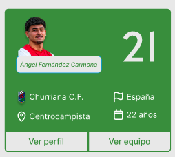

En la tarjeta de jugador se observa la jerarquia: el nombre del jugador destaca con mayor tamaño y peso, seguido del dorsal, y finalmente la información secundaria (club, pais, posicion, edad) con tipografia mas pequena.

```scss
// Ejemplo de jerarquia en tarjetas
.tarjeta__titulo {
  @include tipografia-titulo;
  font-size: var(--font-xl);
  color: var(--text-color);
}

.tarjeta__subtitulo {
  @include tipografia-titulo;
  font-size: var(--font-lg);
  color: var(--text-secondary);
}

.tarjeta__contenido {
  @include tipografia-texto;
  font-size: var(--font-base);
  color: var(--text-secondary);
}
```

#### Contraste

El contraste permite diferenciar elementos y guiar la atencion del usuario hacia las acciónes principales.

- **Contraste de color**: El color primario verde (`--primary: hsl(122, 43%, 39%)`) destaca sobre fondos blancos y grises, utilizándose para botones de acción principal, enlaces y elementos interactivos.
- **Contraste de peso**: Los elementos importantes utilizan `--font-semibold` o `--font-bold`, mientras que el texto regular emplea `--font-regular`.
- **Contraste de estados**: Los botones cambian de borde a relleno en hover, creando una diferenciación clara entre estado normal e interactivo.

**Ejemplo visual - Sección de noticias:**

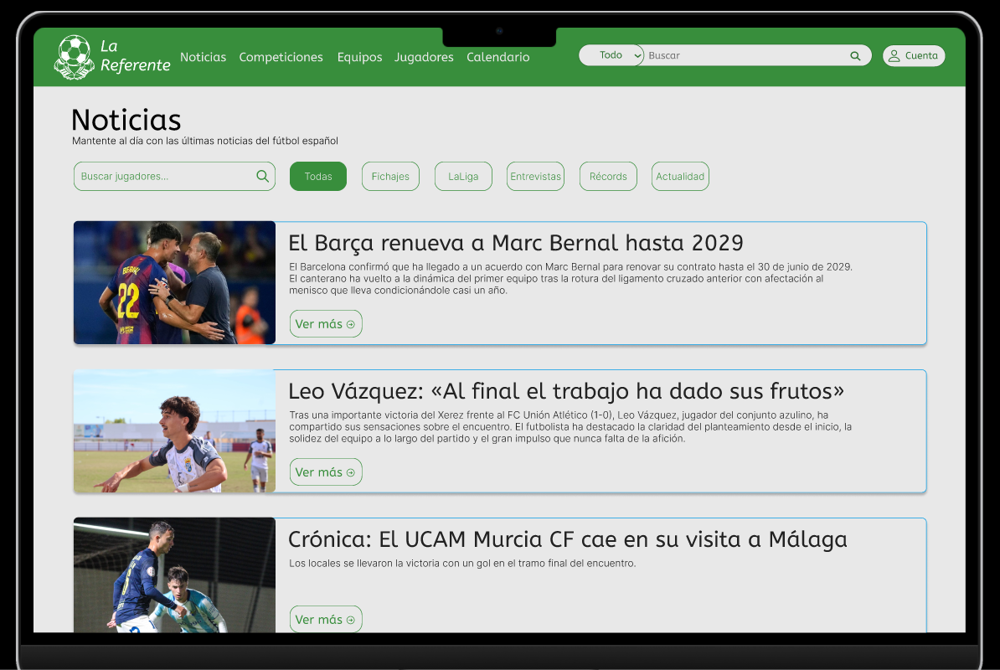

En la sección de noticias se aprecia el contraste: los titulos en color oscuro destacan sobre el fondo claro, las imagenes crean contraste visual, y los botones verdes resaltan como elementos de acción.

```scss
// Contraste en botones primarios
.boton--primario {
  background-color: var(--white);
  border-color: var(--primary);
  color: var(--primary);

  &:hover:not(:disabled) {
    background-color: var(--primary);
    color: var(--white);
  }
}
```

#### Alineacion

La estrategia de alineación del proyecto sigue un patron consistente:

- **Alineacion izquierda**: Se utiliza como estandar para textos, etiquetas de formulario y contenido general, facilitando la lectura natural.
- **Alineacion centrada**: Reservada para elementos de acción como botones en modales, titulos de secciónes principales y mensajes de feedback.
- **Sistema grid**: Los layouts complejos utilizan CSS Grid y Flexbox con gaps consistentes basados en la escala de espaciado.

**Ejemplo visual - Alineaciones y posicionamientos:**


En el diseño se observan las diferentes estrategias de alineación: contenido alineado a la izquierda en las tarjetas, elementos centrados en las cabeceras, y uso de grid para distribuir las tarjetas de forma equilibrada.

```scss
// Alineacion en formularios
.formulario__grupo {
  @include flex-columna(var(--spacing-2));
}

// Alineacion centrada para acciónes
.formulario__acciónes {
  @include flex-centrar;
  gap: var(--spacing-4);
}
```

#### Proximidad

Los elementos relacionados se agrupan mediante espaciados consistentes, creando bloques visuales coherentes:

- **Espaciado interno de grupos**: `--spacing-2` (0.5rem) entre etiqueta y campo de formulario.
- **Espaciado entre grupos**: `--spacing-4` (1rem) entre diferentes campos de un formulario.
- **Espaciado de secciónes**: `--spacing-6` (1.5rem) o superior para separar bloques de contenido independientes.

```scss
// Proximidad en grupos de formulario
.formulario {
  @include flex-columna(var(--spacing-4));  // Entre grupos
}

.formulario__grupo {
  @include flex-columna(var(--spacing-2));  // Dentro del grupo
}
```

#### Repeticion

La coherencia visual se logra mediante la repeticion de patrones en toda la interfaz:

- **Bordes redondeados**: Todos los elementos interactivos utilizan la escala de radios definida (`--radius-md` para inputs, `--radius-lg` para tarjetas, `--radius-full` para botones).
- **Transiciones**: Todas las animaciones utilizan `--duration-fast` (150ms) con `--timing-ease-in-out`.
- **Sombras**: Se aplica `--shadow-md` de forma consistente en tarjetas y elementos elevados.

**Ejemplo visual - Botones coherentes:**

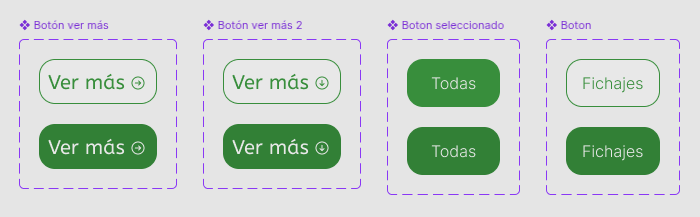

En la imagen se observa como todos los botones mantienen el mismo patron visual: bordes redondeados consistentes, mismo espaciado interno, y transiciónes uniformes. Esta repeticion crea coherencia en toda la interfaz.

```scss
// Patron repetido en elementos interactivos
.boton {
  border-radius: var(--radius-lg);
  transition: all var(--duration-fast) var(--timing-ease-in-out);
}

.tarjeta {
  border-radius: var(--radius-lg);
  box-shadow: var(--shadow-md);
}

.formulario__campo {
  border-radius: var(--radius-full);
  transition: border-color var(--duration-fast) var(--timing-ease-in-out);
}
```

---

### 1.2 Metodología CSS: BEM

El proyecto utiliza la metodologia BEM (Block Element Modifier) para la nomenclatura de clases CSS. Esta decision se fundamenta en las siguientes ventajas:

- **Legibilidad**: El nombre de la clase indica claramente a que componente pertenece y su funcion.
- **Especificidad controlada**: Evita conflictos de especificidad al usar clases unicas y descriptivas.
- **Mantenibilidad**: Facilita la localizacion y modificacion de estilos especificos.
- **Escalabilidad**: Permite anadir nuevos componentes sin riesgo de colisiones.

#### Estructura BEM

**Bloque**: Componente independiente que tiene significado propio.
```scss
.tarjeta { }
.boton { }
.formulario { }
```

**Elemento**: Parte de un bloque que no tiene significado independiente, se une con doble guion bajo.
```scss
.tarjeta__titulo { }
.tarjeta__contenido { }
.tarjeta__acciónes { }
```

**Modificador**: Variacion del bloque o elemento, se une con doble guion.
```scss
.tarjeta--destacada { }
.boton--primario { }
.boton--grande { }
```

#### Ejemplos del Proyecto

```scss
// Bloque: tarjeta
.tarjeta {
  @include tarjeta-base;
  display: flex;
  flex-direction: column;
}

// Elementos de tarjeta
.tarjeta__cabecera {
  display: flex;
  align-items: flex-start;
  justify-content: space-between;
  padding: var(--spacing-4);
}

.tarjeta__titulo {
  @include tipografia-titulo;
  font-size: var(--font-xl);
  color: var(--text-color);
}

.tarjeta__precio {
  @include tipografia-titulo;
  font-size: var(--font-2xl);
  color: var(--primary);
}

// Modificadores de tarjeta
.tarjeta--destacada {
  border: var(--border-medium) solid var(--primary);
}

.tarjeta--horizontal {
  flex-direction: row;
}
```

---

### 1.3 Organización de archivos: ITCSS

El proyecto implementa la arquitectura ITCSS (Inverted Triangle CSS), que organiza los estilos en capas ordenadas de menor a mayor especificidad. Esta estructura evita problemas de cascada y facilita el mantenimiento.

**Diagrama de la arquitectura ITCSS:**

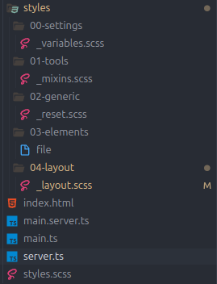

El triangulo invertido representa como la especificidad aumenta de arriba hacia abajo, comenzando con las variables globales y terminando con las utilidades de alta especificidad.

#### Estructura de Carpetas

```
src/styles/
├── 00-settings/
│   ├── _css-variables.scss
│   └── _variables.scss
├── 01-tools/
│   └── _mixins.scss
├── 02-generic/
│   └── _reset.scss
├── 03-elements/
│   ├── _buttons.scss
│   ├── _forms.scss
│   ├── _links.scss
│   ├── _lists.scss
│   └── _typography.scss
├── 04-layout/
│   └── _layout.scss
├── 05-components/
│   ├── _alerta.scss
│   ├── _boton.scss
│   ├── _formulario.scss
│   ├── _modal.scss
│   ├── _navegación.scss
│   ├── _notificacion.scss
│   └── _tarjeta.scss
└── 06-utilities/
    └── _utilities.scss
```

#### Descripción de capas

| Capa | Contenido | Especificidad |
|------|-----------|---------------|
| 00-settings | Variables CSS y SCSS | Ninguna (solo definiciones) |
| 01-tools | Mixins y funciones | Ninguna (solo definiciones) |
| 02-generic | Reset y normalize | Muy baja (selectores de elemento) |
| 03-elements | Estilos base de HTML | Baja (selectores de elemento) |
| 04-layout | Estructuras de pagina | Media (clases de layout) |
| 05-components | Componentes UI | Media-alta (clases BEM) |
| 06-utilities | Clases de utilidad | Alta (clases especificas) |

Esta organizacion garantiza que los estilos mas genericos se carguen primero y los mas especificos despues, respetando el principio de cascada de CSS.

---

### 1.4 Sistema de design tokens

Los design tokens son variables que centralizan los valores de diseño, permitiendo cambios globales desde un unico punto y garantizando consistencia en toda la aplicación.

#### Colores

**Colores Primarios y Secundarios**

Se eligió el verde como color primario (`hsl(122, 43%, 39%)`) por su asociación con naturaleza, crecimiento y acciones positivas, alineándose con la identidad del proyecto. El azul secundario (`hsl(199, 98%, 45%)`) proporciona contraste y se reserva para acciones alternativas.

```scss
// Tema claro
$primary-light: #388e3c;
$primary-hover-light: #328036;
$primary-active-light: #2d7230;

$secondary-light: #039be5;
$secondary-hover-light: #038cce;
$secondary-active-light: #027cb7;

// Tema oscuro
$primary-dark: #2a6b2d;
$primary-hover-dark: #225524;
$primary-active-dark: #19401b;
```

**Escala de Grises**

La escala de grises de 10 niveles permite crear jerarquias visuales sutiles y adaptarse a ambos temas (claro y oscuro).

```scss
$gray50: #f5f5f5;   // Fondos secundarios tema claro
$gray100: #e8e8e8;
$gray200: #cfcfcf;  // Bordes tema claro
$gray300: #b6b6b6;  // Texto secundario tema oscuro
$gray400: #9e9e9e;  // Placeholders
$gray500: #858585;
$gray600: #6b6b6b;  // Texto secundario tema claro
$gray700: #525252;  // Bordes tema oscuro
$gray800: #3b3b3b;  // Fondo secundario tema oscuro
$gray900: #222222;  // Texto primario tema claro / Fondo tema oscuro
```

**Colores Semanticos**

Los colores semanticos comunican estados y feedback al usuario de forma intuitiva.

```scss
$success: #2ecc71;      // Acciones exitosas
$success-bg: #eafaf1;   // Fondo de mensajes de exito
$success-text: #1d8348; // Texto sobre fondo de exito

$error: #c0392b;        // Errores y validaciónes fallidas
$error-bg: #fdf2f0;
$error-text: #922b21;

$warning: #f39c12;      // Advertencias
$warning-bg: #fef5e7;
$warning-text: #9c640c;

$info: #34495e;         // Informacion neutral
$info-bg: #ebedef;
$info-text: #212f3c;
```

#### Tipografia

**Familias Tipograficas**

Se utilizan dos familias tipograficas con roles diferenciados:

- **Inter** (`--font-primary`): Fuente sans-serif optimizada para interfaces digitales. Se utiliza para todo el contenido: parrafos, etiquetas, botones, navegación.
- **ABeeZee** (`--font-secondary`): Fuente con personalidad distintiva, reservada exclusivamente para titulos (h1-h6).

```scss
--font-primary: 'Inter', sans-serif;
--font-secondary: 'ABeeZee', sans-serif;
```

**Escala Tipografica**

La escala sigue una progresion armonica que facilita establecer jerarquias claras:

```scss
--font-xs: 0.75rem;    // 12px - Textos auxiliares, badges
--font-sm: 0.875rem;   // 14px - Ayudas, mensajes de error
--font-base: 1rem;     // 16px - Texto principal
--font-lg: 1.25rem;    // 20px - Subtitulos menores
--font-xl: 1.5rem;     // 24px - Titulos de tarjeta
--font-2xl: 1.875rem;  // 30px - Titulos de sección
--font-3xl: 2.25rem;   // 36px - Titulos principales
--font-4xl: 3rem;      // 48px - Titulos hero
--font-5xl: 3.75rem;   // 60px - Titulos destacados
```

**Pesos y Alturas de Linea**

```scss
// Pesos
--font-light: 300;
--font-regular: 400;    // Texto de contenido
--font-medium: 500;     // Etiquetas, botones
--font-semibold: 600;   // Enfasis
--font-bold: 700;       // Titulos

// Alturas de linea
--font-tight: 1.25;     // Titulos
--font-normal: 1.5;     // Texto de contenido
--font-relaxed: 1.75;   // Texto extenso
```

#### Espaciado

La escala de espaciado utiliza incrementos de 0.25rem, proporcionando flexibilidad para ajustes finos mientras mantiene consistencia:

```scss
--spacing-1: 0.25rem;   // 4px
--spacing-2: 0.5rem;    // 8px - Gaps pequenos
--spacing-3: 0.75rem;   // 12px - Padding de inputs
--spacing-4: 1rem;      // 16px - Gap estandar
--spacing-6: 1.5rem;    // 24px - Padding de tarjetas
--spacing-8: 2rem;      // 32px - Separacion de secciónes
// ... hasta --spacing-24: 6rem
```

#### Breakpoints

Los breakpoints se definen siguiendo un enfoque mobile-first:

```scss
$breakpoint-sm: 640px;   // Moviles grandes
$breakpoint-md: 768px;   // Tablets
$breakpoint-lg: 1024px;  // Laptops
$breakpoint-xl: 1280px;  // Escritorios
$breakpoint-2xl: 1400px; // Pantallas grandes
```

Estos valores se eligieron para cubrir los dispositivos mas comunes, alineandose con los breakpoints estandar de la industria.

---

### 1.5 Mixins y funciones

Los mixins encapsulan patrones de estilos reutilizables, reduciendo la repeticion de codigo y garantizando consistencia.

#### Mixin 1: responsive

Gestiona las media queries de forma consistente utilizando los breakpoints definidos.

```scss
@mixin responsive($breakpoint) {
  @if map-has-key($breakpoints, $breakpoint) {
    @media (min-width: map-get($breakpoints, $breakpoint)) {
      @content;
    }
  }
}

// Uso
.tarjeta {
  width: 100%;

  @include responsive('md') {
    width: 50%;
  }

  @include responsive('lg') {
    width: 33.333%;
  }
}
```

#### Mixin 2: flex-centrar

Centra elementos tanto horizontal como verticalmente.

```scss
@mixin flex-centrar {
  display: flex;
  justify-content: center;
  align-items: center;
}

// Uso
.modal__contenedor {
  @include flex-centrar;
  height: 100vh;
}
```

#### Mixin 3: flex-columna

Establece un layout de columna con gap opcional.

```scss
@mixin flex-columna($gap: 0) {
  display: flex;
  flex-direction: column;
  gap: $gap;
}

// Uso
.formulario {
  @include flex-columna(var(--spacing-4));
}
```

#### Mixin 4: flex-fila

Establece un layout de fila con gap opcional.

```scss
@mixin flex-fila($gap: 0) {
  display: flex;
  flex-direction: row;
  gap: $gap;
}

// Uso
.tarjeta__info-item {
  @include flex-fila(var(--spacing-2));
  align-items: center;
}
```

#### Mixin 5: tipografia-titulo

Aplica los estilos base para titulos.

```scss
@mixin tipografia-titulo {
  font-family: var(--font-secondary);
  font-weight: var(--font-bold);
  line-height: var(--font-tight);
}

// Uso
.tarjeta__titulo {
  @include tipografia-titulo;
  font-size: var(--font-xl);
}
```

#### Mixin 6: tipografia-texto

Aplica los estilos base para texto de contenido.

```scss
@mixin tipografia-texto {
  font-family: var(--font-primary);
  font-weight: var(--font-regular);
  line-height: var(--font-normal);
}

// Uso
.tarjeta__contenido {
  @include tipografia-texto;
  font-size: var(--font-base);
}
```

#### Mixin 7: boton-base

Establece los estilos fundamentales para botones.

```scss
@mixin boton-base {
  display: inline-flex;
  align-items: center;
  justify-content: center;
  padding: var(--spacing-3) var(--spacing-6);
  border: none;
  border-radius: var(--radius-lg);
  font-family: var(--font-primary);
  font-size: var(--font-base);
  cursor: pointer;
  transition: all var(--duration-fast) var(--timing-ease-in-out);

  &:hover:not(:disabled) {
    opacity: 0.9;
  }

  &:disabled {
    opacity: 0.5;
    cursor: not-allowed;
  }
}

// Uso
.boton {
  @include boton-base;
}
```

#### Mixin 8: tarjeta-base

Estilos base para componentes tipo tarjeta.

```scss
@mixin tarjeta-base {
  background-color: var(--bg-color);
  border-radius: var(--radius-lg);
  box-shadow: var(--shadow-md);
  padding: var(--spacing-6);
}

// Uso
.tarjeta {
  @include tarjeta-base;
}
```

#### Mixin 9: input-base

Estilos fundamentales para campos de entrada.

```scss
@mixin input-base {
  width: 100%;
  padding: var(--spacing-3) var(--spacing-4);
  border: var(--border-medium) solid var(--border-color);
  border-radius: var(--radius-md);
  font-family: var(--font-primary);
  font-size: var(--font-base);
  background-color: var(--bg-color);
  color: var(--text-color);
  transition: border-color var(--duration-fast) var(--timing-ease-in-out);

  &:focus {
    outline: none;
    border-color: var(--primary);
  }

  &::placeholder {
    color: var(--gray400);
  }
}

// Uso
.formulario__campo {
  @include input-base;
  border-radius: var(--radius-full);
}
```

#### Mixin 10: texto-truncado

Trunca texto largo con puntos suspensivos.

```scss
@mixin texto-truncado {
  overflow: hidden;
  text-overflow: ellipsis;
  white-space: nowrap;
}

// Uso
.tarjeta__info-texto {
  @include texto-truncado;
}
```

#### Mixin 11: centrar-absoluto

Centra un elemento posicionado absolutamente.

```scss
@mixin centrar-absoluto {
  position: absolute;
  top: 50%;
  left: 50%;
  transform: translate(-50%, -50%);
}

// Uso
.modal__contenido {
  @include centrar-absoluto;
}
```

#### Mixin 12: transición-suave

Aplica transiciónes con duracion y timing consistentes.

```scss
@mixin transición-suave($propiedades: all) {
  transition: $propiedades var(--duration-base) var(--timing-ease-in-out);
}

// Uso
.enlace {
  @include transición-suave(color);
}
```

#### Mixin 13: oculto-accesible

Oculta visualmente un elemento manteniendolo accesible para lectores de pantalla.

```scss
@mixin oculto-accesible {
  position: absolute;
  width: 1px;
  height: 1px;
  padding: 0;
  margin: -1px;
  overflow: hidden;
  clip: rect(0, 0, 0, 0);
  white-space: nowrap;
  border: 0;
}

// Uso
.formulario__etiqueta--oculta {
  @include oculto-accesible;
}
```

#### Mixin 14: overlay

Crea un fondo oscuro semitransparente para modales.

```scss
@mixin overlay {
  position: fixed;
  top: 0;
  left: 0;
  width: 100%;
  height: 100%;
  background-color: var(--overlay-bg);
  z-index: var(--z-modal);
}

// Uso
.modal__fondo {
  @include overlay;
}
```

#### Mixin 15: focus-visible

Aplica estilos de foco accesibles que solo aparecen con navegación por teclado.

```scss
@mixin focus-visible {
  &:focus {
    outline: var(--border-medium) solid var(--primary);
    outline-offset: var(--border-medium);
  }

  &:focus:not(:focus-visible) {
    outline: none;
  }
}

// Uso
.boton {
  @include focus-visible;
}
```

---

### 1.6 ViewEncapsulation en Angular

Angular ofrece tres estrategias de encapsulacion de estilos. El proyecto utiliza un enfoque hibrido que combina las ventajas de cada una.

#### Estrategia Adoptada: Emulated (por defecto) + Estilos Globales

**ViewEncapsulation.Emulated** (configuracion por defecto de Angular):
- Angular anade atributos unicos a los elementos del componente.
- Los estilos definidos en el componente solo afectan a sus propios elementos.
- Evita conflictos entre componentes.

**Estilos Globales** (cargados en styles.scss):
- Los design tokens (variables CSS) son globales y accesibles desde cualquier componente.
- Los estilos de la capa 05-components estan disponibles globalmente.
- Los componentes Angular pueden utilizar las clases BEM definidas en los parciales globales.

#### Justificacion

Esta estrategia hibrida se eligio por las siguientes razones:

1. **Reutilizacion**: Los estilos de componentes como `.boton`, `.tarjeta` o `.formulario` estan definidos globalmente y pueden utilizarse en cualquier componente Angular sin duplicar codigo.

2. **Consistencia**: Al centralizar los estilos en parciales globales, se garantiza que todos los botones, tarjetas y formularios tengan el mismo aspecto en toda la aplicación.

3. **Mantenibilidad**: Los cambios en un componente visual (por ejemplo, el radio de borde de los botones) se realizan en un unico archivo y se propagan automaticamente.

4. **Flexibilidad**: Los componentes Angular pueden anadir estilos especificos adicionales cuando sea necesario, aprovechando la encapsulacion Emulated.

#### Ejemplo de Implementacion

```typescript
// header.component.ts
@Component({
  selector: 'app-header',
  standalone: true,
  templateUrl: './header.component.html',
  styleUrl: './header.component.scss'
  // ViewEncapsulation.Emulated por defecto
})
export class HeaderComponent { }
```

```scss
// header.component.scss
// Estilos especificos del componente (encapsulados)
:host {
  display: block;
  position: sticky;
  top: 0;
  z-index: var(--z-header);
}

.header {
  // Puede usar variables globales
  background-color: var(--bg-color);
  border-bottom: var(--border-thin) solid var(--border-color);
}
```

```html
<!-- header.component.html -->
<!-- Puede usar clases globales como .boton -->
<header class="header">
  <nav class="header__nav">
    <button class="boton boton--primario boton--pequeno">
      Iniciar sesion
    </button>
  </nav>
</header>
```

---

## Sección 2: HTML semántico y estructura

### 2.1 Elementos semánticos utilizados

El proyecto utiliza elementos semanticos de HTML5 para estructurar el contenido de forma significativa, mejorando la accesibilidad y el SEO de la aplicación.

#### header

El elemento `<header>` contiene la cabecera principal de la aplicación, incluyendo el logotipo, la navegación principal y las utilidades de usuario.

```html
<header class="header">
  <section class="header__container">
    <a routerLink="/" class="header__logo">
      
    </a>

    <nav class="header__nav">
      <ul class="header__nav-list">
        <li class="header__nav-item">
          <a routerLink="/noticias" class="header__nav-link">Noticias</a>
        </li>
        <li class="header__nav-item">
          <a routerLink="/competiciones" class="header__nav-link">Competiciones</a>
        </li>
      </ul>
    </nav>

    <section class="header__utilities">
      <!-- Buscador, tema, cuenta -->
    </section>
  </section>
</header>
```

#### nav

El elemento `<nav>` agrupa los enlaces de navegación principal, facilitando a los lectores de pantalla identificar la zona de navegación.

```html
<nav class="header__nav">
  <ul class="header__nav-list">
    <li class="header__nav-item">
      <a routerLink="/noticias" routerLinkActive="header__nav-link--active" class="header__nav-link">
        Noticias
      </a>
    </li>
    <li class="header__nav-item">
      <a routerLink="/competiciones" routerLinkActive="header__nav-link--active" class="header__nav-link">
        Competiciones
      </a>
    </li>
    <li class="header__nav-item">
      <a routerLink="/equipos" routerLinkActive="header__nav-link--active" class="header__nav-link">
        Equipos
      </a>
    </li>
  </ul>
</nav>
```

#### main

El elemento `<main>` contiene el contenido principal de cada pagina. En el proyecto se implementa como un componente de layout reutilizable.

```html
<main class="main">
  <section class="main__container">
    <ng-content></ng-content>
  </section>
</main>
```

#### section

El elemento `<section>` agrupa contenido tematico relacionado. Se utiliza para dividir las paginas en bloques logicos.

```html
<section class="home__featured">
  <h2 class="home__section-title">Jugadores Destacados</h2>
  <section class="home__cards">
    <app-card playerName="Lamine Yamal" />
    <app-card playerName="Pedri González" />
  </section>
</section>

<section class="home__competitions">
  <h2 class="home__section-title">Competiciones</h2>
  <section class="home__competition-cards">
    <app-competition-card name="LaLiga EA Sports" />
    <app-competition-card name="Copa del Rey" />
  </section>
</section>
```

#### article

El elemento `<article>` representa contenido independiente y autocontenido. Se utiliza para elementos que tendrian sentido por si solos, como las filas de un formulario dinamico.

```html
<fieldset formArrayName="phones" class="home__phones-list">
  <legend class="home__form-label">Telefonos</legend>
  @for (phone of phones.controls; track $index) {
    <article [formGroupName]="$index" class="home__phone-row">
      <input formControlName="number" placeholder="6XXXXXXXX o 7XXXXXXXX" class="home__form-input" />
      <button type="button" (click)="removePhone($index)" class="home__phone-remove">
        x
      </button>
    </article>
  }
</fieldset>
```

#### footer

El elemento `<footer>` contiene el pie de pagina con información legal, enlaces de redes sociales y copyright.

```html
<footer class="footer">
  <section class="footer__container">
    <section class="footer__main">
      <section class="footer__brand">
        
        <p class="footer__description">Tu fuente de información sobre futbol español.</p>
      </section>

      <section class="footer__section">
        <h3 class="footer__title">Legal</h3>
        <ul class="footer__list">
          <li class="footer__list-item">
            <a routerLink="/terminos" class="footer__link">Terminos y condiciones</a>
          </li>
          <li class="footer__list-item">
            <a routerLink="/privacidad" class="footer__link">Politica de privacidad</a>
          </li>
        </ul>
      </section>

      <section class="footer__section">
        <h3 class="footer__title">Siguenos</h3>
        <ul class="footer__social-list">
          <li class="footer__social-item">
            <a href="https://twitter.com/lareferente" class="footer__social-link" aria-label="Twitter">
              <!-- Icono SVG -->
            </a>
          </li>
        </ul>
      </section>
    </section>

    <section class="footer__bottom">
      <p class="footer__copyright">La Referente. Todos los derechos reservados.</p>
    </section>
  </section>
</footer>
```

---

### 2.2 Jerarquía de headings

La estructura de encabezados sigue una jerarquia logica y accesible, respetando las siguientes reglas:

- Solo existe un `<h1>` por pagina, representando el titulo principal.
- Los `<h2>` definen las secciónes principales de cada pagina.
- Los `<h3>` subdividen las secciónes cuando es necesario.
- Nunca se saltan niveles (por ejemplo, de h1 a h3 directamente).

#### Diagrama de Jerarquia

```
Pagina Home
│
├── h1: "Bienvenido a La Referente"
│
├── h2: "Prueba los Servicios"
│
├── h2: "Ejemplo FormArray - Lista Dinamica de Telefonos"
│
├── h2: "Jugadores Destacados"
│
└── h2: "Competiciones"


Pagina Footer (como referencia de h3)
│
├── h3: "Legal"
│
└── h3: "Siguenos"
```

#### Ejemplo en Codigo

```html
<!-- Pagina Home -->
<section class="home">
  <header class="home__header">
    <h1 class="home__title">Bienvenido a La Referente</h1>
    <p class="home__description">Tu fuente de información sobre futbol español</p>
  </header>

  <section class="home__demo">
    <h2 class="home__section-title">Prueba los Servicios</h2>
    <p class="home__section-desc">Interactua con los servicios de notificaciones</p>
  </section>

  <section class="home__featured">
    <h2 class="home__section-title">Jugadores Destacados</h2>
    <!-- Contenido -->
  </section>

  <section class="home__competitions">
    <h2 class="home__section-title">Competiciones</h2>
    <!-- Contenido -->
  </section>
</section>
```

#### Estilos de Headings

Cada nivel de encabezado tiene estilos diferenciados para reforzar la jerarquia visual:

```scss
// h1 - Titulo principal de pagina
.home__title {
  font-family: var(--font-secondary);
  font-size: var(--font-4xl);
  font-weight: var(--font-bold);
  line-height: var(--font-tight);
}

// h2 - Secciones principales
.home__section-title {
  font-family: var(--font-secondary);
  font-size: var(--font-2xl);
  font-weight: var(--font-bold);
  line-height: var(--font-tight);
}

// h3 - Subsecciónes
.footer__title {
  font-family: var(--font-secondary);
  font-size: var(--font-lg);
  font-weight: var(--font-bold);
  line-height: var(--font-tight);
}
```

---

### 2.3 Estructura de formularios

Los formularios del proyecto siguen una estructura semantica que garantiza accesibilidad y usabilidad.

#### Asociacion de Labels con Inputs

Todos los campos de formulario tienen su etiqueta `<label>` correctamente asociada mediante los atributos `for` e `id`. Esta asociacion permite que los usuarios puedan hacer clic en la etiqueta para enfocar el campo, y que los lectores de pantalla anuncien correctamente la relacion.

```html
<!-- Componente form-input -->
<section class="form-field">
  @if (label) {
    <label [for]="inputId" class="form-field__label">
      {{ label }}
      @if (required) {
        <span class="form-field__required">*</span>
      }
    </label>
  }

  <section class="form-field__input-wrapper">
    @if (icon) {
      <svg class="form-field__input-icon">
        <path [attr.d]="icon" />
      </svg>
    }

    <input
      class="form-field__input"
      [type]="type"
      [id]="inputId"
      [name]="name"
      [placeholder]="placeholder"
      [required]="required"
      [formControl]="control"
    />
  </section>

  @if (helpText) {
    <small class="form-field__help-text">{{ helpText }}</small>
  }

  @if (errorMessage) {
    <span class="form-field__error-message">{{ errorMessage }}</span>
  }
</section>
```

#### Uso de Fieldset y Legend

Los elementos `<fieldset>` y `<legend>` agrupan campos relacionados, proporcionando contexto semantico. Esto es especialmente util en formularios con multiples campos como el FormArray de telefonos.

```html
<form [formGroup]="phonesForm" (ngSubmit)="onSubmitPhones()" class="home__phones-form">
  <fieldset class="home__form-field">
    <label class="home__form-label">Nombre</label>
    <input
      formControlName="name"
      placeholder="Tu nombre"
      class="home__form-input"
    />
  </fieldset>

  <fieldset formArrayName="phones" class="home__phones-list">
    <legend class="home__form-label">Telefonos</legend>
    @for (phone of phones.controls; track $index) {
      <article [formGroupName]="$index" class="home__phone-row">
        <input
          formControlName="number"
          placeholder="6XXXXXXXX o 7XXXXXXXX"
          class="home__form-input"
        />
        <button type="button" (click)="removePhone($index)" class="home__phone-remove">
          x
        </button>
      </article>
    }
    <button type="button" (click)="addPhone()" class="home__phone-add">
      + Anadir telefono
    </button>
  </fieldset>

  <button type="submit" class="home__form-submit" [disabled]="phonesForm.invalid">
    Guardar telefonos
  </button>
</form>
```

#### Componente form-checkbox

El componente de checkbox mantiene la asociacion label-input y proporciona feedback visual del estado.

```html
<section class="form-checkbox">
  <section class="form-checkbox__wrapper">
    <input
      type="checkbox"
      [id]="checkboxId"
      [name]="name"
      [checked]="checked"
      [required]="required"
      [formControl]="control"
      class="form-checkbox__input"
    />
    <label [for]="checkboxId" class="form-checkbox__label-box">
      <span class="form-checkbox__box">
        <svg class="form-checkbox__icon" viewBox="0 0 24 24">
          <polyline points="20 6 9 17 4 12"></polyline>
        </svg>
      </span>
    </label>
    <span class="form-checkbox__text">
      <ng-content>{{ label }}</ng-content>
      @if (required) {
        <span class="form-checkbox__required">*</span>
      }
    </span>
  </section>
  @if (helpText) {
    <p class="form-checkbox__help">{{ helpText }}</p>
  }
</section>
```

#### Uso en el Formulario de Registro

El formulario de registro utiliza los componentes reutilizables manteniendo la estructura semantica:

```html
<form class="register-form" [formGroup]="registerForm" (ngSubmit)="onSubmit($event)">
  <section class="register-form__field">
    <app-form-input
      label="Correo electronico"
      type="email"
      inputId="register-email"
      placeholder="Introduce tu correo electronico"
      [required]="true"
      [control]="email"
    />
  </section>

  <app-form-input
    label="Nombre"
    type="text"
    inputId="register-nombre"
    placeholder="Introduce tu nombre"
    [required]="true"
    [control]="nombre"
  />

  <section class="register-form__field">
    <app-form-input
      label="Contrasena"
      type="password"
      inputId="register-password"
      placeholder="Minimo 12 caracteres"
      [required]="true"
      [control]="password"
    />
  </section>

  <section class="register-form__terms-wrapper">
    <app-form-checkbox
      checkboxId="register-terms"
      [required]="true"
      [control]="terms"
    >
      Acepto los <a href="/terminos" class="register-form__terms-link">terminos y condiciones</a>
    </app-form-checkbox>
  </section>

  <app-form-modal-button
    text="Registrarse"
    type="submit"
    [disabled]="registerForm.invalid || registerForm.pending"
  />
</form>
```

#### Atributo role="search"

Los formularios de busqueda utilizan el atributo `role="search"` para indicar su proposito a las tecnologias de asistencia.

```html
<form class="header__search" role="search">
  <select class="header__search-dropdown">
    <option value="all">Todo</option>
    <option value="noticias">Noticias</option>
    <option value="equipos">Equipos</option>
  </select>
  <input type="text" class="header__search-input" placeholder="Buscar" />
  <button type="submit" class="header__search-btn" aria-label="Buscar">
    <!-- Icono SVG -->
  </button>
</form>
```

---

## Sección 3: Sistema de componentes UI

### 3.1 Componentes implementados

El proyecto cuenta con un sistema de componentes reutilizables desarrollados en Angular. A continuacion se documenta cada componente con sus propiedades, variantes y ejemplos de uso.

---

#### Button

**Proposito**: Componente de boton reutilizable para acciónes del usuario.

**Variantes disponibles**:
- `primary`: Boton principal con borde verde, fondo blanco que se invierte en hover.
- `secondary`: Boton secundario con borde azul.
- `ghost`: Boton sin borde ni fondo, solo texto.
- `danger`: Boton de acción peligrosa con borde rojo.

**Tamanos disponibles**:
- `sm`: Pequeno (padding reducido, fuente pequena).
- `md`: Mediano (tamaño por defecto).
- `lg`: Grande (padding amplio, fuente mayor).

**Estados que maneja**:
- Normal: Estado por defecto.
- Hover: Cambio de colores al pasar el raton.
- Focus: Outline visible para navegación por teclado.
- Active: Reduccion de escala al hacer clic.
- Disabled: Opacidad reducida, cursor no permitido.

**Ejemplo de uso**:

```html
<app-button
  text="Guardar cambios"
  variant="primary"
  size="md"
  (click)="onSave()"
/>

<app-button
  text="Cancelar"
  variant="ghost"
  size="sm"
  (click)="onCancel()"
/>

<app-button
  text="Eliminar"
  variant="danger"
  size="md"
  [disabled]="!canDelete"
/>
```

---

#### Alert

**Proposito**: Componente para mostrar mensajes de retroalimentacion al usuario.

**Variantes disponibles**:
- `success`: Fondo verde claro, texto verde oscuro.
- `error`: Fondo rojo claro, texto rojo oscuro.
- `warning`: Fondo amarillo claro, texto naranja oscuro.
- `info`: Fondo gris claro, texto gris oscuro.

**Estados que maneja**:
- Visible: Muestra la alerta.
- Cerrado: Oculta la alerta al hacer clic en el boton de cierre.
- Closable: Propiedad que controla si se muestra el boton de cierre.

**Ejemplo de uso**:

```html
<app-alert
  type="success"
  message="Los cambios se han guardado correctamente."
/>

<app-alert
  type="error"
  message="Ha ocurrido un error. Intentalo de nuevo."
  [closable]="true"
  (close)="onAlertClose()"
/>

<app-alert
  type="warning"
  message="Esta acción no se puede deshacer."
/>

<app-alert
  type="info"
  message="Se han actualizado las condiciones del servicio."
/>
```

---

#### Card (Player Card)

**Proposito**: Tarjeta para mostrar información de jugadores de futbol.

**Propiedades requeridas**:
- `playerName`: Nombre del jugador.
- `playerImage`: URL de la imagen del jugador.
- `dorsalNumber`: Numero de dorsal.
- `clubName`: Nombre del club.
- `clubLogo`: URL del escudo del club.
- `country`: Pais de origen.
- `age`: Edad del jugador.
- `position`: Posicion en el campo.

**Estados que maneja**:
- Normal: Muestra toda la información del jugador.
- Hover en botones: Los botones de acción cambian de estilo.

**Ejemplo de uso**:

```html
<app-card
  playerName="Lamine Yamal"
  playerImage="https://ejemplo.com/yamal.png"
  [dorsalNumber]="10"
  clubName="FC Barcelona"
  clubLogo="https://ejemplo.com/barcelona.png"
  country="Espana"
  [age]="18"
  position="Extremo"
/>
```

---

#### CompetitionCard

**Proposito**: Tarjeta para mostrar información de competiciones deportivas.

**Propiedades requeridas**:
- `logo`: URL del logotipo de la competicion.
- `name`: Nombre de la competicion.
- `totalTeams`: Numero total de equipos.
- `startDate`: Fecha de inicio (formato texto).
- `endDate`: Fecha de finalizacion.

**Propiedades opcionales**:
- `groups`: Numero de grupos (si la competicion es multigrupo).

**Estados que maneja**:
- Normal: Muestra la información de la competicion.
- Multigrupo: Si tiene grupos, muestra información adicional.

**Ejemplo de uso**:

```html
<app-competition-card
  logo="https://ejemplo.com/laliga.png"
  name="LaLiga EA Sports"
  [totalTeams]="20"
  startDate="Agosto 2024"
  endDate="Mayo 2025"
/>

<app-competition-card
  logo="https://ejemplo.com/copa.png"
  name="Copa del Rey"
  [totalTeams]="116"
  [groups]="4"
  startDate="Octubre 2024"
  endDate="Abril 2025"
/>
```

---

#### FormInput

**Proposito**: Campo de entrada reutilizable para formularios.

**Propiedades disponibles**:
- `label`: Etiqueta del campo.
- `type`: Tipo de input (text, email, password, etc.).
- `inputId`: ID unico para asociar con label.
- `name`: Nombre del campo.
- `placeholder`: Texto de placeholder.
- `required`: Indica si el campo es obligatorio.
- `icon`: Path SVG del icono (opcional).
- `helpText`: Texto de ayuda.
- `errorMessage`: Mensaje de error.
- `control`: FormControl para formularios reactivos.

**Estados que maneja**:
- Normal: Campo vacio o con valor.
- Focus: Borde resaltado.
- Con icono: Muestra icono a la izquierda.
- Error: Muestra mensaje de error.
- Requerido: Muestra asterisco junto a la etiqueta.

**Ejemplo de uso**:

```html
<app-form-input
  label="Correo electronico"
  type="email"
  inputId="email"
  placeholder="correo@ejemplo.com"
  icon="M3 8l7.89 5.26a2 2 0 002.22 0L21 8M5 19h14..."
  [required]="true"
  [control]="emailControl"
/>
```

---

#### FormTextarea

**Proposito**: Area de texto para entradas multilinea.

**Propiedades disponibles**:
- `label`: Etiqueta del campo.
- `textareaId`: ID unico.
- `name`: Nombre del campo.
- `placeholder`: Texto de placeholder.
- `required`: Indica si es obligatorio.
- `rows`: Numero de filas visibles.
- `maxLength`: Longitud maxima de caracteres.
- `helpText`: Texto de ayuda.
- `errorMessage`: Mensaje de error.

**Estados que maneja**:
- Normal: Area de texto estandar.
- Focus: Borde resaltado.
- Con limite: Muestra contador de caracteres.

**Ejemplo de uso**:

```html
<app-form-textarea
  label="Descripcion"
  textareaId="description"
  name="description"
  placeholder="Escribe tu comentario..."
  [rows]="4"
  [maxLength]="500"
/>
```

---

#### FormSelect

**Proposito**: Selector desplegable para opciones predefinidas.

**Propiedades disponibles**:
- `label`: Etiqueta del selector.
- `selectId`: ID unico.
- `name`: Nombre del campo.
- `options`: Array de opciones (value, label).
- `placeholder`: Texto por defecto.
- `required`: Indica si es obligatorio.

**Estados que maneja**:
- Normal: Selector cerrado.
- Focus: Icono rotado, borde resaltado.
- Con seleccion: Muestra la opcion seleccionada.

**Ejemplo de uso**:

```typescript
// En el componente
positionOptions = [
  { value: 'portero', label: 'Portero' },
  { value: 'defensa', label: 'Defensa' },
  { value: 'centrocampista', label: 'Centrocampista' },
  { value: 'delantero', label: 'Delantero' }
];
```

```html
<app-form-select
  label="Posicion"
  selectId="position"
  name="position"
  [options]="positionOptions"
  placeholder="Selecciona una posicion"
  [required]="true"
/>
```

---

#### FormCheckbox

**Proposito**: Casilla de verificacion con diseño personalizado.

**Propiedades disponibles**:
- `label`: Etiqueta del checkbox.
- `checkboxId`: ID unico.
- `name`: Nombre del campo.
- `required`: Indica si es obligatorio.
- `checked`: Estado inicial marcado.
- `helpText`: Texto de ayuda adicional.
- `control`: FormControl para formularios reactivos.

**Estados que maneja**:
- Normal: Checkbox sin marcar.
- Checked: Checkbox marcado con icono de verificacion.
- Focus: Outline visible.
- Disabled: Opacidad reducida.

**Ejemplo de uso**:

```html
<app-form-checkbox
  checkboxId="terms"
  [required]="true"
  [control]="termsControl"
>
  Acepto los <a href="/terminos">terminos y condiciones</a>
</app-form-checkbox>

<app-form-checkbox
  checkboxId="newsletter"
  label="Suscribirme al boletin"
  helpText="Recibiras un correo mensual"
/>
```

---

#### AccountModal

**Proposito**: Modal para formularios de autenticación (login, registro).

**Propiedades disponibles**:
- `title`: Titulo del modal.

**Eventos emitidos**:
- `close`: Se emite al cerrar el modal.

**Estados que maneja**:
- Abierto: Muestra el modal con overlay.
- Click en overlay: Cierra el modal.
- Click en contenido: Detiene la propagacion (no cierra).

**Ejemplo de uso**:

```html
@if (showLoginModal()) {
  <app-account-modal title="Iniciar sesion" (close)="closeLoginModal()">
    <app-login-form (switchToRegister)="switchToRegister()" />
  </app-account-modal>
}
```

---

#### FormModalButton

**Proposito**: Boton especifico para modales de formulario.

**Propiedades disponibles**:
- `text`: Texto del boton.
- `type`: Tipo de boton (submit, button).
- `disabled`: Estado deshabilitado.

**Ejemplo de uso**:

```html
<app-form-modal-button
  text="Registrarse"
  type="submit"
  [disabled]="registerForm.invalid"
/>
```

---

### 3.2 Nomenclatura y metodología

La nomenclatura de clases CSS sigue la metodologia BEM (Block Element Modifier), aplicada de forma consistente en todos los componentes.

#### Estructura BEM en Componentes

**Block (Bloque)**: Representa el componente como entidad independiente.

```scss
.button { }
.alert { }
.card { }
.form-field { }
.form-checkbox { }
```

**Element (Elemento)**: Representa una parte del bloque que no tiene sentido por si sola. Se une al bloque con doble guion bajo (`__`).

```scss
.card__header { }
.card__player { }
.card__player-image { }
.card__info { }
.card__info-item { }
.card__actions { }

.alert__message { }
.alert__close { }

.form-field__label { }
.form-field__input { }
.form-field__input-wrapper { }
.form-field__help-text { }
.form-field__error-message { }
```

**Modifier (Modificador)**: Representa una variacion del bloque o elemento. Se une con doble guion (`--`).

```scss
// Modificadores de variante
.button--primary { }
.button--secondary { }
.button--ghost { }
.button--danger { }

// Modificadores de tamaño
.button--sm { }
.button--md { }
.button--lg { }

// Modificadores de tipo
.alert--success { }
.alert--error { }
.alert--warning { }
.alert--info { }

// Modificadores de estado
.card__button--primary { }
.card__button--secondary { }
```

#### Modificadores vs Clases de Estado

**Modificadores** se utilizan para variaciones estructurales o visuales que se definen al crear el componente:

```html
<!-- El modificador define la variante del boton -->
<button class="button button--primary button--lg">Guardar</button>

<!-- El modificador define el tipo de alerta -->
<aside class="alert alert--success">Operacion exitosa</aside>
```

**Clases de estado** se utilizan para cambios dinamicos que dependen de la interacción o datos:

```scss
// Estados aplicados dinamicamente
.form-field__input--error { }
.form-field__input--valid { }
.header__nav-link--active { }
.header__hamburger--open { }
```

```html
<!-- Clase de estado aplicada condicionalmente -->
<input
  class="form-field__input"
  [class.form-field__input--error]="control.invalid && control.touched"
/>

<!-- Clase de estado para navegación activa -->
<a
  routerLink="/noticias"
  routerLinkActive="header__nav-link--active"
  class="header__nav-link"
>
  Noticias
</a>
```

#### Ejemplo Completo: Componente Button

```scss
// Bloque
.button {
  font-family: var(--font-primary);
  font-weight: var(--font-medium);
  cursor: pointer;
  transition: all var(--duration-fast) var(--timing-ease-in-out);
  border: var(--border-medium) solid transparent;

  // Estado focus (pseudoclase, no modificador)
  &:focus {
    outline: var(--border-medium) solid var(--primary);
    outline-offset: var(--border-medium);
  }

  // Estado disabled
  &:disabled {
    opacity: 0.5;
    cursor: not-allowed;
  }

  // Modificadores de tamaño
  &--sm {
    padding: var(--spacing-2) var(--spacing-4);
    font-size: var(--font-sm);
    border-radius: var(--radius-xl);
  }

  &--md {
    padding: var(--spacing-3) var(--spacing-6);
    font-size: var(--font-base);
    border-radius: var(--radius-2xl);
  }

  &--lg {
    padding: var(--spacing-4) var(--spacing-8);
    font-size: var(--font-lg);
    border-radius: var(--radius-2xl);
  }

  // Modificadores de variante
  &--primary {
    background-color: var(--white);
    border-color: var(--primary);
    color: var(--primary);

    &:hover:not(:disabled) {
      background-color: var(--primary);
      color: var(--white);
    }
  }

  &--secondary {
    background-color: var(--white);
    border-color: var(--secondary);
    color: var(--secondary);

    &:hover:not(:disabled) {
      background-color: var(--secondary);
      color: var(--white);
    }
  }

  &--danger {
    background-color: transparent;
    border-color: var(--error);
    color: var(--error);

    &:hover:not(:disabled) {
      background-color: var(--error);
      color: var(--white);
    }
  }
}
```

---

### 3.3 Guía de estilo

El proyecto incluye una pagina de Style Guide accesible en la ruta `/style-guide`. Esta pagina sirve como documentacion visual y referencia para todos los componentes del sistema de diseño.

#### Proposito del Style Guide

1. **Documentacion visual**: Muestra todos los componentes con sus variantes y estados, permitiendo ver de un vistazo el aspecto de cada uno.

2. **Testing visual**: Permite verificar que los componentes se renderizan correctamente tras cambios en los estilos globales o en los propios componentes.

3. **Referencia para desarrollo**: Los desarrolladores pueden consultar la guia para ver como utilizar cada componente y que propiedades acepta.

4. **Consistencia**: Garantiza que todos los miembros del equipo utilicen los componentes de forma uniforme.

#### Estructura del Style Guide

```html
<section class="style-guide">
  <header class="style-guide__header">
    <h1 class="style-guide__title">Style Guide</h1>
    <p class="style-guide__subtitle">Guia de componentes y estilos de La Referente</p>
  </header>

  <!-- Seccion de Botones -->
  <section id="buttons" class="style-guide__section">
    <h2 class="style-guide__section-title">Botones</h2>
    <p class="style-guide__section-desc">Todos los tamaños, variantes y estados.</p>

    <article class="style-guide__component">
      <h3 class="style-guide__component-title">Primary Buttons</h3>
      <section class="style-guide__showcase">
        <section class="style-guide__item">
          <app-button text="Small" variant="primary" size="sm" />
          <span class="style-guide__label">Small</span>
        </section>
        <section class="style-guide__item">
          <app-button text="Medium" variant="primary" size="md" />
          <span class="style-guide__label">Medium</span>
        </section>
        <section class="style-guide__item">
          <app-button text="Large" variant="primary" size="lg" />
          <span class="style-guide__label">Large</span>
        </section>
        <section class="style-guide__item">
          <app-button text="Disabled" variant="primary" [disabled]="true" />
          <span class="style-guide__label">Disabled</span>
        </section>
      </section>
    </article>
  </section>

  <!-- Seccion de Formularios -->
  <section id="forms" class="style-guide__section">
    <h2 class="style-guide__section-title">Formularios</h2>
    <!-- Inputs, selects, textareas, checkboxes -->
  </section>

  <!-- Seccion de Tarjetas -->
  <section id="cards" class="style-guide__section">
    <h2 class="style-guide__section-title">Tarjetas</h2>
    <!-- Player cards, competition cards -->
  </section>

  <!-- Seccion de Feedback -->
  <section id="feedback" class="style-guide__section">
    <h2 class="style-guide__section-title">Feedback</h2>
    <!-- Alerts -->
  </section>
</section>
```

#### Secciones del Style Guide

| Seccion | Componentes incluidos |
|---------|----------------------|
| Botones | Primary, Secondary, Ghost, Danger (cada uno en sm, md, lg y disabled) |
| Formularios | FormInput, FormTextarea, FormSelect, FormCheckbox |
| Tarjetas | Card (jugador), CompetitionCard |
| Feedback | Alert (success, error, warning, info) |

**Captura del Style Guide:**

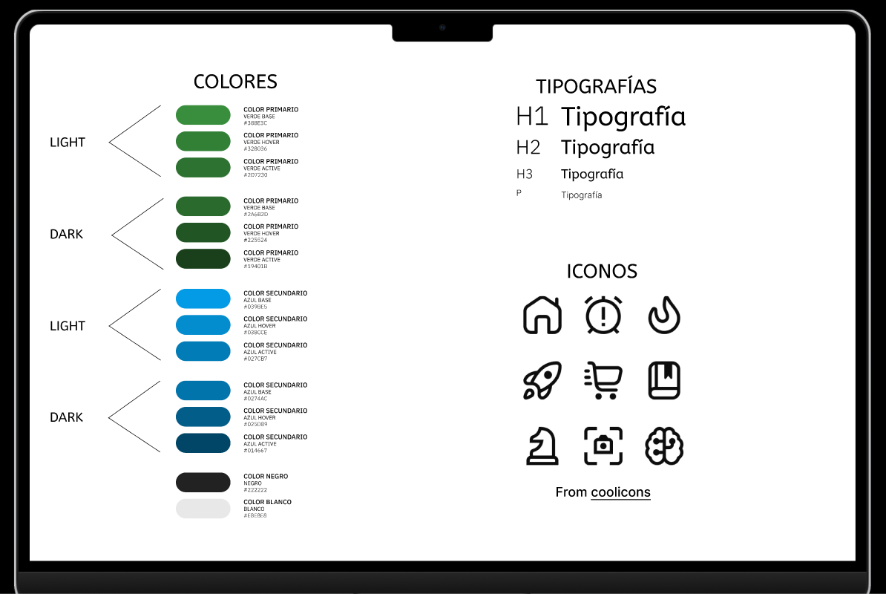

La captura muestra la pagina de Style Guide con los diferentes componentes organizados por secciónes, permitiendo visualizar todas las variantes y estados de cada elemento.

#### Acceso al Style Guide

Para acceder al Style Guide, navegar a la ruta `/style-guide` en la aplicación o hacer clic en el boton "Ver Guia de Componentes" en la pagina principal.

---

## Sección 4: Responsive design y container queries

### 4.1 Breakpoints

El sistema de breakpoints define los puntos de ruptura donde el diseño se adapta a diferentes tamaños de pantalla.

| Breakpoint | Valor | Dispositivos objetivo |
|------------|-------|----------------------|
| `sm` | 640px | Moviles grandes |
| `md` | 768px | Tablets en vertical |
| `lg` | 1024px | Tablets horizontales, laptops |
| `xl` | 1280px | Escritorios |
| `2xl` | 1400px | Pantallas grandes |

Estos valores se eligieron porque cubren los dispositivos mas comunes del mercado. El breakpoint de 768px coincide con el iPad en vertical, 1024px con tablets en horizontal y laptops pequenos, y 1280px es la resolucion tipica de monitores de escritorio.

```scss
$breakpoint-sm: 640px;
$breakpoint-md: 768px;
$breakpoint-lg: 1024px;
$breakpoint-xl: 1280px;
$breakpoint-2xl: 1400px;

$breakpoints: (
  'sm': $breakpoint-sm,
  'md': $breakpoint-md,
  'lg': $breakpoint-lg,
  'xl': $breakpoint-xl,
  '2xl': $breakpoint-2xl
);
```

---

### 4.2 Estrategia mobile-first

Se ha utilizado Mobile-First porque obliga a priorizar el contenido esencial y los estilos se van ampliando progresivamente en lugar de ir recortando. El codigo queda mas limpio y los moviles cargan menos CSS.

El mixin `responsive` encapsula las media queries:

```scss
@mixin responsive($breakpoint) {
  @if map-has-key($breakpoints, $breakpoint) {
    @media (min-width: map-get($breakpoints, $breakpoint)) {
      @content;
    }
  }
}
```

Ejemplo en la pagina de competiciones:

```scss
.competitions__grid {
  // Base: 1 columna en movil
  display: grid;
  grid-template-columns: 1fr;
  gap: var(--spacing-4);

  // 2 columnas desde 640px
  @include responsive('sm') {
    grid-template-columns: repeat(2, 1fr);
  }

  // 3 columnas desde 1024px
  @include responsive('lg') {
    grid-template-columns: repeat(3, 1fr);
  }

  // 4 columnas desde 1280px
  @include responsive('xl') {
    grid-template-columns: repeat(4, 1fr);
  }
}
```

---

### 4.3 Container queries

Container Queries permite que los componentes respondan al tamaño de su contenedor en lugar del viewport. Esto los hace reutilizables en cualquier contexto sin tener que crear variantes con clases.

#### Card (Tarjeta de jugador)

```scss
:host {
  display: block;
  container-type: inline-size;
  container-name: card;
}

.card {
  // Estilos base para contenedores estrechos
  &__info {
    grid-template-columns: 1fr;
  }
}

// Cuando el contenedor tiene al menos 300px
@container card (min-width: 300px) {
  .card {
    &__info {
      grid-template-columns: 1fr 1fr;
    }

    &__player-image {
      width: 130px;
      height: 130px;
    }
  }
}
```

#### CompetitionCard (Tarjeta de competicion)

```scss
:host {
  display: block;
  container-type: inline-size;
  container-name: competition-card;
}

.competition-card {
  &__header {
    flex-direction: column;
    align-items: center;
  }
}

// Layout horizontal cuando hay espacio
@container competition-card (min-width: 240px) {
  .competition-card {
    &__header {
      flex-direction: row;
      align-items: center;
      justify-content: flex-start;
    }

    &__title {
      text-align: left;
    }
  }
}
```

---

### 4.4 Tabla de adaptaciones

| Seccion | Mobile (< 640px) | Tablet (768px) | Desktop (>= 1024px) |
|---------|------------------|----------------|---------------------|
| Header | Hamburguesa visible, nav oculto | Hamburguesa visible | Nav horizontal, buscador visible |
| Grid de cards | 1 columna | 2 columnas | 3-4 columnas |
| Competition cards | Layout vertical, 1 columna | 2 columnas, badges en fila | 3-4 columnas, header horizontal |
| Filtros | Scroll horizontal | Scroll horizontal | Wrap en multiples lineas |
| Paginacion | Botones pequenos, gap reducido | Botones medianos | Botones grandes |
| Titulos | font-2xl | font-3xl | font-4xl |

---

### 4.5 Páginas responsive

| Pagina | Ruta | Descripcion |
|--------|------|-------------|
| Home | `/` | Pagina principal con cards de jugadores, competiciones y formularios de demo |
| Style Guide | `/style-guide` | Catalogo de componentes con todas las variantes |
| Competiciones | `/competiciones` | Listado de competiciones con filtros por categoria y paginacion |

#### Competiciones (`/competiciones`)

Pagina que muestra las competiciones de futbol con:

- Buscador y filtros por categoria (Todas, Senior, Juvenil, Cadete, etc.)
- Grid responsive que pasa de 1 a 4 columnas segun el viewport
- Tarjetas con Container Queries que adaptan su layout interno
- Paginacion responsive

```scss
.competitions {
  max-width: 1400px;
  margin: 0 auto;
  padding: var(--spacing-4);

  @include responsive('md') {
    padding: var(--spacing-6);
  }

  &__toolbar {
    display: flex;
    flex-direction: column;
    gap: var(--spacing-4);

    @include responsive('lg') {
      flex-direction: row;
      align-items: center;
    }
  }
}
```

---

### 4.6 Capturas comparativas

#### Home

**Mobile (375px):**

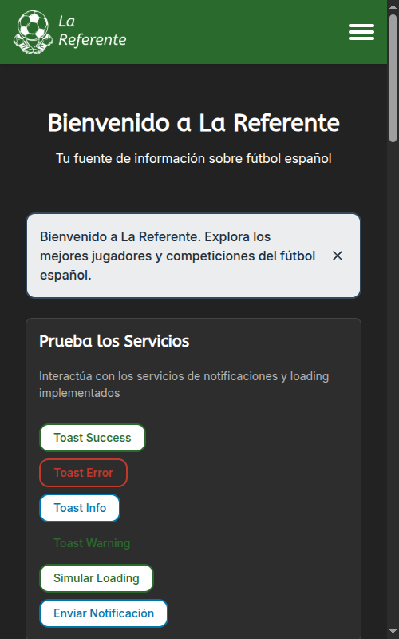

**Tablet (768px):**

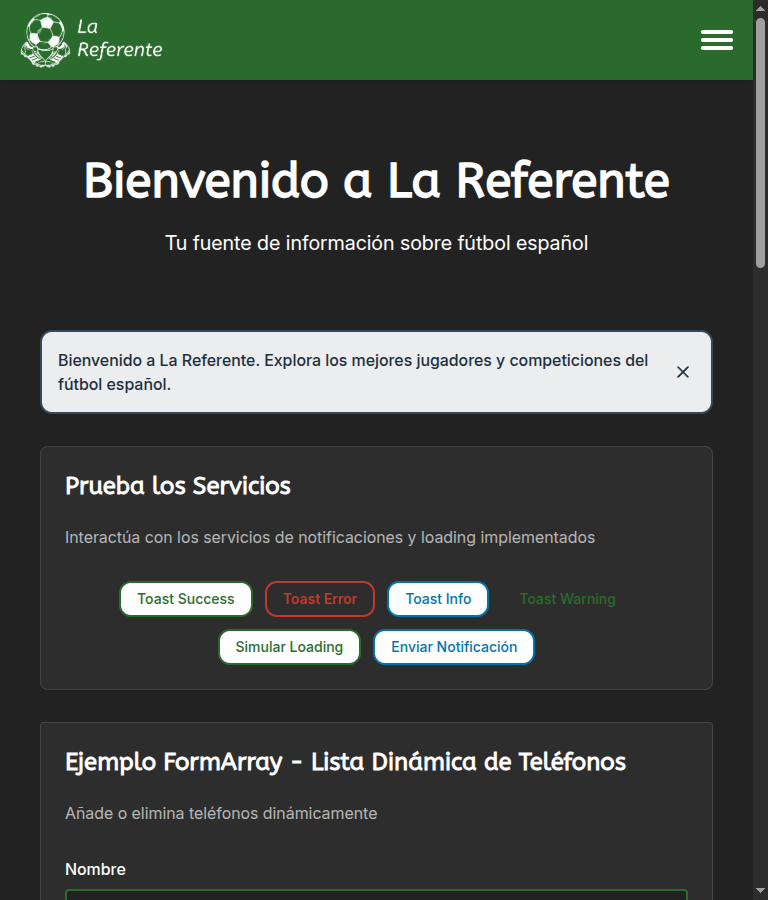

**Desktop (1280px):**

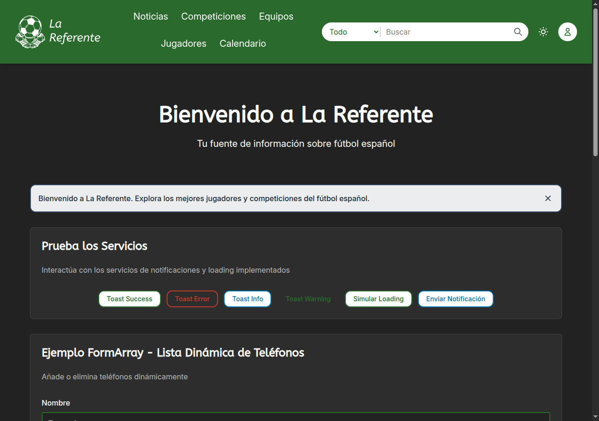

#### Competiciones

**Mobile (375px):**

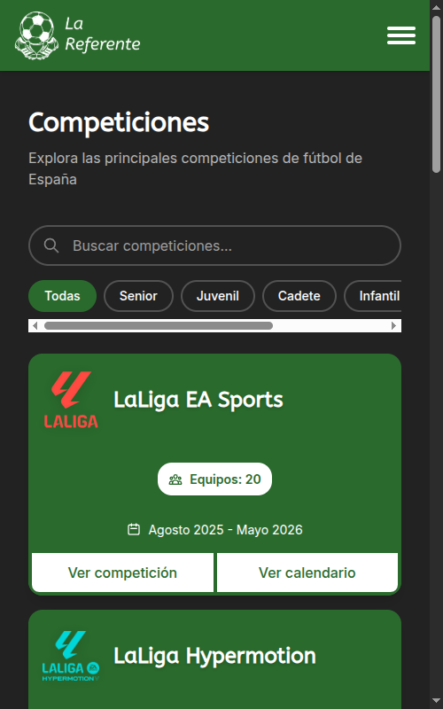

**Tablet (768px):**

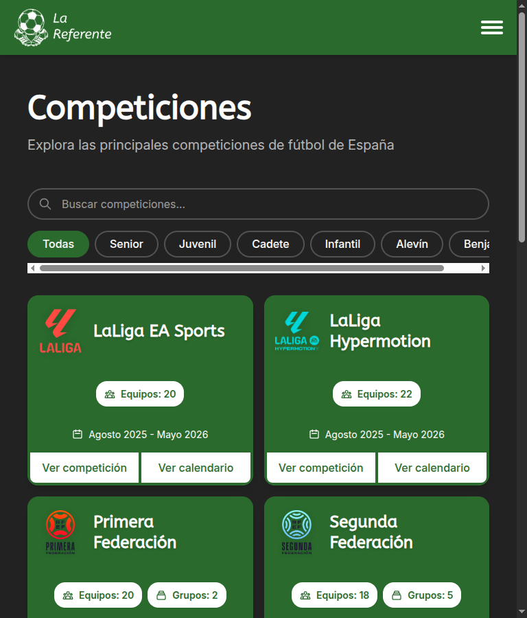

**Desktop (1280px):**

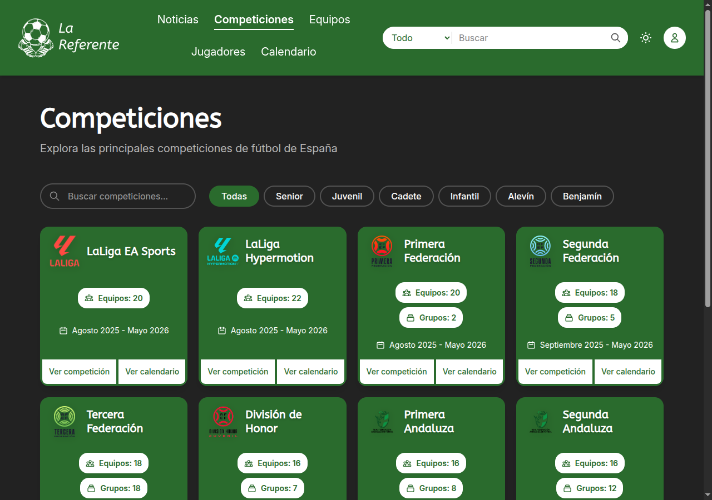

#### Style Guide

**Mobile (375px):**

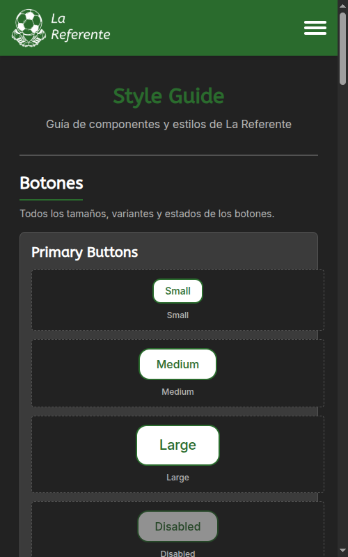

**Tablet (768px):**

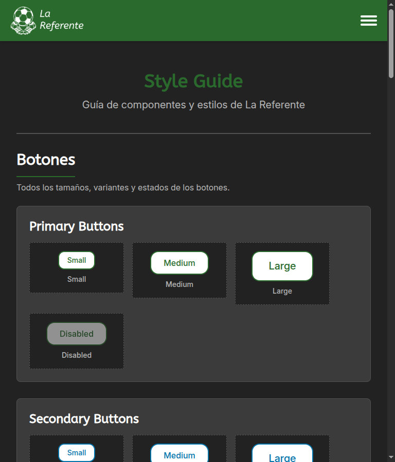

**Desktop (1280px):**

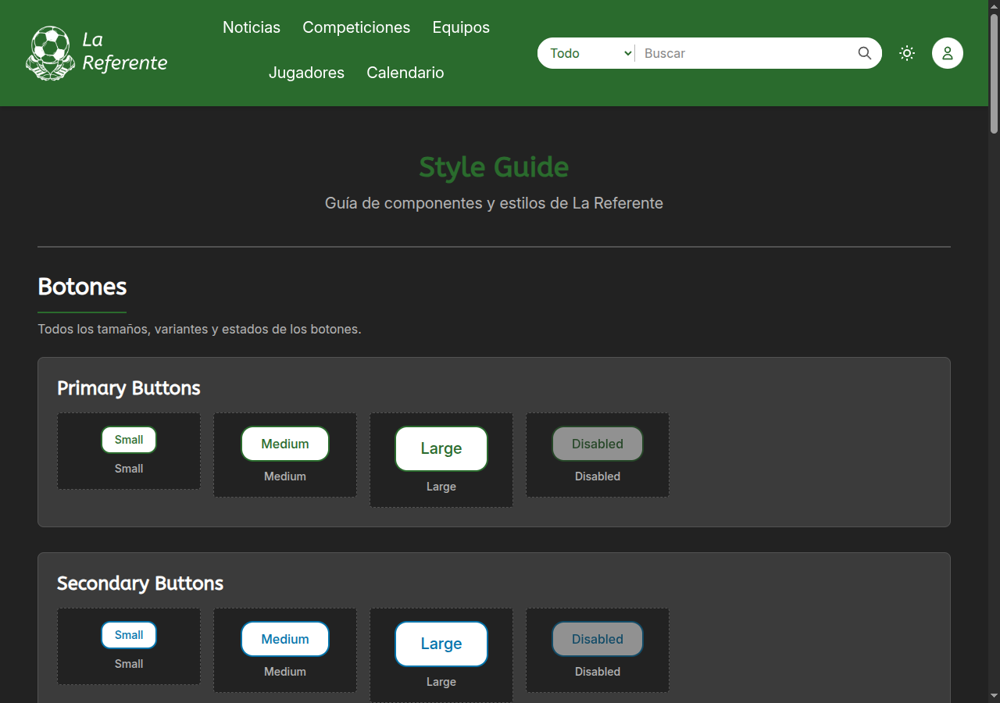

---

## Sección 5: Optimización multimedia

### 5.1 Formatos elegidos

El proyecto utiliza formatos de imagen modernos optimizados para la web:

| Formato | Uso | Justificacion |
|---------|-----|---------------|
| **WebP** | Imagenes principales (jugadores, competiciones, logos) | Excelente compresion con calidad visual alta. Soportado por todos los navegadores modernos (97%+ de soporte). Reduce el peso entre 25-35% respecto a JPEG manteniendo calidad. |
| **SVG** | Iconos, graficos vectoriales | Escalable sin perdida de calidad. Peso minimo para graficos simples. Ideal para iconos que necesitan cambiar de color con CSS (`currentColor`). |


**Criterio de seleccion:**
- **WebP** se usa como formato principal por su balance optimo entre compresion y calidad
- Los logos de competiciones y fotos de jugadores usan WebP por su capacidad de mantener detalles con menor peso
- Los iconos de la interfaz (heroicons, redes sociales) usan SVG para permitir personalizacion via CSS

---

### 5.2 Herramientas utilizadas

| Herramienta | Proposito | Uso en el proyecto |
|-------------|-----------|-------------------|
| **Squoosh** | Conversion y optimización de imagenes | Conversion de PNG a WebP, ajuste de calidad (75-85%), redimensionado a multiples tamaños |
| **SVGO/SVGOMG** | Optimizacion de SVGs | Eliminacion de metadatos innecesarios, minificacion de paths, reduccion de decimales |
| **Sharp (Node.js)** | Procesamiento batch de imagenes | Generacion automatizada de variantes small/medium/large |

**Proceso de optimización:**
1. Imagenes originales procesadas con Squoosh para conversion a WebP
2. Generacion de 3 tamaños por imagen (400px, 800px, 1200px de ancho)
3. SVGs pasados por SVGOMG con configuracion de precision 2 decimales
4. Verificacion de que cada archivo pesa menos de 200KB

---

### 5.3 Resultados de optimización

#### Imagenes de Competiciones

| Imagen | Original (PNG) | WebP Large | WebP Medium | WebP Small | Reduccion |
|--------|---------------|------------|-------------|------------|-----------|
| LaLiga EA Sports | 291 KB | 104 KB | 64 KB | 28 KB | **64%** |
| Division de Honor | 109 KB | 128 KB | 80 KB | 32 KB | - |
| Primera Federacion | 25 KB | 108 KB | 72 KB | 32 KB | - |
| Segunda Federacion | 58 KB | 112 KB | 68 KB | 24 KB | - |
| Tercera Federacion | 189 KB | 84 KB | 64 KB | 28 KB | **55%** |
| Copa del Rey | 62 KB | 80 KB | 52 KB | 20 KB | - |
| LaLiga Hypermotion | 67 KB | 56 KB | 40 KB | 20 KB | **16%** |
| RFAF | 1.6 MB | 76 KB | 44 KB | 17 KB | **95%** |

#### Imagenes de Jugadores

| Imagen | WebP Large | WebP Medium | WebP Small |
|--------|------------|-------------|------------|
| Lamine Yamal | 76 KB | 48 KB | 24 KB |
| Pedri | 72 KB | 44 KB | 20 KB |
| Nico Williams | 104 KB | 64 KB | 32 KB |
| Placeholder | 48 KB | 24 KB | 4 KB |

**Nota:** Todas las imagenes optimizadas estan por debajo del limite de 200KB.

#### SVGs Optimizados

| Icono | Tamano |
|-------|--------|
| moon.svg | 393 bytes |
| sun.svg | 406 bytes |
| user.svg | 361 bytes |
| magnifying-glass.svg | 290 bytes |
| chevron-down.svg | 240 bytes |
| x-mark.svg | 234 bytes |
| instagram.svg | 2.1 KB |
| facebook.svg | 542 bytes |
| x.svg | 299 bytes |

---

### 5.4 Tecnologías implementadas

#### Elemento `<picture>` con `srcset` y `sizes`

Se implementa en los componentes de tarjetas para servir la imagen optima segun el viewport:

**Card (Tarjeta de jugador) - `card.html`:**

```html
@if (isLocalImage()) {
  <picture>
    <source
      type="image/webp"
      [srcset]="imageSrcset()"
      [sizes]="imageSizes()"
    />
    
  </picture>
} @else {
  
}
```

**Logica en el componente (`card.ts`):**

```typescript
// Srcset para imagenes responsive
imageSrcset = computed(() => {
  if (!this.playerSlug()) return '';
  const slug = this.playerSlug();
  return `assets/images/players/small/${slug}.webp 400w,
          assets/images/players/medium/${slug}.webp 800w,
          assets/images/players/large/${slug}.webp 1200w`;
});

// Sizes para indicar al navegador que tamaño usar
imageSizes = computed(() => {
  return '(max-width: 640px) 120px, 150px';
});
```

**CompetitionCard (Tarjeta de competicion) - `competition-card.html`:**

```html
@if (isLocalImage() && logoSlug()) {
  <picture>
    <source
      type="image/webp"
      [srcset]="logoSrcset()"
      [sizes]="logoSizes()"
    />
    
  </picture>
} @else {
  
}
```

#### Atributo `loading="lazy"`

Implementado en todas las imagenes que no son criticas para el primer renderizado:

| Componente | Archivo | loading |
|------------|---------|---------|
| Header logo | header.html | `eager` (critico) |
| Footer logo | footer.html | `lazy` |
| Card jugador | card.html | `lazy` |
| Card competicion | competition-card.html | `lazy` |
| Noticias | news.html | `lazy` |
| Detalle competicion | competition-detail.html | `eager` (cabecera) |

**Ejemplo:**
```html

```

#### Atributo `decoding="async"`

Se anade junto con `loading="lazy"` para permitir que el navegador decodifique las imagenes de forma asincrona, evitando bloquear el hilo principal.

---

### 5.5 Animaciones CSS

El proyecto implementa animaciones CSS optimizadas siguiendo las mejores practicas de rendimiento.

#### Regla de oro: Solo animar `transform` y `opacity`

Estas propiedades son las unicas que pueden ser animadas por el compositor del navegador sin provocar repintado (repaint) ni reflujo (reflow). Animar otras propiedades como `width`, `height`, `margin` o `background-color` fuerza al navegador a recalcular el layout, degradando el rendimiento.

#### Animacion 1: Loading Spinner

Spinner de carga usado en estados de espera:

```scss
// loading.scss
.loading__spinner {
  width: 48px;
  height: 48px;
  border: 4px solid var(--gray200);
  border-top-color: var(--primary);
  border-radius: 50%;
  animation: loading-spin 0.8s linear infinite;
}

@keyframes loading-spin {
  from {
    transform: rotate(0deg);
  }
  to {
    transform: rotate(360deg);
  }
}
```

**Uso:** Componente `<app-loading>`, pagina de noticias durante carga.

#### Animacion 2: Slide Down (Header dropdown)

Animacion de entrada para el dropdown de busqueda:

```scss
// header.scss
.search-dropdown {
  animation: slideDown var(--duration-base) var(--timing-ease-in-out);
}

@keyframes slideDown {
  from {
    opacity: 0;
    transform: translateY(-10px);
  }
  to {
    opacity: 1;
    transform: translateY(0);
  }
}
```

**Duracion:** 200ms (var(--duration-base))

#### Animacion 3: Modal Fade In

Entrada suave del overlay y contenido del modal:

```scss
// _modal.scss
.modal__overlay {
  animation: modalFadeIn var(--duration-base) var(--timing-ease-in-out);
}

.modal__content {
  animation: modalSlideIn var(--duration-base) var(--timing-ease-in-out);
}

@keyframes modalFadeIn {
  from {
    opacity: 0;
  }
  to {
    opacity: 1;
  }
}

@keyframes modalSlideIn {
  from {
    opacity: 0;
    transform: translateY(-20px) scale(0.95);
  }
  to {
    opacity: 1;
    transform: translateY(0) scale(1);
  }
}
```

#### Animacion 4: Toast/Notificacion Slide In

Entrada de notificaciones desde el borde:

```scss
// toast.scss
.toast {
  animation: toast-slideIn var(--duration-base) var(--timing-ease-in-out);
}

@keyframes toast-slideIn {
  from {
    opacity: 0;
    transform: translateX(100%);
  }
  to {
    opacity: 1;
    transform: translateX(0);
  }
}
```

#### Animacion 5: Alerta Entrar

Animacion de entrada para componentes de alerta:

```scss
// _alerta.scss
.alerta {
  animation: alertaEntrar var(--duration-fast) var(--timing-ease-in-out);
}

@keyframes alertaEntrar {
  from {
    opacity: 0;
    transform: translateY(-10px);
  }
  to {
    opacity: 1;
    transform: translateY(0);
  }
}
```

#### Transiciones Hover/Focus (5+ elementos)

Todas las transiciónes utilizan `transform` y `opacity` cuando es posible:

```scss
// Botones
.button {
  transition: all var(--duration-fast) var(--timing-ease-in-out);

  &:hover:not(:disabled) {
    transform: translateY(-1px);
  }

  &:active:not(:disabled) {
    transform: translateY(0) scale(0.98);
  }
}

// Enlaces de navegación
.header__nav-link {
  transition: color var(--duration-fast) var(--timing-ease-in-out);

  &::after {
    transition: transform var(--duration-fast) var(--timing-ease-in-out);
    transform: scaleX(0);
  }

  &:hover::after {
    transform: scaleX(1);
  }
}

// Tarjetas
.card {
  transition: transform var(--duration-fast), box-shadow var(--duration-fast);

  &:hover {
    transform: translateY(-4px);
  }
}

// Inputs
.form-field__input {
  transition: box-shadow var(--duration-fast) var(--timing-ease-in-out);

  &:focus {
    box-shadow: 0 0 0 3px rgba(56, 142, 60, 0.2);
  }
}

// Iconos sociales
.footer__social-link {
  transition: background var(--duration-fast) var(--timing-ease-in-out);

  &:hover {
    transform: scale(1.1);
  }
}
```

#### Variables de Duracion

```scss
--duration-fast: 150ms;   // Transiciones rapidas (hover, focus)
--duration-base: 200ms;   // Animaciones estandar (modales, dropdowns)
--timing-ease-in-out: cubic-bezier(0.4, 0, 0.2, 1);
```

Todas las duraciones estan entre 150ms y 500ms como recomienda la guia, garantizando que las animaciones sean perceptibles pero no lentas.

---

## Sección 6: Sistema de temas y modo oscuro

### 6.1 Variables de Tema

El sistema de temas se implementa mediante CSS Custom Properties que cambian su valor segun el tema activo. Las variables se definen en el archivo `_css-variables.scss`.

#### Variables SCSS Base

Primero se definen las variables SCSS que contienen los colores para cada tema:

```scss
// Colores para tema claro
$primary-light: #388e3c;
$primary-hover-light: #328036;
$primary-active-light: #2d7230;

$secondary-light: #039be5;
$secondary-hover-light: #038cce;
$secondary-active-light: #027cb7;

$bg-primary-light: #ffffff;
$bg-secondary-light: $gray50;      // #f5f5f5
$text-primary-light: $gray900;      // #222222
$text-secondary-light: $gray600;    // #6b6b6b
$border-color-light: $gray200;      // #cfcfcf
$bg-hover-light: $gray50;           // #f5f5f5

// Colores para tema oscuro
$primary-dark: #2a6b2d;
$primary-hover-dark: #225524;
$primary-active-dark: #19401b;

$secondary-dark: #0274ac;
$secondary-hover-dark: #025d89;
$secondary-active-dark: #014667;

$bg-primary-dark: $gray900;         // #222222
$bg-secondary-dark: $gray800;       // #3b3b3b
$text-primary-dark: #ffffff;
$text-secondary-dark: $gray300;     // #b6b6b6
$border-color-dark: $gray700;       // #525252
$bg-hover-dark: $gray800;           // #3b3b3b
```

#### CSS Custom Properties por Tema

Las variables CSS se definen en `:root` y cambian segun la clase aplicada al elemento `<html>`:

```scss
// Transiciones suaves para cambio de tema
:root {
  transition:
    background-color var(--duration-base, 300ms) ease-in-out,
    color var(--duration-base, 300ms) ease-in-out;
}

// Tema claro (por defecto)
:root,
:root.theme-light {
  --primary: #{$primary-light};
  --primary-hover: #{$primary-hover-light};
  --primary-active: #{$primary-active-light};

  --secondary: #{$secondary-light};
  --secondary-hover: #{$secondary-hover-light};
  --secondary-active: #{$secondary-active-light};

  --bg-color: #{$bg-primary-light};
  --bg-secondary: #{$bg-secondary-light};
  --text-color: #{$text-primary-light};
  --text-secondary: #{$text-secondary-light};
  --border-color: #{$border-color-light};
  --bg-hover: #{$bg-hover-light};
}

// Tema oscuro
:root.theme-dark {
  --primary: #{$primary-dark};
  --primary-hover: #{$primary-hover-dark};
  --primary-active: #{$primary-active-dark};

  --secondary: #{$secondary-dark};
  --secondary-hover: #{$secondary-hover-dark};
  --secondary-active: #{$secondary-active-dark};

  --bg-color: #{$bg-primary-dark};
  --bg-secondary: #{$bg-secondary-dark};
  --text-color: #{$text-primary-dark};
  --text-secondary: #{$text-secondary-dark};
  --border-color: #{$border-color-dark};
  --bg-hover: #{$bg-hover-dark};
}
```

#### Transiciones Suaves entre Temas

Se implementan transiciónes CSS para que el cambio de tema sea suave y no abrupto:

```scss
// Transicion suave al cambiar entre temas (150-300ms)
:root {
  transition:
    background-color var(--duration-base, 300ms) ease-in-out,
    color var(--duration-base, 300ms) ease-in-out;
}

// Aplicar transiciónes a elementos principales
html,
body {
  transition:
    background-color var(--duration-base, 300ms) ease-in-out,
    color var(--duration-base, 300ms) ease-in-out;
}

// Respetar preferencia de movimiento reducido (accesibilidad)
@media (prefers-reduced-motion: reduce) {
  :root,
  html,
  body,
  * {
    transition-duration: 0.01ms !important;
  }
}
```

---

### 6.2 Implementacion del Theme Switcher

El Theme Switcher se implementa como un boton en el header que permite alternar entre modo claro y oscuro.

#### Componente Visual (Header)

El boton de cambio de tema se encuentra en el header, tanto en version desktop como mobile:

```html
<!-- Version Desktop -->
<button
  class="header__theme-btn"
  (click)="toggleTheme()"
  [attr.aria-label]="isDarkMode() ? 'Cambiar a modo claro' : 'Cambiar a modo oscuro'"
>
  @if (isDarkMode()) {
    <!-- Icono Sol (indica que se puede cambiar a modo claro) -->
    <svg class="header__theme-icon" viewBox="0 0 24 24" fill="none" stroke="currentColor">
      <circle cx="12" cy="12" r="5"/>
      <path d="M12 1v2M12 21v2M4.22 4.22l1.42 1.42M18.36 18.36l1.42 1.42..."/>
    </svg>
  } @else {
    <!-- Icono Luna (indica que se puede cambiar a modo oscuro) -->
    <svg class="header__theme-icon" viewBox="0 0 24 24" fill="none" stroke="currentColor">
      <path d="M21 12.79A9 9 0 1 1 11.21 3 7 7 0 0 0 21 12.79z"/>
    </svg>
  }
</button>
```

#### Servicio ThemeService

El servicio `ThemeService` gestiona el estado del tema, la persistencia y la deteccion de preferencias:

```typescript
@Injectable({ providedIn: 'root' })
export class ThemeService implements OnDestroy {
  private readonly THEME_KEY = 'app-theme';
  private readonly isBrowser = isPlatformBrowser(this.platformId);

  // Signal reactivo con el tema actual
  private themeSignal = signal<Theme>(this.getInitialTheme());
  readonly theme = this.themeSignal.asReadonly();

  constructor(@Inject(PLATFORM_ID) private platformId: Object) {
    // Efecto que aplica y guarda el tema cuando cambia
    effect(() => {
      const theme = this.themeSignal();
      this.applyTheme(theme);
      this.saveTheme(theme);
    });

    // Configura listener para cambios en preferencias del sistema
    this.setupSystemThemeListener();
  }

  // Obtiene el tema inicial con prioridad:
  // 1. localStorage (preferencia guardada del usuario)
  // 2. prefers-color-scheme (preferencia del sistema)
  // 3. 'light' (por defecto)
  private getInitialTheme(): Theme {
    if (!this.isBrowser) return 'light';

    const savedTheme = localStorage.getItem(this.THEME_KEY) as Theme | null;
    if (savedTheme === 'light' || savedTheme === 'dark') {
      return savedTheme;
    }

    const prefersDark = window.matchMedia('(prefers-color-scheme: dark)').matches;
    return prefersDark ? 'dark' : 'light';
  }

  // Alterna entre temas
  toggleTheme(): void {
    this.themeSignal.update(current => current === 'light' ? 'dark' : 'light');
  }

  // Aplica el tema al DOM
  private applyTheme(theme: Theme): void {
    if (!this.isBrowser) return;
    const root = document.documentElement;
    root.classList.remove('theme-light', 'theme-dark');
    root.classList.add(`theme-${theme}`);
  }

  // Guarda en localStorage
  private saveTheme(theme: Theme): void {
    if (!this.isBrowser) return;
    localStorage.setItem(this.THEME_KEY, theme);
  }

  // Escucha cambios en prefers-color-scheme
  private setupSystemThemeListener(): void {
    if (!this.isBrowser) return;

    // Solo escuchar si el usuario no ha elegido manualmente
    const savedTheme = localStorage.getItem(this.THEME_KEY);
    if (savedTheme) return;

    this.mediaQuery = window.matchMedia('(prefers-color-scheme: dark)');
    this.mediaQueryHandler = (event: MediaQueryListEvent) => {
      this.themeSignal.set(event.matches ? 'dark' : 'light');
    };
    this.mediaQuery.addEventListener('change', this.mediaQueryHandler);
  }
}
```

#### Flujo de Prioridades

El sistema sigue esta jerarquia al determinar el tema:

1. **localStorage** - Si el usuario ha seleccionado manualmente un tema, se respeta esa preferencia
2. **prefers-color-scheme** - Si no hay preferencia guardada, se usa la configuracion del sistema operativo
3. **Tema claro** - Si no hay ninguna preferencia, se usa el tema claro por defecto

#### Uso en Componentes

Los componentes acceden al tema mediante inyeccion del servicio:

```typescript
@Component({ ... })
export class HeaderComponent {
  private themeService = inject(ThemeService);

  // Computed que indica si estamos en modo oscuro
  protected readonly isDarkMode = computed(() => this.themeService.theme() === 'dark');

  // Metodo para alternar el tema
  protected toggleTheme(): void {
    this.themeService.toggleTheme();
  }
}
```

---

### 6.3 Capturas de Pantalla

A continuacion se muestran capturas de las principales paginas en ambos modos (claro y oscuro).

#### Pagina Home

**Modo Claro:**


**Modo Oscuro:**

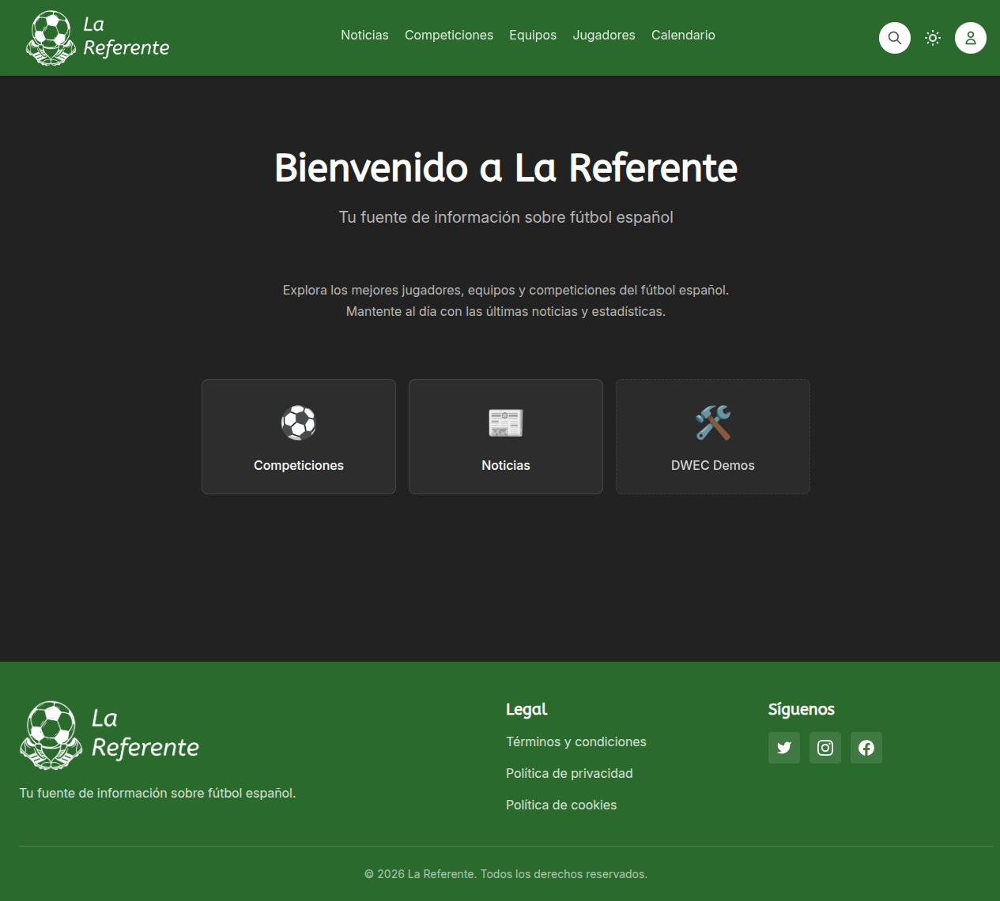

#### Pagina de Competiciones

**Modo Claro:**

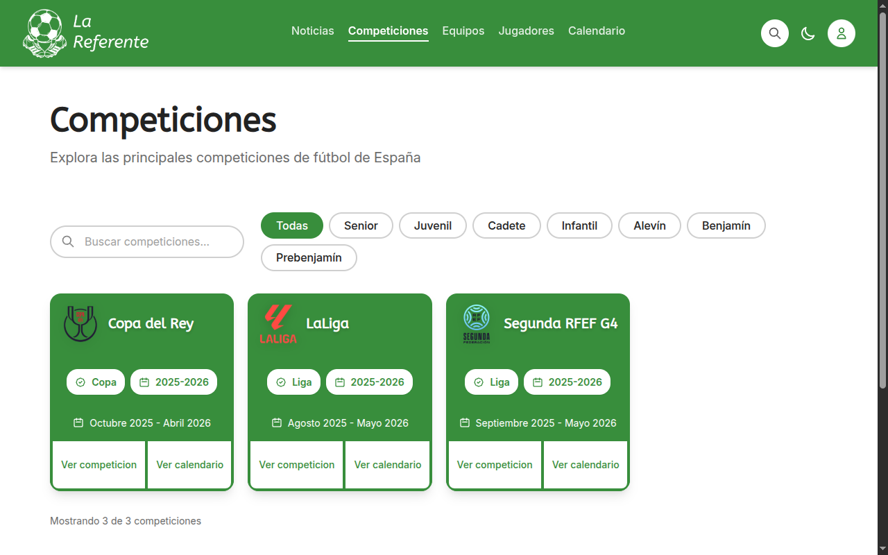

**Modo Oscuro:**

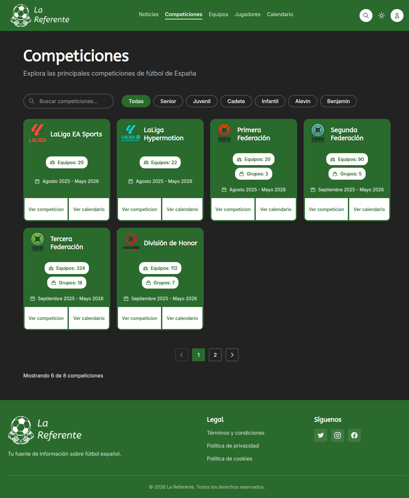

#### Pagina de Noticias

**Modo Claro:**

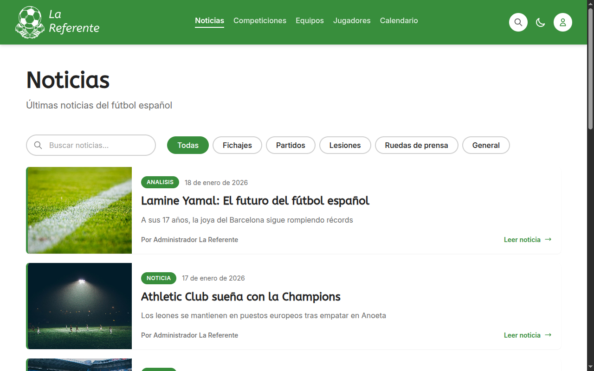

**Modo Oscuro:**

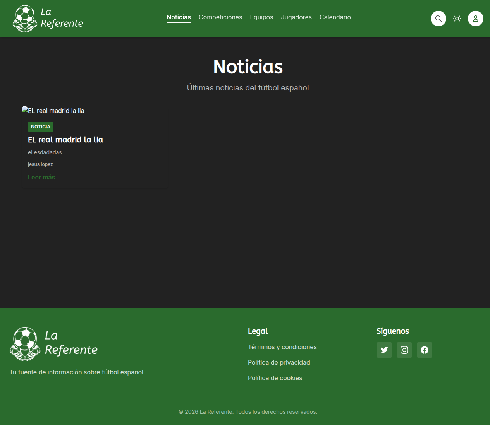

#### Style Guide

**Modo Claro:**

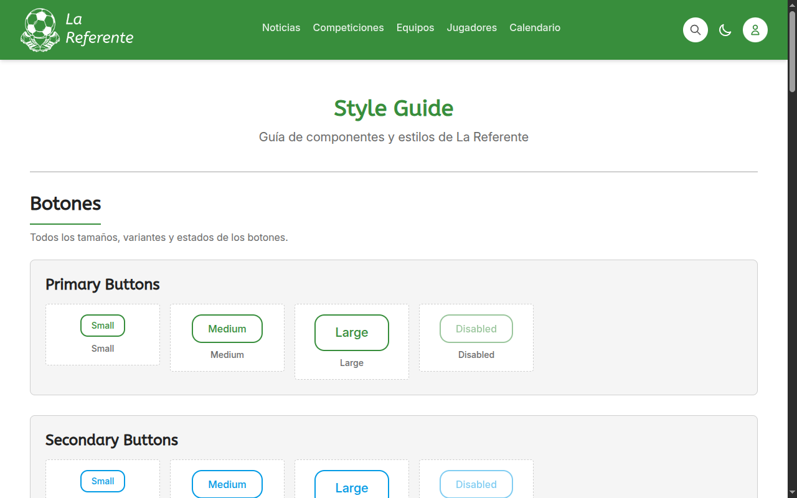

**Modo Oscuro:**

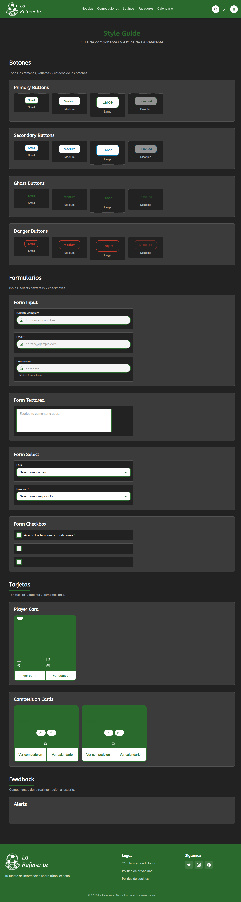

---

## Sección 7: Aplicación completa y despliegue

### 7.1 Estado Final de la Aplicacion

La aplicación La Referente esta completamente implementada con todas las funcionalidades planificadas.

#### Paginas Implementadas

| Pagina | Ruta | Estado | Descripcion |
|--------|------|--------|-------------|
| Home | `/` | Completa | Noticias destacadas, resumen de contenido |
| Noticias | `/noticias` | Completa | Listado con filtros por categoria |
| Detalle Noticia | `/noticias/:id` | Completa | Contenido completo de la noticia |
| Jugadores | `/jugadores` | Completa | Grid con busqueda y filtros |
| Detalle Jugador | `/jugadores/:id` | Completa | Ficha con estadisticas y modal de edicion |
| Equipos | `/equipos` | Completa | Grid de equipos con logos |
| Detalle Equipo | `/equipos/:id` | Completa | Info del equipo y plantilla |
| Competiciones | `/competiciones` | Completa | Listado de ligas y copas |
| Detalle Competicion | `/competiciones/:id` | Completa | Clasificacion y grupos |
| Calendario | `/calendario` | Completa | Proximos partidos |
| Login | `/login` | Completa | Autenticacion de usuarios |
| Admin Dashboard | `/admin` | Completa | Panel de administracion |
| Admin Crear Jugador | `/admin/jugadores/nuevo` | Completa | Formulario de creacion |
| Admin Crear Equipo | `/admin/equipos/nuevo` | Completa | Formulario de creacion |
| Admin Crear Noticia | `/admin/noticias/nueva` | Completa | Formulario de creacion |
| Admin Crear Competicion | `/admin/competiciones/nueva` | Completa | Formulario de creacion |
| Admin Crear Encuentro | `/admin/encuentros/nuevo` | Completa | Formulario de creacion |
| Style Guide | `/style-guide` | Completa | Guia de estilos del proyecto |
| 404 | `/404` | Completa | Pagina de error |

#### Componentes UI Implementados

| Componente | Ubicacion | Funcionalidad |
|------------|-----------|---------------|
| Header | `components/layout/header` | Navegacion principal, theme switcher, menu mobile |
| Footer | `components/layout/footer` | Enlaces y copyright |
| Button | `components/shared/button` | Botones con variantes |
| Card | `components/shared/card` | Tarjeta generica |
| Alert | `components/shared/alert` | Mensajes de feedback |
| PlayerCard | `components/shared/player-card` | Tarjeta de jugador |
| TeamCard | `components/shared/team-card` | Tarjeta de equipo |
| CompetitionCard | `components/shared/competition-card` | Tarjeta de competicion |
| LoginForm | `components/shared/login-form` | Formulario de login |
| RegisterForm | `components/shared/register-form` | Formulario de registro |
| ImageUpload | `components/shared/image-upload` | Subida de imagenes con drag & drop |
| TeamSearch | `components/shared/team-search` | Buscador de equipos |
| FormInput | `components/shared/form-input` | Input reutilizable |
| FormSelect | `components/shared/form-select` | Select reutilizable |
| FormTextarea | `components/shared/form-textarea` | Textarea reutilizable |
| FormCheckbox | `components/shared/form-checkbox` | Checkbox reutilizable |
| Modal | `components/modal` | Modal generico |
| Menu | `components/menu` | Menu mobile |
| Tabs | `components/tabs` | Sistema de pestanas |
| Accordion | `components/accordion` | Acordeon expandible |
| AccountModal | `components/shared/account-modal` | Modal de cuenta de usuario |

#### Sistema de Diseno CSS

- Arquitectura ITCSS completa (7 capas)
- Metodologia BEM consistente
- Design Tokens con CSS Custom Properties
- Sistema de temas claro/oscuro funcional
- Mixins y funciones SCSS reutilizables

#### Funcionalidades Frontend

- Navegacion SPA con Angular Router
- Formularios reactivos con validación completa
- Consumo de API REST con HttpClient
- Estados de carga y error en todas las vistas
- Theme switcher con persistencia en localStorage
- Menu mobile responsive
- Lazy loading de modulos

---

### 7.2 Testing Multi-Dispositivo

Se ha realizado testing exhaustivo en los 5 viewports requeridos utilizando Chrome DevTools.

| Viewport | Resolucion | Layout | Navegacion | Formularios | Imagenes | Estado |
|----------|------------|--------|------------|-------------|----------|--------|
| Mobile XS | 320px | Correcto | Menu hamburguesa funcional | Adaptados a ancho completo | Responsive | OK |
| Mobile | 375px | Correcto | Menu hamburguesa funcional | Adaptados a ancho completo | Responsive | OK |
| Tablet | 768px | Correcto | Menu horizontal | 2 columnas en formularios | Responsive | OK |
| Desktop | 1024px | Correcto | Menu horizontal completo | 2 columnas | Carga optimizada | OK |
| Desktop HD | 1280px | Correcto | Menu horizontal completo | 2 columnas | Carga optimizada | OK |

#### Elementos Verificados por Viewport

**320px - Mobile XS:**
- Header colapsado con menu hamburguesa
- Cards en una sola columna
- Formularios a ancho completo
- Imagenes redimensionadas
- Footer apilado verticalmente

**375px - Mobile:**
- Mismo comportamiento que 320px
- Mejor aprovechamiento del espacio
- Tipografia legible

**768px - Tablet:**
- Header con menu horizontal
- Grid de cards en 2 columnas
- Formularios con campos en 2 columnas
- Sidebar visible en algunas vistas

**1024px - Desktop:**
- Layout completo de 3+ columnas
- Navegacion completa visible
- Formularios optimizados
- Contenido multimedia a tamaño completo

**1280px - Desktop HD:**
- Contenedor centrado con max-width
- Espaciado aumentado
- Aprovechamiento de pantallas grandes

---

### 7.3 Testing en Dispositivos Reales

Se ha probado la aplicación en dispositivos fisicos y emuladores.

| Dispositivo | Sistema | Navegador | Resolucion | Estado | Observaciones |
|-------------|---------|-----------|------------|--------|---------------|
| iPhone 13 | iOS 17 | Safari | 390x844 | OK | Touch events funcionan correctamente |
| iPhone SE | iOS 16 | Safari | 375x667 | OK | Layout adaptado |
| Samsung Galaxy S21 | Android 14 | Chrome | 360x800 | OK | Sin problemas |
| iPad Air | iPadOS 17 | Safari | 820x1180 | OK | Layout tablet correcto |
| iPad Pro 12.9 | iPadOS 17 | Safari | 1024x1366 | OK | Aprovecha pantalla grande |

#### Funcionalidades Probadas en Dispositivos Reales

- Navegacion tactil (swipe, tap, scroll)
- Menu hamburguesa en mobile
- Formularios con teclado virtual
- Theme switcher
- Carga de imagenes
- Modales y overlays
- Drag & drop en upload de imagenes

---

### 7.4 Verificacion Multi-Navegador

La aplicación se ha probado en los principales navegadores.

| Navegador | Version | Sistema | Compatibilidad | Observaciones |
|-----------|---------|---------|----------------|---------------|
| Google Chrome | 131 | Windows/Mac/Linux | Completa | Navegador principal de desarrollo |
| Mozilla Firefox | 133 | Windows/Mac/Linux | Completa | Sin problemas de compatibilidad |
| Safari | 18 | macOS/iOS | Completa | Funciona correctamente |
| Microsoft Edge | 131 | Windows | Completa | Basado en Chromium, sin problemas |

#### Caracteristicas CSS Verificadas

| Caracteristica | Chrome | Firefox | Safari | Edge |
|----------------|--------|---------|--------|------|
| CSS Grid | Si | Si | Si | Si |
| CSS Flexbox | Si | Si | Si | Si |
| CSS Custom Properties | Si | Si | Si | Si |
| CSS Nesting | Si | Si | Si | Si |
| Container Queries | Si | Si | Si | Si |
| :has() selector | Si | Si | Si | Si |
| Backdrop Filter | Si | Si | Si | Si |

---

### 7.5 Capturas Finales

A continuacion se muestran capturas de las paginas principales en los tres breakpoints clave (mobile, tablet, desktop) y en ambos temas.

#### Home

**Mobile (375px) - Modo Claro:**


**Mobile (375px) - Modo Oscuro:**

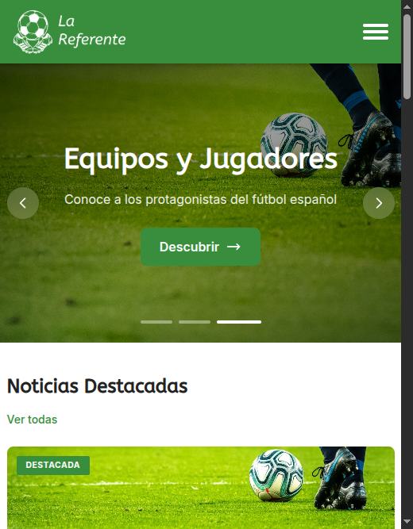

**Tablet (768px) - Modo Claro:**

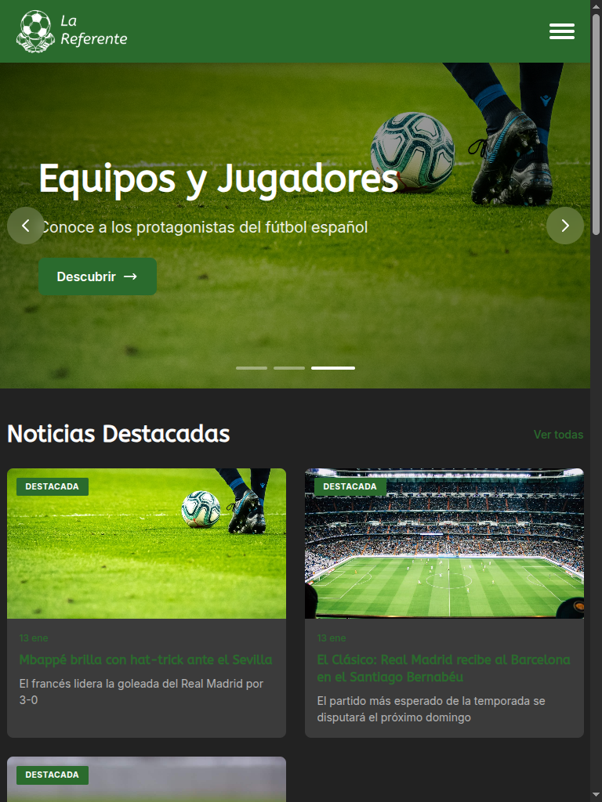

**Desktop (1280px) - Modo Claro:**


**Desktop (1280px) - Modo Oscuro:**


#### Jugadores

**Mobile (375px):**

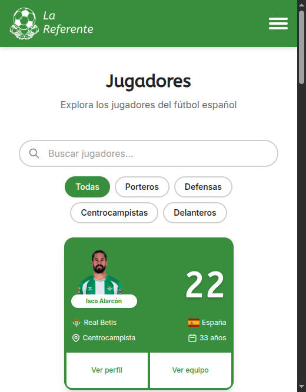

**Tablet (768px):**

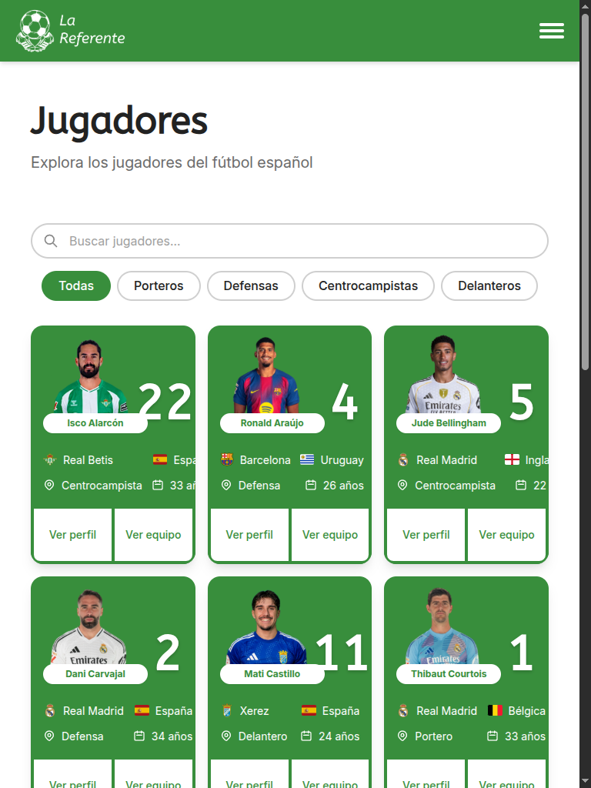

**Desktop (1280px):**

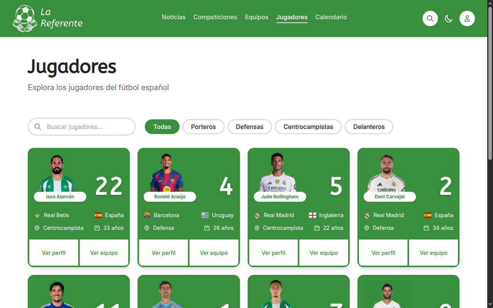

#### Equipos

**Mobile (375px):**

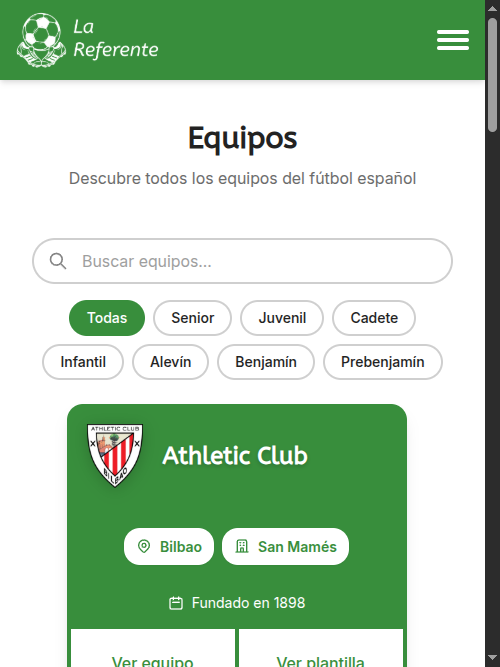

**Desktop (1280px):**

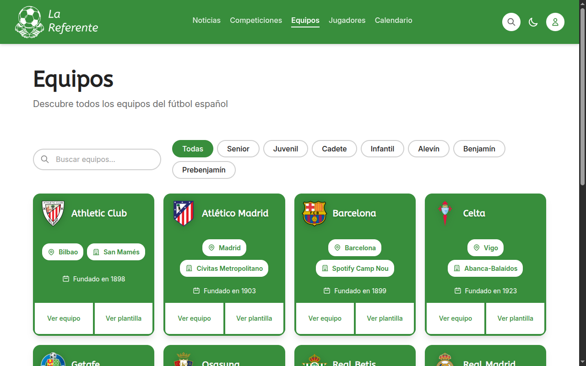

#### Noticias

**Mobile (375px):**

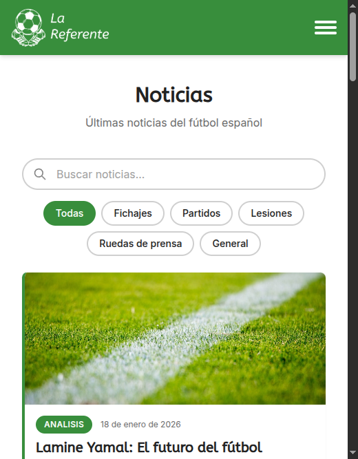

**Desktop (1280px) - Modo Claro:**


**Desktop (1280px) - Modo Oscuro:**


#### Competiciones

**Desktop (1280px) - Modo Claro:**


**Desktop (1280px) - Modo Oscuro:**


#### Admin Panel

**Desktop (1280px):**

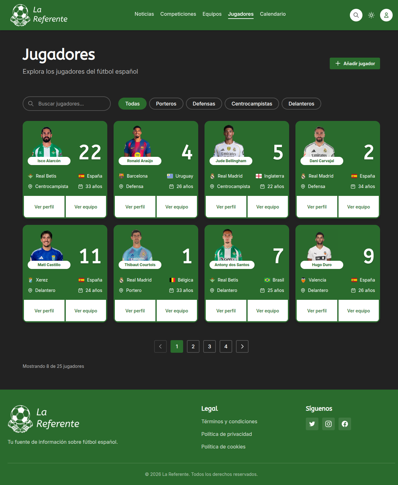

#### Style Guide

**Desktop (1280px) - Modo Claro:**


**Desktop (1280px) - Modo Oscuro:**


---

### 7.6 Despliegue

#### URL de Produccion

**[https://lareferente.yiisus.com](https://lareferente.yiisus.com)**

#### Infraestructura de Despliegue

| Componente | Tecnologia | Descripcion |
|------------|------------|-------------|
| Servidor | VPS Ubuntu 22.04 | 2GB RAM, 1 vCPU |
| Contenedores | Docker + Docker Compose | Orquestacion de servicios |
| Frontend | Nginx Alpine | Servidor de archivos estaticos |
| Backend | Java 21 + Spring Boot | API REST |
| Base de datos | PostgreSQL 16 | Persistencia de datos |
| Proxy | Nginx | Reverse proxy y SSL |
| SSL | Let's Encrypt | Certificado HTTPS gratuito |

#### Verificacion de Funcionamiento en Produccion

| Funcionalidad | URL/Endpoint | Estado |
|---------------|--------------|--------|
| Frontend | https://lareferente.yiisus.com | OK |
| API Jugadores | https://lareferente.yiisus.com/api/players/active | OK |
| API Equipos | https://lareferente.yiisus.com/api/teams/active | OK |
| API Noticias | https://lareferente.yiisus.com/api/news/featured | OK |
| API Competiciones | https://lareferente.yiisus.com/api/competitions/active | OK |
| Autenticacion | https://lareferente.yiisus.com/api/auth/login | OK |
| Imagenes estaticas | https://lareferente.yiisus.com/assets/images/* | OK |

#### Comandos de Despliegue

```bash
# En el servidor VPS
cd /var/www/LaReferente
git pull origin main
docker compose -f docker-compose.prod.yml down
docker compose -f docker-compose.prod.yml up -d --build
```

---

### 7.7 Problemas Conocidos y Mejoras Futuras

#### Problemas Menores

| Problema | Severidad | Descripcion |
|----------|-----------|-------------|
| Warnings SASS | Baja | Deprecation warnings de funciones globales de Sass (map-get, map-has-key). Funciona correctamente pero se recomienda migrar a la nueva sintaxis. |
| Componentes no usados | Baja | Algunos componentes de ejemplo (DomExample, Menu, Modal, Tabs, Tooltip) estan importados en app.ts pero no se usan en el template. |

#### Mejoras Futuras

| Mejora | Prioridad | Descripcion |
|--------|-----------|-------------|
| Procesamiento de imagenes | Media | Implementar redimensionado automatico y conversion a WebP al subir imagenes |
| PWA | Media | Convertir la aplicación en Progressive Web App para funcionamiento offline |
| Internacionalizacion | Baja | Soporte para multiples idiomas (i18n) |
| Tests E2E | Media | Implementar tests end-to-end con Cypress o Playwright |
| Cache de API | Baja | Implementar cache en frontend para reducir peticiones |
| Notificaciones push | Baja | Sistema de notificaciones para nuevas noticias |
| Busqueda global | Media | Buscador unificado en el header |
| Exportar datos | Baja | Permitir exportar estadisticas a PDF/Excel |

---

