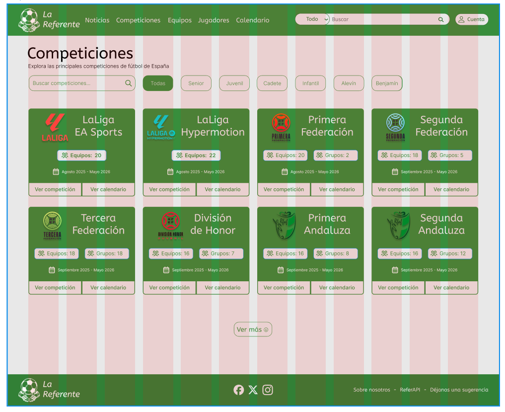

# Sección 1: Arquitectura CSS y comunicación visual

## 1.1 Principios de comunicación visual

### Jerarquía: Tamaños, pesos y espaciado para crear importancia visual

La jerarquía visual en "La Referente" se establece mediante un sistema tipográfico escalado y consistente:

**Sistema de tamaños tipográficos:**
```scss
--font-xs:  0.75rem;   // 12px - Textos secundarios, labels pequeños
--font-s:   0.875rem;  // 14px - Textos de cuerpo secundario
--font-m:   1rem;      // 16px - Texto base, párrafos principales
--font-l:   1.25rem;   // 20px - Subtítulos, destacados
--font-xl:  1.5rem;    // 24px - Títulos de sección
--font-2xl: 1.875rem;  // 30px - Títulos de página secundarios
--font-3xl: 2.25rem;   // 36px - Títulos principales
--font-4xl: 3rem;      // 48px - Headers destacados
--font-5xl: 3.75rem;   // 60px - Hero sections
```

**Pesos tipográficos para enfatizar:**
- `--font-light` (light): Textos decorativos o secundarios
- `--font-regular` (normal): Texto de lectura estándar
- `--font-medium` (medium): Textos con ligero énfasis
- `--font-semibold` (600): Subtítulos y elementos importantes
- `--font-bold` (bold): Títulos principales y CTAs

**Aplicación en el proyecto:**
- **H1**: `--font-3xl` + `--font-bold` → Títulos principales de página
- **H2**: `--font-xl` + `--font-semibold` → Títulos de sección
- **H3**: `--font-l` + `--font-medium` → Subtítulos
- **Body**: `--font-m` + `--font-regular` → Contenido principal
- **Small**: `--font-s` + `--font-regular` → Metadatos, fechas

**Espaciado para separar niveles:**
```scss
--spacing-1:  0.25rem;  // Espacios mínimos
--spacing-2:  0.5rem;   // Entre texto relacionado
--spacing-4:  1rem;     // Entre elementos de grupo
--spacing-8:  2rem;     // Entre secciones pequeñas
--spacing-12: 3rem;     // Entre secciones medias
--spacing-16: 4rem;     // Entre secciones principales
--spacing-24: 6rem;     // Entre bloques de contenido
```

> **Captura de pantalla:** 

---

### Contraste: Color, tamaño y peso para diferenciar elementos

El contraste en "La Referente" se logra mediante:

**1. Contraste de color:**

**Tema claro:**
- Primario: `#388E3C` (verde) → Cabecera, footer, botones principales, enlaces, acciones destacadas
- Secundario: `#039BE5` (azul) → Botones secundarios, información adicional
- Texto principal: `#222222` (gray900) sobre fondo blanco → Alto contraste
- Texto secundario: `#525252` (gray700) → Contraste moderado

**Tema oscuro:**
- Primario: `#2A6B2D` (verde oscuro) → Mantiene identidad visual
- Secundario: `#0274AC` (azul oscuro)
- Texto principal: `#ffffff` sobre `#222222` → Contraste invertido
- Fondo: `#222222` (gray900)

**2. Estados para feedback visual:**
```scss
--state-success: #2ECC71;  // Verde brillante para confirmaciones
--state-error:   #E74C3C;  // Rojo para errores y alertas
--state-warning: #F39C12;  // Naranja para advertencias
--state-info:    #34495E;  // Gris azulado para información
```

Cada estado incluye variantes de fondo y texto:
- `--state-success-bg`: `#EAFAF1` (fondo suave)
- `--state-success-text`: `#1D8348` (texto con contraste)

**3. Contraste de tamaño:**
- **Botones primarios**: Padding `--spacing-4` × `--spacing-6` (1rem × 1.5rem)
- **Botones secundarios**: Padding `--spacing-3` × `--spacing-5` (0.75rem × 1.25rem)
- **Botones terciarios**: Padding `--spacing-2` × `--spacing-4` (0.5rem × 1rem)

**4. Contraste de peso:**
- **CTAs**: `--font-semibold` o `--font-bold`
- **Texto informativo**: `--font-regular`
- **Metadatos**: `--font-light`

> **Captura de pantalla:** 

---

### Alineación: Estrategia de alineación (izquierda, centro, grid)

"La Referente" utiliza un sistema de grid flexible y alineación consistente:

**Sistema de Grid (implementado con CSS Grid):**
```scss
.container {
  display: grid;
  grid-template-columns: repeat(12, 1fr); // Grid de 12 columnas
  gap: var(--spacing-6); // 1.5rem entre columnas
}

// Breakpoints para responsive
@media (max-width: $breakpoint-sm) {  // 640px
  grid-template-columns: repeat(4, 1fr);
}
@media (min-width: $breakpoint-md) {  // 768px
  grid-template-columns: repeat(8, 1fr);
}
@media (min-width: $breakpoint-lg) {  // 1024px
  grid-template-columns: repeat(12, 1fr);
}
```

**Estrategia de alineación:**

1. **Textos largos y contenido de lectura**: Alineación izquierda
   - Artículos, descripciones de productos
   - Facilita la lectura natural (patrón F)

2. **Títulos y elementos destacados**: Alineación centrada
   - Hero sections
   - Títulos de landing pages
   - Modales y alertas

3. **Navegación y menús**: Alineación horizontal distribuida
   ```scss
   .nav {
     display: flex;
     justify-content: space-between; // Distribuir elementos
     align-items: center; // Centrar verticalmente
   }
   ```

4. **Cards y elementos de grid**: Alineación en grid
   ```scss
   .product-grid {
     display: grid;
     grid-template-columns: repeat(auto-fit, minmax(280px, 1fr));
     gap: var(--spacing-6);
   }
   ```

5. **Formularios**: Alineación izquierda con labels encima
   - Labels y inputs alineados a la izquierda
   - Botones de acción alineados a la derecha

> **Captura de pantalla:** 

---

### Proximidad: Agrupación de elementos relacionados con espaciado

La proximidad en "La Referente" sigue la ley de Gestalt: elementos relacionados están cerca, elementos no relacionados están separados.

**Sistema de proximidad por espaciado:**

```scss
// Elementos muy relacionados
.input-group {
  label + input { margin-top: var(--spacing-1); } // 4px
}

// Elementos relacionados
.card-content {
  h3 + p { margin-top: var(--spacing-2); } // 8px
  p + p { margin-top: var(--spacing-3); } // 12px
}

// Grupos de elementos
.section-block {
  margin-bottom: var(--spacing-8); // 32px
}

// Secciones principales 
section + section {
  margin-top: var(--spacing-16); // 64px
}

// Bloques de contenido 
.page-section {
  padding-block: var(--spacing-24); // 96px
}
```

**Reglas de proximidad aplicadas:**

1. **Label + Input**: `--spacing-1` (4px) → Unidad visual clara
2. **Título + Descripción**: `--spacing-2` (8px) → Relación directa
3. **Párrafos consecutivos**: `--spacing-3` (12px) → Continuidad de lectura
4. **Items de lista**: `--spacing-2` (8px) → Elementos del mismo grupo
5. **Cards en grid**: `--spacing-6` (24px) → Separación visual entre items
6. **Secciones de página**: `--spacing-16` (64px) → Cambio de contexto

**Ejemplo práctico - Card de jugador:**
```
┌─────────────────────────┐
│ [Foto]         [Dorsal] │ ← spacing-9 entre nombre y dorsal
│ Nombre                  │
│                         │ 
│                         │ 
│ EQUIPO         PAÍS     │ ← spacing-12 entre datos
│ POSICIÓN       EDAD     │ ← spacing-12 entre datos
│                         │ 
|-------------------------|
| Ver perfil | Ver equipo |
└─────────────────────────┘
```

> **Captura de pantalla:** 

---

### Repetición: Coherencia mediante patrones visuales

La repetición en "La Referente" crea coherencia y profesionalismo mediante:

**1. Componentes reutilizables:**

**Botones** - Patrón repetido:
```scss
.btn {
  border-radius: var(--radius-2xl);     // mayormente utilizado
  font-weight: var(--font-semibold);   
  transition: all var(--duration-base) var(--timing-ease-in-out);

  &--primary {
    background: var(--primary);
    color: white;
    &:hover { background: var(--primary-hover); }
  }
}
```

Todas las variantes (`primary`, `secondary`, `outline`) comparten:
- Border radius consistente
- Peso tipográfico
- Duración de transición
- Estados hover/active

**2. Cards** - Estructura repetida:
```scss
.card {
  background: var(--bg-color);
  border: var(--border-thin) solid var(--border-color);
  border-radius: var(--radius-lg);     
  box-shadow: var(--shadow-md);        
  padding: var(--spacing-6);            
}
```

**3. Espaciado vertical consistente:**
```scss
section {
  padding-block: var(--spacing-16); 

  h2 {
    margin-bottom: var(--spacing-6);
  }
}
```

**4. Radios de borde coherentes:**
```scss
--radius-sm:   2px;
--radius-md:   4px; 
--radius-lg:   8px;  
--radius-xl:   12px; 
--radius-2xl:  16px; 
--radius-full: 9999px; 
```

Cada tipo de elemento usa **siempre** el mismo radio.

**5. Sombras estandarizadas:**
```scss
--shadow-sm: 0 1px 2px 0 rgba(0, 0, 0, 0.05);      
--shadow-md: 0 4px 6px -1px rgba(0, 0, 0, 0.1);    
--shadow-lg: 0 10px 15px -3px rgba(0, 0, 0, 0.1);  
--shadow-xl: 0 20px 25px -5px rgba(0, 0, 0, 0.1); 
```

**6. Transiciones uniformes:**
```scss
--duration-fast: 150ms;  
--duration-base: 300ms;  
--duration-slow: 500ms;  

--timing-ease-in-out: ease-in-out;
```

**Patrón de repetición visual:**
- **Iconos**: Siempre mismo tamaño (24px estándar, 16px small, 32px large)
- **Avatares**: Siempre circulares con `border-radius: var(--radius-full)`
- **Badges**: Siempre `--radius-full` con padding `--spacing-1 --spacing-2`
- **Separadores**: Siempre `1px solid var(--border-color)`

> **Captura de pantalla:** 


---

## 1.2 Metodología CSS

"La Referente" utiliza **BEM** como metodología de nomenclatura CSS.

### ¿Por qué BEM?

- **Claridad**: Los nombres de clase son autodescriptivos
- **Modularidad**: Cada bloque es independiente y reutilizable
- **Evita conflictos**: Especificidad baja y controlada
- **Compatible con Angular**: Se integra con ViewEncapsulation
- **Aprendizaje previo**: Ya trabajado anteriormente con el profesor

### Estructura BEM

**1. Bloque**: Componente independiente
```scss
.card { }
.header { }
.player-card { }
```

**2. Elemento**: Parte de un bloque (doble guión bajo `__`)
```scss
.card__title { }
.card__image { }
.player-card__name { }
.player-card__photo { }
```

**3. Modificador**: Variante de un bloque (doble guión `--`)
```scss
.card--featured { }
.card--compact { }
.button--primary { }
.button--disabled { }
```

### Ejemplo de uso

```html
<!-- Card normal -->
<article class="player-card">
  
  <h3 class="player-card__name">Ángel Fernández Carmona</h3>
  <span class="player-card__position">Centrocampista</span>
</article>

<!-- Card destacada -->
<article class="player-card player-card--featured">
  
  <h3 class="player-card__name">Ángel Fernández Carmona</h3>
  <span class="player-card__position">Centrocampista</span>
</article>
```

```scss
.player-card {
  background: var(--bg-color);
  padding: var(--spacing-6);
  border-radius: var(--radius-lg);
}

.player-card__photo {
  width: 100%;
  border-radius: var(--radius-md);
}

.player-card__name {
  font-size: var(--font-l);
  font-weight: var(--font-semibold);
}

.player-card--featured {
  border: 2px solid var(--primary);
  box-shadow: var(--shadow-lg);
}
```

---

## 1.3 Organización de archivos

"La Referente" utiliza **ITCSS**, una metodología que organiza los estilos de **menor a mayor especificidad**.

### ¿Por qué ITCSS?

- **Evita conflictos de especificidad**: Los estilos se aplican en orden natural
- **Escalable**: Fácil añadir nuevos estilos sin romper los existentes
- **Predecible**: Sabes exactamente dónde buscar cada tipo de estilo
- **Compatible con preprocesadores**: Funciona perfectamente con SCSS

### Estructura de carpetas (ITCSS)

```
frontend/src/styles/
├── 00-settings/         # Variables y configuración
│   └── _variables.scss
├── 01-tools/            # Mixins y funciones
│   └── _mixins.scss
├── 02-generic/          # Reset y normalize
│   └── _reset.scss
├── 03-elements/         # Estilos base de HTML (sin clases)
│   └── _base.scss
├── 04-layout/           # Estructura de página (grid, contenedores)
│   └── _layout.scss
└── styles.scss          # Archivo principal que importa todo
```

### Explicación por capas (de menor a mayor especificidad)

**00-settings** - Variables globales
- Variables CSS (custom properties)
- Colores, tipografía, espaciado
- Breakpoints SCSS
- **No genera CSS**, solo define valores

**01-tools** - Herramientas
- Mixins de SCSS
- Funciones reutilizables
- **No genera CSS**, solo herramientas

**02-generic** - Estilos genéricos
- Reset CSS
- Normalize
- Box-sizing universal
- **Baja especificidad**, afecta a todo

**03-elements** - Elementos HTML base
- Estilos para `h1`, `p`, `a`, `button` (sin clases)
- Tipografía base del body
- **Especificidad baja**, selectores de etiqueta

**04-layout** - Estructura de página
- Grid system
- Contenedores (.container)
- Secciones principales
- **Especificidad media**, layout general

### Archivo principal (styles.scss)

```scss
// 00-settings: Variables
@import './styles/00-settings/variables';

// 01-tools: Mixins y funciones
@import './styles/01-tools/mixins';

// 02-generic: Reset
@import './styles/02-generic/reset';

// 03-elements: Elementos HTML
@import './styles/03-elements/base';

// 04-layout: Grid y estructura
@import './styles/04-layout/layout';

```

### Reglas de uso

1. **Nunca saltar capas**: No poner variables en otro sitio
2. **Orden de imports**: Siempre de 00 a 04
4. **Utilities última**: Para sobreescribir cuando sea necesario

> **Captura de pantalla:** 


---

## 1.4 Sistema de Design Tokens

Los **Design Tokens** son las variables de diseño que definen los valores visuales del proyecto. En "La Referente" usamos **CSS Custom Properties**.

### ¿Por qué Design Tokens?

- **Consistencia**: Un único lugar para todos los valores de diseño
- **Mantenibilidad**: Cambiar un color afecta a todo el proyecto
- **Theming**: Fácil implementación de temas (claro/oscuro)
- **Escalabilidad**: Añadir nuevos valores sin duplicar código

### Categorías de tokens

**1. Colores**
```scss
  --primary: #388e3c;
  --primary-hover: #328036;
  --primary-active: #2d7230;

  --secondary: #039be5;
  --secondary-hover: #038cce;
  --secondary-active: #027cb7;

  --bg-color: #ffffff;
  --text-color: var(--gray900);
  --border-color: var(--gray200);
  --bg-hover: var(--gray50);

  --primary: #2a6b2d;
  --primary-hover: #225524;
  --primary-active: #19401b;

  --secondary: #0274ac;
  --secondary-hover: #025d89;
  --secondary-active: #014667;

  --bg-color: var(--gray900);
  --text-color: #ffffff;
  --border-color: var(--gray700);
  --bg-hover: var(--gray800);

  --gray50: #f5f5f5;
  --gray100: #e8e8e8;
  --gray200: #cfcfcf;
  --gray300: #b6b6b6;
  --gray400: #9e9e9e;
  --gray500: #858585;
  --gray600: #6b6b6b;
  --gray700: #525252;
  --gray800: #3b3b3b;
  --gray900: #222222;

  --state-success: #2ecc71;
  --state-success-bg: #eafaf1;
  --state-success-text: #1d8348;

  --state-error: #e74c3c;
  --state-error-bg: #fdf2f0;
  --state-error-text: #922b21;

  --state-warning: #f39c12;
  --state-warning-bg: #fef5e7;
  --state-warning-text: #9c640c;

  --state-info: #34495e;
  --state-info-bg: #ebedef;
  --state-info-text: #212f3c;
```

Elegí principalmente el color verde como principal ya que es un color muy representativo en el fútbol por el color del terreno de juego, y el azul, podría decir que lo elegí por el contraste que hace el cielo con el césped durante los partidos, pero simplemente me parecía buena combinación para los detalles.

**2. Tipografía**
```scss
// Tamaños
  --font-primary: 'Inter', sans-serif;
  --font-secondary: 'ABeeZee', sans-serif;

  --font-xs: 0.75rem;
  --font-s: 0.875rem;
  --font-m: 1rem;
  --font-l: 1.25rem;
  --font-xl: 1.5rem;
  --font-2xl: 1.875rem;
  --font-3xl: 2.25rem;
  --font-4xl: 3rem;
  --font-5xl: 3.75rem;

  --font-light: light;
  --font-regular: normal;
  --font-medium: medium;
  --font-semibold: 600;
  --font-bold: bold;

  --font-tight: 1.25;
  --font-normal: 1.5;
  --font-relaxed: 1.75;
```

He elegido estas tipografías ya que son sencillas, bonitas y fácilmente legibles. Y los tamaños he utilizado una amplia gama de los más comúnes

**3. Espaciado**
```scss
  --spacing-1: 0.25rem;
  --spacing-2: 0.5rem;
  --spacing-3: 0.75rem;
  --spacing-4: 1rem;
  --spacing-5: 1.25rem;
  --spacing-6: 1.5rem;
  --spacing-7: 1.75rem;
  --spacing-8: 2rem;
  --spacing-9: 2.25rem;
  --spacing-10: 2.5rem;
  --spacing-11: 2.75rem;
  --spacing-12: 3rem;
  --spacing-13: 3.25rem;
  --spacing-14: 3.5rem;
  --spacing-15: 3.75rem;
  --spacing-16: 4rem;
  --spacing-17: 4.25rem;
  --spacing-18: 4.5rem;
  --spacing-19: 4.75rem;
  --spacing-20: 5rem;
  --spacing-21: 5.25rem;
  --spacing-22: 5.5rem;
  --spacing-23: 5.75rem;
  --spacing-24: 6rem;
```

He elegido estos espaciados ya que componen un gran abanico de posibilidades para cualquier cosa del proyecto.

**4. Bordes y radios**
```scss
// Grosores
  --border-thin: 1px;
  --border-medium: 2px;
  --border-thick: 4px;

  --radius-sm: 2px;
  --radius-md: 4px;
  --radius-lg: 8px;
  --radius-xl: 12px;
  --radius-2xl: 16px;
  --radius-full: 9999px;
```

He usado estos grosores y radios principalmente por que eran los que se solicitaban y funcionan en base 8.

**5. Sombras**
```scss
  --shadow-sm: 0 1px 2px 0 rgba(0, 0, 0, 0.05);
  --shadow-md: 0 4px 6px -1px rgba(0, 0, 0, 0.1), 0 2px 4px -1px rgba(0, 0, 0, 0.06);
  --shadow-lg: 0 10px 15px -3px rgba(0, 0, 0, 0.1), 0 4px 6px -2px rgba(0, 0, 0, 0.05);
  --shadow-xl: 0 20px 25px -5px rgba(0, 0, 0, 0.1), 0 10px 10px -5px rgba(0, 0, 0, 0.04);
```

He puesto unas sombras que creo que puedan encajar bien con mi diseño, ya que no desentonan pero se notan sutílmente

**6. Transiciones**
```scss
--duration-fast: 150ms;
--duration-base: 300ms;
--duration-slow: 500ms;
--timing-ease-in-out: ease-in-out;
```

He utilizado unas transiciones y tiempos bastante estándar para que sea lo mejor a la vista dek usuario

### Theming con tokens

```scss
// Tema claro (default)
:root,
:root.theme-light {
  --bg-color: #ffffff;
  --text-color: var(--gray900);
  --primary: #388e3c;
}

// Tema oscuro
:root.theme-dark {
  --bg-color: var(--gray900);
  --text-color: #ffffff;
  --primary: #2a6b2d;
}
```

Al cambiar la clase en `:root`, todos los componentes se actualizan automáticamente.

---

## 1.5 Mixins y funciones

Los **mixins** son funciones reutilizables de SCSS que generan bloques de código CSS. Facilitan el desarrollo y evitan repetición.

### Mixins disponibles

**1. flex-center**

Centra elementos usando Flexbox (horizontal y verticalmente).

```scss
@mixin flex-center {
  display: flex;
  justify-content: center;
  align-items: center;
}
```

---

**2. text-truncate**

Recorta texto largo con puntos suspensivos (...).

```scss
@mixin text-truncate {
  white-space: nowrap;
  overflow: hidden;
  text-overflow: ellipsis;
}
```

---

**3. media-up**

Media query para responsive (min-width). Aplica estilos desde un breakpoint hacia arriba.

```scss
@mixin media-up($breakpoint) {
  @media (min-width: $breakpoint) {
    @content;
  }
}
```

### Ventajas de usar mixins

- **Reutilización**: Escribir una vez, usar muchas veces
- **Mantenibilidad**: Cambiar en un lugar, afecta a todo
- **Legibilidad**: Código más limpio y expresivo
- **Parámetros**: Mixins flexibles con valores dinámicos

---

## 1.6 ViewEncapsulation en Angular

### ¿Qué estrategia usaremos?

**Emulated**. Los estilos se encapsulan por componente usando atributos únicos generados automáticamente.

```typescript
@Component({
  selector: 'app-card',
  templateUrl: './card.component.html',
  styleUrls: ['./card.component.scss'],
  encapsulation: ViewEncapsulation.Emulated 
})
```

### ¿Por qué Emulated?

- **Modularidad**: Cada componente tiene sus estilos sin colisiones
- **Compatibilidad con BEM**: Funciona bien con la metodología que usamos
- **Estilos globales disponibles**: Las variables CSS siguen siendo accesibles
- **Mantenibilidad**: Cambios en un componente no rompen otros
- **Shadow DOM simulado**: Funciona en todos los navegadores sin necesitar Shadow DOM real

### Cuándo usar None

Solo en componentes que requieren estilos verdaderamente globales. En general, se evita para mantener la encapsulación.

---

## 2. HTML Semántico y Estructura

### 2.1 Elementos Semánticos Utilizados

#### **`<header>`**
Encabezado principal de la aplicación. Contiene el logo, navegación principal y utilidades.

**Ubicación:** `frontend/src/app/components/layout/header/header.html`

```html
<header class="header">
  <section class="header__container">
    <!-- Logo -->
    <a routerLink="/" class="header__logo">
      
    </a>

    <!-- Navegación principal -->
    <nav class="header__nav">
      <ul class="header__nav-list">
        <li class="header__nav-item">
          <a routerLink="/noticias" routerLinkActive="header__nav-link--active" 
             class="header__nav-link">
            Noticias
          </a>
        </li>
        <li class="header__nav-item">
          <a routerLink="/competiciones" routerLinkActive="header__nav-link--active" 
             class="header__nav-link">
            Competiciones
          </a>
        </li>
      </ul>
    </nav>

    <!-- Buscador y utilidades -->
    <section class="header__utilities">
      <form class="header__search" role="search">
        <select class="header__search-dropdown">
          <option value="all">Todo</option>
          <option value="noticias">Noticias</option>
        </select>
        <input type="text" class="header__search-input" placeholder="Buscar" />
        <button class="header__search-btn" aria-label="Buscar">
          <!-- Icono -->
        </button>
      </form>
    </section>
  </section>
</header>
```


#### **`<nav>`**
Navegación principal de la aplicación.

**Cuándo usarlo:**
- Solo para la navegación principal del sitio
- NO para cualquier grupo de enlaces

```html
<nav class="header__nav">
  <ul class="header__nav-list">
    <li class="header__nav-item">
      <a routerLink="/noticias" class="header__nav-link">Noticias</a>
    </li>
  </ul>
</nav>
```

#### **`<main>`**
Contenido principal de cada página.

**Ubicación:** `frontend/src/app/components/layout/main/main.html`

```html
<main class="main">
  <section class="main__container">
    <ng-content></ng-content>
  </section>
</main>
```

#### **`<footer>`**
Pie de página con información legal y redes sociales.

**Ubicación:** `frontend/src/app/components/layout/footer/footer.html`

```html
<footer class="footer">
  <section class="footer__container">
    <!-- Sección principal del footer -->
    <section class="footer__main">
      <!-- Logo y descripción -->
      <section class="footer__brand">
        
        <p class="footer__description">
          Tu fuente de información sobre fútbol español.
        </p>
      </section>

      <!-- Enlaces legales -->
      <section class="footer__section">
        <h3 class="footer__title">Legal</h3>
        <ul class="footer__list">
          <li class="footer__list-item">
            <a routerLink="/terminos" class="footer__link">Términos y condiciones</a>
          </li>
        </ul>
      </section>
    </section>

    <!-- Copyright -->
    <section class="footer__bottom">
      <p class="footer__copyright">
        © 2024 La Referente. Todos los derechos reservados.
      </p>
    </section>
  </section>
</footer>
```

#### **`<section>`**
Agrupación temática de contenido.

**Cuándo usarlo:**
- Cuando el contenido tiene un tema específico
- Generalmente tiene un heading (h2, h3, etc.)

```html
<!-- Utilidades del header -->
<section class="header__utilities">
  <form class="header__search" role="search">
    <!-- ... -->
  </form>
  <button class="header__theme-btn"><!-- ... --></button>
</section>

<!-- Sección legal del footer -->
<section class="footer__section">
  <h3 class="footer__title">Legal</h3>
  <ul class="footer__list">
    <!-- ... -->
  </ul>
</section>
```

#### **`<article>`**
**Cuándo lo usaremos:**
- Para noticias individuales
- Para perfiles de jugadores
- Contenido que puede ser distribuido independientemente

**Ejemplo futuro:**
```html
<article class="noticia">
  <header class="noticia__header">
    <h2 class="noticia__titulo">Título de la noticia</h2>
    <time class="noticia__fecha" datetime="2024-12-15">15 de diciembre, 2024</time>
  </header>
  <section class="noticia__contenido">
    <p>Contenido de la noticia...</p>
  </section>
</article>
```

#### **`<aside>`**
**Cuándo lo usaremos:**
- Para contenido relacionado pero no esencial
- Barras laterales con información adicional
- Widgets de redes sociales

**Ejemplo futuro:**
```html
<aside class="sidebar">
  <h3 class="sidebar__titulo">Últimos resultados</h3>
  <ul class="sidebar__lista">
    <!-- ... -->
  </ul>
</aside>
```

### 2.2 Jerarquía de Headings

**Reglas aplicadas:**

1. **Un solo `<h1>` por página** - Título principal del contenido
2. **`<h2>` para secciones principales** - Dividen el contenido en bloques temáticos
3. **`<h3>` para subsecciones** - Subdividen las secciones h2
4. **NUNCA saltar niveles** - No pasar de h2 a h4

**Diagrama de jerarquía:**

```
Página: Inicio
│
└─ h1: "Bienvenido a La Referente"
   │
   ├─ h2: "Últimas Noticias"
   │  ├─ h3: "Noticia 1"
   │  ├─ h3: "Noticia 2"
   │  └─ h3: "Noticia 3"
   │
   ├─ h2: "Competiciones Destacadas"
   │  ├─ h3: "La Liga"
   │  │  └─ h4: "Próximos partidos"
   │  ├─ h3: "Copa del Rey"
   │  │  └─ h4: "Resultados recientes"
   │  └─ h3: "Champions League"
   │
   └─ h2: "Jugadores Destacados"
      ├─ h3: "Delanteros"
      ├─ h3: "Mediocampistas"
      └─ h3: "Defensas"
```


### 2.3 Estructura de Formularios

#### **Componente `form-input`**

**Ubicación:** `frontend/src/app/components/shared/form-input/form-input.html`

**Características:**
- Asociación correcta de `label` con `input` mediante `for` e `id`
- Indicador visual de campo requerido (`*`)
- Iconos descriptivos
- Mensajes de ayuda y error

**Código completo:**

```html
<section class="form-field">
  @if (label) {
    <label [for]="inputId" class="form-field__label">
      {{ label }}@if (required) {<span class="form-field__required">*</span>}
    </label>
  }

  <section class="form-field__input-wrapper">
    @if (icon) {
      <svg class="form-field__input-icon" xmlns="http://www.w3.org/2000/svg"
           fill="none" viewBox="0 0 24 24" stroke="currentColor">
        <path stroke-linecap="round" stroke-linejoin="round"
              stroke-width="2" [attr.d]="icon" />
      </svg>
    }

    <input
      class="form-field__input"
      [type]="type"
      [id]="inputId"
      [name]="name"
      [placeholder]="placeholder"
      [required]="required"
    />
  </section>

  @if (helpText) {
    <small class="form-field__help-text">{{ helpText }}</small>
  }

  @if (errorMessage) {
    <span class="form-field__error-message">{{ errorMessage }}</span>
  }
</section>
```

**Explicación:**

1. **Asociación label-input:**
   ```html
   <label [for]="inputId">Correo electrónico</label>
   <input [id]="inputId" type="email" />
   ```
   - El atributo `for` del label debe coincidir con el `id` del input
   - Esto permite hacer clic en el label para enfocar el input
   - Mejora la accesibilidad

2. **Campo requerido:**
   ```html
   {{ label }}@if (required) {<span class="form-field__required">*</span>}
   ```
   - Indicador visual (`*`) en rojo
   - Atributo `required` en el input para validación HTML5

3. **Iconos descriptivos:**
   ```html
   <svg class="form-field__input-icon">
     <path [attr.d]="icon" />
   </svg>
   ```
   - Mejoran la identificación visual del campo
   - No son interactivos (`pointer-events: none`)

4. **Mensajes de ayuda y error:**
   ```html
   <small class="form-field__help-text">{{ helpText }}</small>
   <span class="form-field__error-message">{{ errorMessage }}</span>
   ```
   - Proporcionan contexto adicional
   - Los errores se muestran en rojo

#### **Uso del componente:**

```html
<app-form-input
  label="Correo electrónico"
  type="email"
  name="email"
  inputId="register-email"
  placeholder="Introduce tu correo electrónico"
  icon="M3 8l7.89 5.26a2 2 0 002.22 0L21 8M5 19h14a2 2 0 002-2V7a2 2 0 00-2-2H5a2 2 0 00-2 2v10a2 2 0 002 2z"
  [required]="true">
</app-form-input>
```

**Genera HTML accesible:**

```html
<section class="form-field">
  <label for="register-email" class="form-field__label">
    Correo electrónico<span class="form-field__required">*</span>
  </label>

  <section class="form-field__input-wrapper">
    <svg class="form-field__input-icon"><!-- Icono --></svg>
    <input
      class="form-field__input"
      type="email"
      id="register-email"
      name="email"
      placeholder="Introduce tu correo electrónico"
      required
    />
  </section>
</section>
```

#### **`<fieldset>` y `<legend>`**

**Cuándo los usaremos:**

Los usaremos cuando tengamos formularios más complejos con grupos de campos relacionados.

**Ejemplo futuro - Formulario de filtros:**

```html
<form class="filtros-form">
  <fieldset class="filtros-form__group">
    <legend class="filtros-form__legend">Filtrar por competición</legend>
    
    <label class="filtros-form__label">
      <input type="checkbox" name="competicion" value="la-liga">
      La Liga
    </label>
    
    <label class="filtros-form__label">
      <input type="checkbox" name="competicion" value="copa-rey">
      Copa del Rey
    </label>
    
    <label class="filtros-form__label">
      <input type="checkbox" name="competicion" value="champions">
      Champions League
    </label>
  </fieldset>

  <fieldset class="filtros-form__group">
    <legend class="filtros-form__legend">Filtrar por fecha</legend>
    
    <label class="filtros-form__label">
      Desde:
      <input type="date" name="fecha-desde">
    </label>
    
    <label class="filtros-form__label">
      Hasta:
      <input type="date" name="fecha-hasta">
    </label>
  </fieldset>
</form>
```

**Beneficios:**
- Agrupa campos relacionados semánticamente
- Mejora la accesibilidad (lectores de pantalla)
- Permite estilizar grupos completos

#### **Formularios actuales:**

**Login Form:**
```html
<form class="login-form" (submit)="onSubmit($event)">
  <app-form-input
    label="Correo electrónico"
    type="email"
    name="email"
    inputId="login-email"
    [required]="true">
  </app-form-input>

  <!-- Input de contraseña personalizado para layout especial -->
  <section class="login-form__password-wrapper">
    <section class="login-form__password-header">
      <p class="login-form__password-label">
        Contraseña<span class="login-form__required">*</span>
      </p>
      <a href="/recuperar-contrasena" class="login-form__forgot-password">
        ¿Olvidaste tu contraseña?
      </a>
    </section>
    <section class="login-form__input-wrapper">
      <svg class="login-form__input-icon"><!-- Icono --></svg>
      <input
        type="password"
        id="login-password"
        name="password"
        class="login-form__input"
        placeholder="Introduce tu contraseña"
        required
      />
    </section>
  </section>

  <app-form-modal-button text="Iniciar sesión" type="submit" />
</form>
```

**Register Form:**
```html
<form class="register-form" (submit)="onSubmit($event)">
  <app-form-input
    label="Correo electrónico"
    type="email"
    name="email"
    inputId="register-email"
    [required]="true">
  </app-form-input>

  <app-form-input
    label="Nombre"
    type="text"
    name="nombre"
    inputId="register-nombre"
    [required]="true">
  </app-form-input>

  <app-form-input
    label="Contraseña"
    type="password"
    name="password"
    inputId="register-password"
    [required]="true">
  </app-form-input>

  <!-- Checkbox de términos -->
  <section class="register-form__terms-checkbox">
    <input type="checkbox" id="terms" name="terms"
           class="register-form__terms-input" required />
    <label for="terms" class="register-form__terms-label">
      Acepto los <a href="/terminos" class="register-form__terms-link">
        términos y condiciones
      </a>
    </label>
  </section>

  <app-form-modal-button text="Registrarse" type="submit" />
</form>
```

**Características de accesibilidad:**
- Todos los inputs tienen `label` asociados
- Campos requeridos marcados visualmente (`*`) y con atributo `required`
- Placeholders descriptivos
- Nombres semánticos (`name` attribute)
- IDs únicos para cada campo

---

## 3. Sistema de componentes UI

### 3.1 Componentes implementados

#### **Button**

**Propósito:** Botón reutilizable para acciones del usuario.

**Ubicación:** `frontend/src/app/components/shared/button/button.ts`

**Variantes disponibles:**
- `primary` - Acción principal (fondo blanco, borde verde)
- `secondary` - Acción secundaria (fondo blanco, borde azul)
- `ghost` - Acción terciaria (transparente, sin borde)
- `danger` - Acciones destructivas (transparente, borde rojo)

**Tamaños disponibles:**
- `sm` - Small (padding 8px 16px, font 14px, radius 12px)
- `md` - Medium (padding 12px 24px, font 16px, radius 16px)
- `lg` - Large (padding 16px 32px, font 20px, radius 20px)

**Estados:**
- Normal
- Hover (fondo color, texto blanco)
- Active (escala 0.98)
- Disabled (opacity 0.5, cursor not-allowed)

**Ejemplo de uso:**

```html
<app-button
  text="Guardar cambios"
  variant="primary"
  size="md"
  type="submit">
</app-button>

<app-button
  text="Cancelar"
  variant="secondary"
  size="md"
  [disabled]="true">
</app-button>
```

**Código del componente:**

```typescript
export class Button {
  readonly text = input.required<string>();
  readonly variant = input<'primary' | 'secondary' | 'ghost' | 'danger'>('primary');
  readonly size = input<'sm' | 'md' | 'lg'>('md');
  readonly type = input<'button' | 'submit' | 'reset'>('button');
  readonly disabled = input<boolean>(false);
  readonly click = output<void>();
}
```

---

#### **Form Input**

**Propósito:** Campo de entrada de texto accesible con label, icono opcional y validación.

**Ubicación:** `frontend/src/app/components/shared/form-input/form-input.ts`

**Variantes disponibles:**
- text, email, password, number (según type)

**Características:**
- Label asociado con for/id
- Icono descriptivo opcional (SVG)
- Texto de ayuda opcional
- Mensaje de error opcional
- Indicador visual de campo requerido (*)

**Estados:**
- Normal
- Focus (box-shadow verde)
- Error (mensaje en rojo)

**Ejemplo de uso:**

```html
<app-form-input
  label="Correo electrónico"
  type="email"
  name="email"
  inputId="user-email"
  placeholder="correo@ejemplo.com"
  icon="M3 8l7.89 5.26a2 2 0 002.22 0L21 8M5 19h14a2 2 0 002-2V7a2 2 0 00-2-2H5a2 2 0 00-2 2v10a2 2 0 002 2z"
  [required]="true"
  helpText="Usaremos este correo para contactarte">
</app-form-input>
```

**Código del componente:**

```typescript
export class FormInput {
  readonly label = input<string>();
  readonly type = input<string>('text');
  readonly inputId = input.required<string>();
  readonly name = input.required<string>();
  readonly placeholder = input<string>('');
  readonly required = input<boolean>(false);
  readonly icon = input<string>();
  readonly helpText = input<string>();
  readonly errorMessage = input<string>();
}
```

---

#### **Form Textarea**

**Propósito:** Área de texto multilínea para comentarios o descripciones.

**Ubicación:** `frontend/src/app/components/shared/form-textarea/form-textarea.ts`

**Características:**
- Resize vertical
- Scrollbar personalizado (color primary)
- Altura mínima 80px
- Ancho máximo 500px

**Estados:**
- Normal
- Focus (box-shadow verde, borde primary)

**Ejemplo de uso:**

```html
<app-form-textarea
  textareaId="comentario"
  name="comentario"
  placeholder="Escribe tu comentario aquí..."
  [rows]="4">
</app-form-textarea>
```

**Código del componente:**

```typescript
export class FormTextarea {
  readonly textareaId = input.required<string>();
  readonly name = input.required<string>();
  readonly placeholder = input<string>('');
  readonly rows = input<number>(3);
}
```

---

#### **Form Select**

**Propósito:** Selector dropdown para elegir entre opciones predefinidas.

**Ubicación:** `frontend/src/app/components/shared/form-select/form-select.ts`

**Características:**
- Label opcional
- Icono de flecha que rota al hacer focus
- Placeholder como primera opción disabled
- Indicador de campo requerido
- Borde primary y radius xl

**Estados:**
- Normal
- Focus (box-shadow verde, icono rotado 180deg)
- Hover (box-shadow sutil)

**Ejemplo de uso:**

```html
<app-form-select
  label="País"
  selectId="pais"
  name="pais"
  [options]="paisesOptions"
  placeholder="Selecciona un país"
  [required]="true">
</app-form-select>
```

**Código del componente:**

```typescript
export interface SelectOption {
  value: string;
  label: string;
}

export class FormSelect {
  readonly label = input<string>();
  readonly selectId = input.required<string>();
  readonly name = input.required<string>();
  readonly options = input.required<SelectOption[]>();
  readonly placeholder = input<string>('');
  readonly required = input<boolean>(false);
}
```

---

#### **Form Checkbox**

**Propósito:** Casilla de verificación para opciones binarias.

**Ubicación:** `frontend/src/app/components/shared/form-checkbox/form-checkbox.ts`

**Características:**
- Label asociado correctamente
- Estado checked por defecto opcional
- Texto de ayuda opcional
- Indicador de campo requerido
- Diseño personalizado con borde primary

**Estados:**
- Unchecked
- Checked (background primary)
- Focus (outline primary)

**Ejemplo de uso:**

```html
<app-form-checkbox
  checkboxId="terminos"
  name="terminos"
  label="Acepto los términos y condiciones"
  [required]="true"
  helpText="Debes aceptar para continuar">
</app-form-checkbox>

<app-form-checkbox
  checkboxId="newsletter"
  name="newsletter"
  label="Recibir novedades por email"
  [checked]="true">
</app-form-checkbox>
```

**Código del componente:**

```typescript
export class FormCheckbox {
  readonly checkboxId = input.required<string>();
  readonly name = input.required<string>();
  readonly label = input.required<string>();
  readonly required = input<boolean>(false);
  readonly checked = input<boolean>(false);
  readonly helpText = input<string>();
}
```

---

#### **Alert**

**Propósito:** Mensajes de feedback para el usuario (éxito, error, advertencia, información).

**Ubicación:** `frontend/src/app/components/shared/alert/alert.ts`

**Variantes disponibles:**
- `success` - Verde (confirmaciones exitosas)
- `error` - Rojo (errores y fallos)
- `warning` - Naranja (advertencias)
- `info` - Azul (información general)

**Características:**
- Botón de cerrar opcional
- Animación de entrada (slideIn)
- Se oculta al cerrar usando signals
- Border radius xl

**Estados:**
- Visible
- Cerrado (display none mediante signal)

**Ejemplo de uso:**

```html
<app-alert
  type="success"
  message="Los cambios se han guardado correctamente"
  [closable]="true"
  (close)="handleAlertClose()">
</app-alert>

<app-alert
  type="error"
  message="Ha ocurrido un error al procesar la solicitud">
</app-alert>

<app-alert
  type="warning"
  message="Esta acción no se puede deshacer">
</app-alert>

<app-alert
  type="info"
  message="Se han actualizado las condiciones del servicio">
</app-alert>
```

**Código del componente:**

```typescript
export type AlertType = 'success' | 'error' | 'warning' | 'info';

export class Alert {
  readonly type = input<AlertType>('info');
  readonly message = input.required<string>();
  readonly closable = input<boolean>(true);
  readonly close = output<void>();
  protected readonly visible = signal(true);

  protected onClose(): void {
    this.visible.set(false);
    this.close.emit();
  }
}
```

---

#### **Card (Jugador)**

**Propósito:** Tarjeta para mostrar información de un jugador.

**Ubicación:** `frontend/src/app/components/shared/card/card.ts`

**Características:**
- Foto del jugador
- Número de dorsal
- Nombre completo
- Logo del club
- País, edad y posición
- Botones de acción (Ver perfil / Ver equipo)

**Estados:**
- Normal
- Hover en botones

**Ejemplo de uso:**

```html
<app-card
  playerName="Alexia Putellas"
  playerImage="https://example.com/alexia.jpg"
  [dorsalNumber]="11"
  clubName="FC Barcelona"
  clubLogo="https://example.com/fcb-logo.png"
  country="España"
  [age]="30"
  position="Centrocampista">
</app-card>
```

**Código del componente:**

```typescript
export class Card {
  readonly playerName = input.required<string>();
  readonly playerImage = input.required<string>();
  readonly dorsalNumber = input.required<number>();
  readonly clubName = input.required<string>();
  readonly clubLogo = input.required<string>();
  readonly country = input.required<string>();
  readonly age = input.required<number>();
  readonly position = input.required<string>();
}
```

---

#### **Competition Card**

**Propósito:** Tarjeta para mostrar información de una competición.

**Ubicación:** `frontend/src/app/components/shared/competition-card/competition-card.ts`

**Características:**
- Logo de la competición
- Nombre
- Total de equipos
- Número de grupos (opcional)
- Fechas de inicio y fin

**Estados:**
- Normal
- Hover (transform scale)

**Ejemplo de uso:**

```html
<!-- Liga de grupo único -->
<app-competition-card
  logo="https://example.com/laliga.png"
  name="LaLiga EA Sports"
  [totalTeams]="20"
  startDate="Agosto 2025"
  endDate="Mayo 2026">
</app-competition-card>

<!-- Liga multigrupo -->
<app-competition-card
  logo="https://example.com/copa.png"
  name="Copa de la Reina"
  [totalTeams]="16"
  [groups]="2"
  startDate="Septiembre 2025"
  endDate="Junio 2026">
</app-competition-card>
```

**Código del componente:**

```typescript
export class CompetitionCard {
  readonly logo = input.required<string>();
  readonly name = input.required<string>();
  readonly totalTeams = input.required<number>();
  readonly groups = input<number>();
  readonly startDate = input.required<string>();
  readonly endDate = input.required<string>();
}
```

---

#### **Account Modal**

**Propósito:** Modal genérico para login y registro.

**Ubicación:** `frontend/src/app/components/shared/account-modal/account-modal.ts`

**Características:**
- Título personalizable
- Proyección de contenido (ng-content)
- Botón de cerrar (X)
- Overlay oscuro con blur
- Animación de entrada
- Z-index alto (var(--z-modal))

**Estados:**
- Abierto
- Cerrado

**Ejemplo de uso:**

```html
@if (showLoginModal()) {
  <app-account-modal title="Iniciar sesión" (close)="closeLoginModal()">
    <app-login-form (switchToRegister)="switchToRegister()" />
  </app-account-modal>
}

@if (showRegisterModal()) {
  <app-account-modal title="Registrarse" (close)="closeRegisterModal()">
    <app-register-form (switchToLogin)="switchToLogin()" />
  </app-account-modal>
}
```

**Código del componente:**

```typescript
export class AccountModal {
  readonly title = input.required<string>();
  readonly close = output<void>();

  protected onClose(): void {
    this.close.emit();
  }
}
```

---

#### **Login Form**

**Propósito:** Formulario de inicio de sesión.

**Ubicación:** `frontend/src/app/components/shared/login-form/login-form.ts`

**Características:**
- Input de email
- Input de contraseña con enlace "¿Olvidaste tu contraseña?"
- Botón submit
- Link para cambiar a registro
- Signal para manejar estado del formulario

**Eventos:**
- `switchToRegister` - Emitido al hacer clic en "Regístrate"

**Ejemplo de uso:**

```html
<app-login-form (switchToRegister)="openRegisterModal()" />
```

---

#### **Register Form**

**Propósito:** Formulario de registro de nuevos usuarios.

**Ubicación:** `frontend/src/app/components/shared/register-form/register-form.ts`

**Características:**
- Input de email
- Input de nombre
- Input de contraseña
- Checkbox de términos y condiciones
- Botón submit
- Link para cambiar a login

**Eventos:**
- `switchToLogin` - Emitido al hacer clic en "Inicia sesión"

**Ejemplo de uso:**

```html
<app-register-form (switchToLogin)="openLoginModal()" />
```

---

#### **Form Modal Button**

**Propósito:** Botón específico para formularios dentro de modales.

**Ubicación:** `frontend/src/app/components/shared/form-modal-button/form-modal-button.ts`

**Características:**
- Ancho completo (width 100%)
- Padding mayor
- Font semibold
- Color primary

**Ejemplo de uso:**

```html
<app-form-modal-button text="Iniciar sesión" type="submit" />
<app-form-modal-button text="Registrarse" type="submit" />
```

---

### 3.2 Nomenclatura y metodología

La nomenclatura en "La Referente" sigue estrictamente **BEM (Block Element Modifier)**.

#### **Estructura BEM aplicada**

**Block:** Componente independiente

```scss
.button { }
.card { }
.alert { }
.form-field { }
.header { }
```

**Element:** Parte del bloque (doble guión bajo `__`)

```scss
.button__text { }
.card__title { }
.card__image { }
.alert__message { }
.alert__close { }
.form-field__label { }
.form-field__input { }
.header__logo { }
.header__nav { }
```

**Modifier:** Variante del bloque o elemento (doble guión `--`)

```scss
.button--primary { }
.button--secondary { }
.button--disabled { }
.card--featured { }
.alert--success { }
.alert--error { }
.form-field__input--error { }
```

#### **Ejemplos reales del proyecto**

**Componente Button:**

```html
<button class="button button--primary button--md">
  Guardar
</button>
```

```scss
.button {
  font-family: var(--font-primary);
  cursor: pointer;
  transition: all var(--duration-fast);

  &--sm {
    padding: var(--spacing-2) var(--spacing-4);
    font-size: var(--font-s);
    border-radius: 12px;
  }

  &--md {
    padding: var(--spacing-3) var(--spacing-6);
    font-size: var(--font-m);
    border-radius: 16px;
  }

  &--primary {
    background: white;
    border-color: var(--primary);
    color: var(--primary);

    &:hover:not(:disabled) {
      background: var(--primary);
      color: white;
    }
  }
}
```

**Componente Card:**

```html
<article class="card">
  
  <span class="card__dorsal">11</span>
  <h3 class="card__name">Alexia Putellas</h3>
  <div class="card__info">
    
    <span class="card__club-name">FC Barcelona</span>
  </div>
  <div class="card__stats">
    <span class="card__stat">País: España</span>
    <span class="card__stat">Edad: 30</span>
  </div>
</article>
```

```scss
.card {
  &__photo {
    width: 100%;
    border-radius: var(--radius-md);
  }

  &__dorsal {
    position: absolute;
    top: var(--spacing-2);
    right: var(--spacing-2);
    background: var(--primary);
    color: white;
  }

  &__name {
    font-size: var(--font-l);
    font-weight: var(--font-semibold);
  }

  &__info {
    display: flex;
    align-items: center;
    gap: var(--spacing-2);
  }
}
```

**Componente Alert:**

```html
<div class="alert alert--success">
  <span class="alert__message">Operación exitosa</span>
  <button class="alert__close">X</button>
</div>
```

```scss
.alert {
  display: flex;
  padding: var(--spacing-4);
  border-radius: var(--radius-xl);
  border: 2px solid;

  &__message {
    flex: 1;
  }

  &__close {
    width: 24px;
    height: 24px;
    background: transparent;
    border: none;
    cursor: pointer;
  }

  &--success {
    background: #d4edda;
    color: #155724;
    border-color: #c3e6cb;
  }

  &--error {
    background: #f8d7da;
    color: #721c24;
    border-color: #f5c6cb;
  }
}
```

#### **Block vs Element: Criterios de decisión**

**Uso de Block:**
- Cuando el componente puede existir independientemente
- Cuando se puede reutilizar en diferentes contextos
- Cuando tiene sentido semántico por sí mismo

Ejemplos: `.button`, `.card`, `.alert`, `.header`

**Uso de Element:**
- Cuando la parte no tiene sentido fuera del bloque
- Cuando depende del contexto del bloque padre
- Cuando no se reutiliza fuera del bloque

Ejemplos: `.card__title`, `.alert__message`, `.header__logo`

#### **Modificadores vs clases de estado**

**Modificadores:** Para variantes visuales o funcionales

```scss
.button--primary
.button--secondary
.button--sm
.button--lg
.alert--success
.alert--error
```

**Clases de estado:** Para cambios temporales interactivos

Uso de pseudo-clases CSS en lugar de clases adicionales:

```scss
.button {
  &:hover { }
  &:active { }
  &:disabled { }
  &:focus { }
}
```

O atributos data cuando es dinámico:

```html
<div class="alert" data-visible="true"></div>
```

```scss
.alert[data-visible="false"] {
  display: none;
}
```

**Regla:** Si el estado es visual y predecible, usar pseudo-clase. Si es dinámico desde JS/TS, usar data-attribute o signal.

---

### 3.3 Style Guide

#### **Propósito del Style Guide**

El Style Guide es una página especial (`/style-guide`) que muestra todos los componentes del proyecto en un solo lugar.

**Ubicación:** `frontend/src/app/pages/style-guide/`

**Funciones principales:**

1. **Documentación visual:** Ver todos los componentes y sus variantes de un vistazo
2. **Testing manual:** Probar interacciones y estados
3. **Referencia para desarrollo:** Comprobar diseños antes de implementar
4. **Consistencia:** Asegurar que todos los componentes sigan el sistema de diseño

#### **Estructura del Style Guide**

El Style Guide se organiza en secciones temáticas:

**Secciones:**
- **Botones:** Todas las variantes (primary, secondary, ghost, danger) y tamaños (sm, md, lg)
- **Formularios:** Inputs, textareas, selects, checkboxes con ejemplos
- **Tarjetas:** Cards de jugador y competiciones
- **Feedback:** Alerts en sus 4 variantes (success, error, warning, info)

**Código del Style Guide:**

```html
<section class="style-guide">
  <header class="style-guide__header">
    <h1 class="style-guide__title">Style Guide</h1>
    <p class="style-guide__subtitle">Guía de componentes y estilos de La Referente</p>
  </header>

  <!-- SECCIÓN: BOTONES -->
  <section id="buttons" class="style-guide__section">
    <h2 class="style-guide__section-title">Botones</h2>
    <p class="style-guide__section-desc">Todos los tamaños, variantes y estados.</p>

    <article class="style-guide__component">
      <h3 class="style-guide__component-title">Primary Buttons</h3>
      <div class="style-guide__showcase">
        <div class="style-guide__item">
          <app-button text="Small" variant="primary" size="sm" />
          <span class="style-guide__label">Small</span>
        </div>
        <div class="style-guide__item">
          <app-button text="Medium" variant="primary" size="md" />
          <span class="style-guide__label">Medium</span>
        </div>
        <div class="style-guide__item">
          <app-button text="Large" variant="primary" size="lg" />
          <span class="style-guide__label">Large</span>
        </div>
        <div class="style-guide__item">
          <app-button text="Disabled" variant="primary" [disabled]="true" />
          <span class="style-guide__label">Disabled</span>
        </div>
      </div>
    </article>

    <!-- Más variantes de botones... -->
  </section>

  <!-- SECCIÓN: FORMULARIOS -->
  <section id="forms" class="style-guide__section">
    <!-- Form inputs, selects, textareas, checkboxes... -->
  </section>

  <!-- SECCIÓN: TARJETAS -->
  <section id="cards" class="style-guide__section">
    <!-- Cards de jugador y competiciones... -->
  </section>

  <!-- SECCIÓN: FEEDBACK -->
  <section id="feedback" class="style-guide__section">
    <!-- Alerts... -->
  </section>
</section>
```

#### **Beneficios del Style Guide**

**Para desarrollo:**
- Ver cómo se ve un componente antes de integrarlo
- Comprobar que las variantes funcionan correctamente
- Detectar inconsistencias visuales

**Para diseño:**
- Referencia visual de todos los componentes
- Verificar que se respeta el sistema de diseño
- Documentación viva que se actualiza con el código

**Para testing:**
- Probar estados hover, focus, disabled
- Verificar responsive design
- Comprobar accesibilidad

**Para mantenimiento:**
- Un solo lugar para ver impacto de cambios CSS
- Facilita refactoring
- Previene regresiones visuales

> **Captura de pantalla:** 
